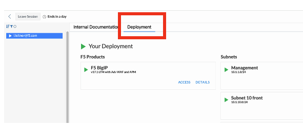
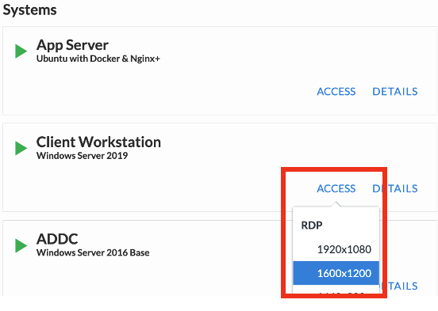

Environment Overview
=====================

UDF Blueprint
-----------------

Leavering BIG-IP Access to Improve Your Zero Trust Architecture

Lab Components
--------------

The following components have been included in your lab environment:

- 1 x F5 BIG-IP VE (v17.1.x)
- 1 x Super Jump Host
- 1 x Windows 2016 Server - AD Server
- 1 x Windows 2019 Server - Clent Workstation for students to run lab
- 1 x Ubuntu - application server
- 1 x Ubuntu - Open Policy Agent Server

Credential for the components can be found in Details tab of each component. 

Accessing the lab
-----------------

For both labs you'll be using the Client Workstation. Inside the Client Workstation, you'll have access to and use Postman, BIG-IP, and Google Chrome with shortcuts to all the resources needed to complete the lab. 

From the course, click Deployment tab.

    |image1|

Under System column, click on Access, and select the resolution size to download remote desktop file to access the Client Workstation. 

    |image2|

At the logon prompt, enter the following credential to log into the workstation. 

**Windows Credential**  

**Username:** user 

**Password:** user 

Once you're logged in, open Chrome browser, click on BIG-IP from the shortcut bar, and log into the BIG-IP to start the lab. 

**BIG-IP Credential** 

**Username:** admin 

**Password:** admin 

If you're not able to use an RDP session, you can use Guacamole from the Super Jump Host

**Guacamole**

**Username:** guacadmin

**Password:** guacadmin

.. |image3| image:: media/lab/image3.png