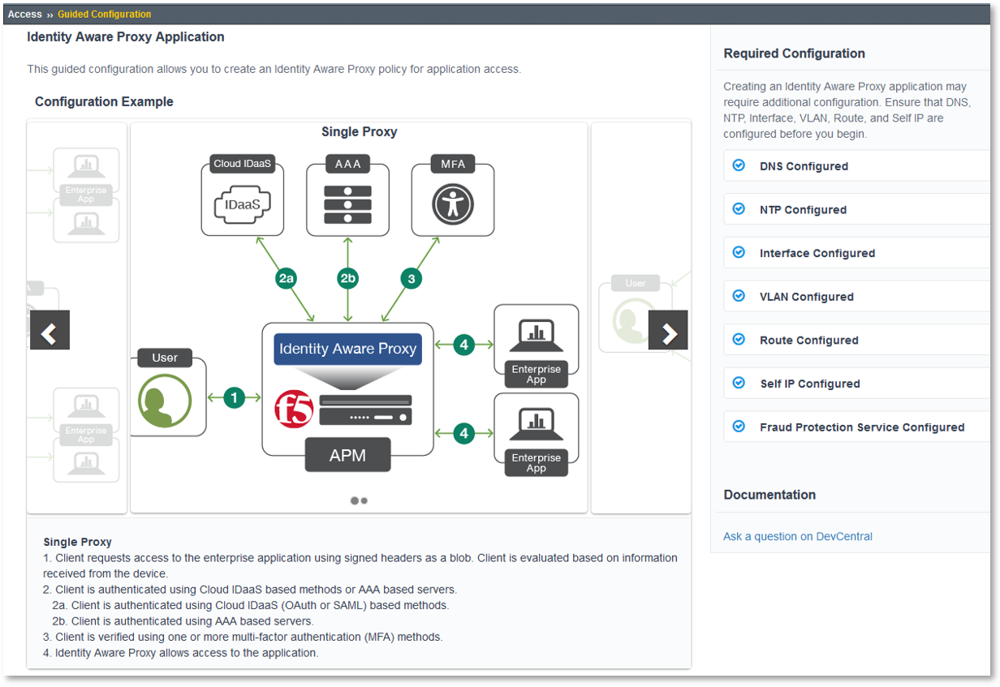
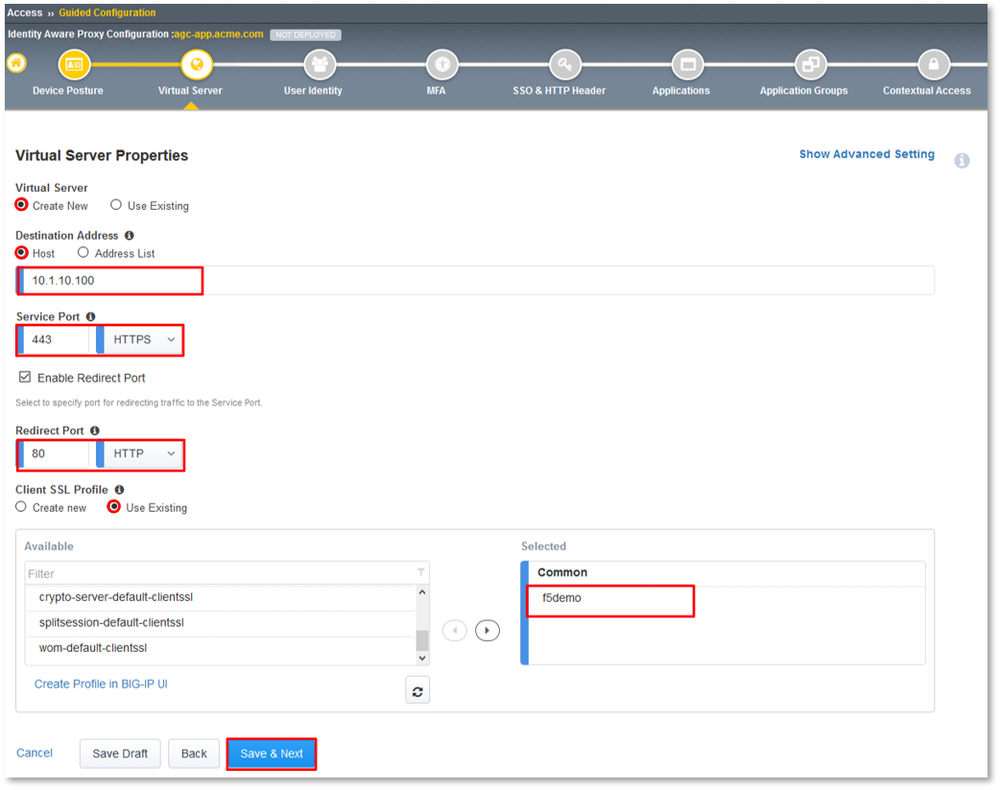
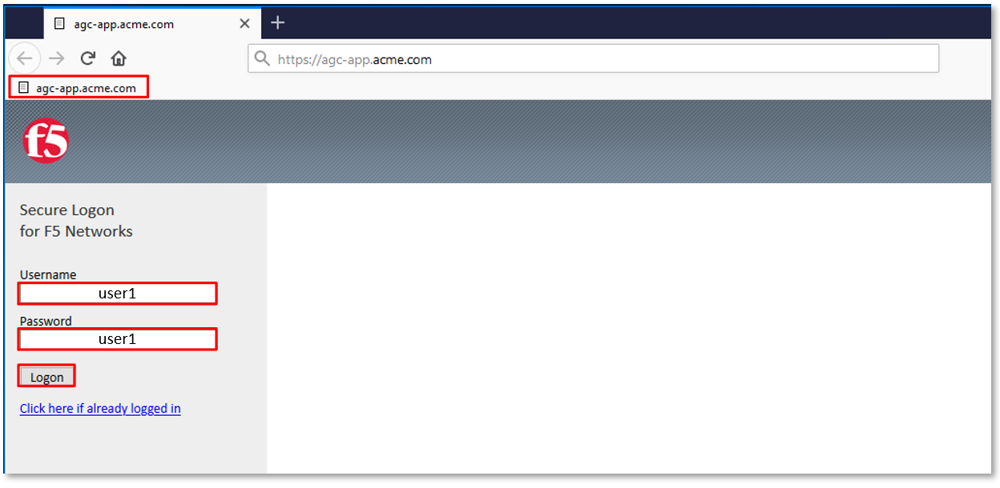
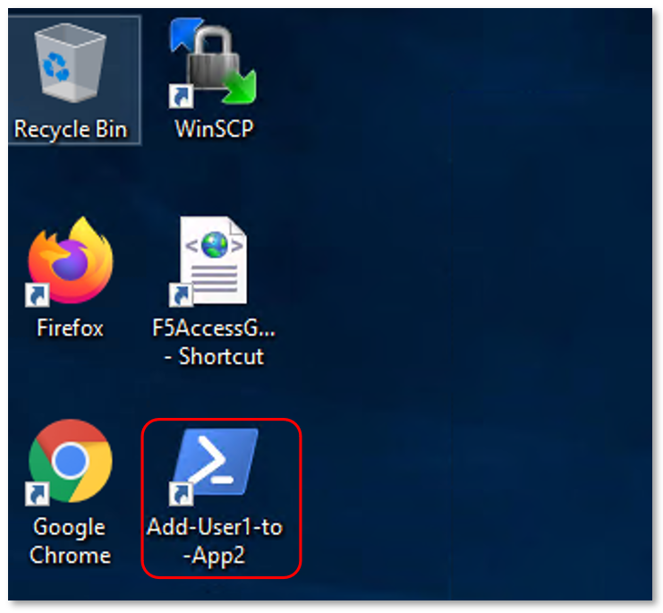

Lab 1: Access Guided Configuration - Per Request Policy
=======================================================

The purpose of this lab is to leverage Access Guided Configuration (AGC) to 
deploy an Identity Aware Proxy extended by Per Request Policies (PRP) access 
controls. The Per Request Policies will restrict access based on AD Group 
Membership and the URI accessed. Students will configure the various aspects 
of the application using strictly AGC, review the configuration and perform 
tests of the deployment.

Objective:
----------

-  Gain an understanding of Access Guided Configurations and
   its various configurations and deployment models

-  Gain an initial understanding of Per Request Policies and their applicability
   in various delivery and control scenarios

Lab Requirements:
-----------------

-  All Lab requirements will be noted in the tasks that follow

-  Estimated completion time: 30 minutes

Lab 1 Tasks:
-----------------

TASK 1: Intialize Access Guided Configuration (AGC)
~~~~~~~~~~~~~~~~~~~~~~~~~~~~~~~~~~~~~~~~~~~~~~~~~~~

+----------------------------------------------------------------------------------------------+
| 1. Login to your provided lab Virtual Edition: **bigp1.f5lab.local**                         |
|                                                                                              |
| 2. Navigate to:  **Access -> Guided Configuration**                                          |
|                                                                                              |
| 3. Click the **Zero Trust** graphic as shown.                                                |
+----------------------------------------------------------------------------------------------+
| |image001|                                                                                   |
+----------------------------------------------------------------------------------------------+

+----------------------------------------------------------------------------------------------+
| 4. Click on the **Identity Aware Proxy**  dialogue box click under **Zero Trust**            |
|                                                                                              |
|    in the navigation as shown.                                                               |
+----------------------------------------------------------------------------------------------+
| |image002|                                                                                   |
+----------------------------------------------------------------------------------------------+

+----------------------------------------------------------------------------------------------+
| 5. Review the **Identity Aware Proxy Application** configuration example presented.          |
|                                                                                              |
| 6. Scroll through and review the remaining element of the dialogue box to the bottom of the  |
|                                                                                              |
|    screen and click "Next"                                                                   |
+----------------------------------------------------------------------------------------------+
| |image003|                                                                                   |
|                                                                                              |
| |image004|                                                                                   |
+----------------------------------------------------------------------------------------------+

TASK 2: Name Configuration and define Device Posture  
~~~~~~~~~~~~~~~~~~~~~~~~~~~~~~~~~~~~~~~~~~~~~~~~~~~~

+----------------------------------------------------------------------------------------------+
| 1. In the **Configuration Name** dialogue box, enter **agc-app.acme.com**                    |
|                                                                                              |
| 2. Click **Save & Next** at the bottom of the dialogue window.                               |
+----------------------------------------------------------------------------------------------+
| |image005|                                                                                   |
+----------------------------------------------------------------------------------------------+

TASK: 3: Configure Virtual Server Properties 
~~~~~~~~~~~~~~~~~~~~~~~~~~~~~~~~~~~~~~~~~~~~

+----------------------------------------------------------------------------------------------+
| 1. Select the **Create New** radio button under **Virtual Server**                           |
|                                                                                              |
| 2. Select the **Host** radio button under **Destination Address**                            |
|                                                                                              |
| 3. Enter the IP Address **10.1.10.100** in the dialogue box for **Destination Address**.     |
|                                                                                              |
| 4. Confirm the **Rediect Port** is **80** and **HTTP**.                                      |
|                                                                                              |
| 5. Select the **Use Existing** radio button under **Client SSL Profile**                     |
|                                                                                              |
| 6. Move the **f5demo** Client SSL Profile to the right, **Selected**                         |
|                                                                                              |
| 7. Click **Save & Next** at the bottom of the dialogue window.                               |
+----------------------------------------------------------------------------------------------+
| |image006|                                                                                   |
+----------------------------------------------------------------------------------------------+

TASK: 4: Configure User Identity  
~~~~~~~~~~~~~~~~~~~~~~~~~~~~~~~~

+----------------------------------------------------------------------------------------------+
| 1. Enter **agc-f5lab-AD** in the **Name** field                                              |
|                                                                                              |
| 2. Confirm **Authentication Type** is **AAA**                                                |
|                                                                                              |
| 3. Confirm **Choose Authentication Server Type** is **Active Directory**                     |
|                                                                                              |
| 4. Select **f5lab.local** from the **Choose Authentication Server** drop down.               |
|                                                                                              |
| 5. Check the **Active Directory Query Properties** checkbox.                                 |
|                                                                                              |
| 6. Check the **Fetch Nested Group** checkbox.                                                |
|                                                                                              |
| 7. Move the **memberOf** to the right under **Required Attributes**                          |
|                                                                                              |
| 8. Click **Save** at the bottom of the dialogue window.                                      |
+----------------------------------------------------------------------------------------------+
| |image007|                                                                                   |
+----------------------------------------------------------------------------------------------+

+----------------------------------------------------------------------------------------------+
| 9. In the dialogue window that follows for **User Identity**, confirm **agc-f5lab-AD** is    |
|                                                                                              |
|    listed, then click **Save & Next** at the bottom if the dialogue window.                  |
+----------------------------------------------------------------------------------------------+
| |image008|                                                                                   |
+----------------------------------------------------------------------------------------------+

TASK 5: Multi Factor Authentication
~~~~~~~~~~~~~~~~~~~~~~~~~~~~~~~~~~~

+----------------------------------------------------------------------------------------------+
| 1. In the **Multi Factor Authentication** dialogue box, click **Save & Next** at the bottom  |
|                                                                                              |
|    of the dialogue window.                                                                   |
+----------------------------------------------------------------------------------------------+
| |image009|                                                                                   |
+----------------------------------------------------------------------------------------------+

TASK 6: Single Sign-on & HTTP Header
~~~~~~~~~~~~~~~~~~~~~~~~~~~~~~~~~~~~

+----------------------------------------------------------------------------------------------+
| 1. Check **Enable Single Sign-on (Optional)** checkbox in the                                |
|                                                                                              |
|    **Single Sign-on & HTTP Header** dialogue window.                                         |
+----------------------------------------------------------------------------------------------+
| |image010|                                                                                   |
+----------------------------------------------------------------------------------------------+
 
+----------------------------------------------------------------------------------------------+
| 2. Enter **agc-app-header** in the **Name** field in the **Single Sign-on & HTTP Header**    |
|                                                                                              |
|    **Properties** dialogue window.                                                           |
|                                                                                              |
| 3. Select the **HTTP Headers** radio button under **Type**                                   |
|                                                                                              |
| 4. Click the **+ (Plus Symbol)** in the **Action** column of the **SSO Headers** section.    |
|                                                                                              |
| 5. In the new **SSO Headers** row, enter the following values:                               |
|                                                                                              |
|    - **Header Operation**: **replace**                                                       |
|                                                                                              |
|    - **Header Name**: **agc-app-uid**                                                        |
|                                                                                              |
|    - **Header Value**: **%{subsession.logon.last.username}**                                 |
|                                                                                              |
| 6. Repeat steps 4 & 5 with the following values:                                             |
|                                                                                              |
|    - **Header Operation**: **replace**                                                       |
|                                                                                              |
|    - **Header Name**: **agc-memberOf**                                                       |
|                                                                                              |
|    - **Header Value**: **%{subsession.ad.last.attr.memberOf}**                               |
|                                                                                              |
| 7. At the bottom of the screen, click **Save**                                               |
+----------------------------------------------------------------------------------------------+
| |image011|                                                                                   |
+----------------------------------------------------------------------------------------------+

+----------------------------------------------------------------------------------------------+
| 8. In the dialogue window that follows for **Single Sign-on & HTTP Header**, confirm         |
|                                                                                              |
|    **agc-app-header** is listed, then click **Save & Next** at the bottom if the             |
|                                                                                              |
|    dialogue window.                                                                          |
+----------------------------------------------------------------------------------------------+
| |image012|                                                                                   |
+----------------------------------------------------------------------------------------------+

TASK 7: Applications
~~~~~~~~~~~~~~~~~~~~
  
+----------------------------------------------------------------------------------------------+
| 1. In the **Application Properties** dialogue window, click **Show Advanced Setting** in the |
|                                                                                              |
|    upper right hand corner of the dialogue window.                                           |
|                                                                                              |
| 2. In the **Name** field enter **agc-app.acme.com**.                                         |
|                                                                                              |
| 3. In the **FQDN** field enter **agc-app.acme.com**.                                         |
|                                                                                              |
| 4. In the **Subpath Pattern** field enter **/apps/app1\***.                                  |
|                                                                                              |
| 5. On the **Subpath Pattern** row entered in Step 5, click the **+ (Plus Symbol)** twice     |
|                                                                                              |
|    to add to more rows.                                                                      |
|                                                                                              |
| 6. In the two new rows add **/apps/app2\*** and **/apps/app3\*** respectively.               |
|                                                                                              |
| 7. In the **Pool Configuration** section, under **Health Monitors** area move                |
|                                                                                              |
|    **/Common/http** to the right **Selected** side.                                          |
|                                                                                              |
| 8. In the **Pool Configuration** section, under **Load Balancing Method** area select        |
|                                                                                              |
|    **/Common/10.1.20.6** from the **IP Address/Node name**                                   |
|                                                                                              |
| 9. Click the **Save** button at the bottom of the dialogue window.                           |
+----------------------------------------------------------------------------------------------+
| |image014|                                                                                   |
+----------------------------------------------------------------------------------------------+

+----------------------------------------------------------------------------------------------+
| 10. In the **Applications** dialogue window that follows, expand the **Subpaths** and ensure |
|                                                                                              |
|    /apps/app1*, /apps/app2*, /apps/app3* are present for the **agc-app.acme.com** row.       |
|                                                                                              |
| 11. Click the **Save & Next** button at the bottom of the dialogue window.                   |
+----------------------------------------------------------------------------------------------+
| |image015|                                                                                   |
+----------------------------------------------------------------------------------------------+

TASK 8: Application Groups
~~~~~~~~~~~~~~~~~~~~~~~~~~

+----------------------------------------------------------------------------------------------+
| 1. Check the **Enable Application Groups** checkbox in the **Application Groups**            |
|                                                                                              |
|    dialogue window.                                                                          |
+----------------------------------------------------------------------------------------------+
| |image016|                                                                                   |
+----------------------------------------------------------------------------------------------+

+----------------------------------------------------------------------------------------------+
| 2. **Application Group Properties** dialogue window, enter **app1** in the **Field**.        |
|                                                                                              |
| 3. Move **/apps/app1\*** from the **Available** side to the **Selected** side under          |
|                                                                                              |
|    **Application List**.                                                                     |
|                                                                                              |
| 4. Click the **Save** button at the bottom of the dialogue window.                           |
+----------------------------------------------------------------------------------------------+
| |image017|                                                                                   |
+----------------------------------------------------------------------------------------------+

+----------------------------------------------------------------------------------------------+
| 5. Click the **Add* button in the *Application Groups** dialogue window that follows and     |
|                                                                                              |
|    repeat steps 2 through 4 using the following values:                                      |
|                                                                                              |
|    - **Name**: app2, **Selected**: **/apps/app2\***                                          |
|                                                                                              |
|    - **Name**: app3, **Selected**: **/apps/app3\***                                          |
|                                                                                              |
|    - **Name**: base, **Selected**: **/**                                                     |
+----------------------------------------------------------------------------------------------+
| |image018|                                                                                   |
+----------------------------------------------------------------------------------------------+

+----------------------------------------------------------------------------------------------+
| 6. Review the **Applications Groups** dialogue window following completion of step 5 and     |
|                                                                                              |
| 7. Click the **Save & Next** button at the bottom of the dialogue window.                    |
+----------------------------------------------------------------------------------------------+
| |image019|                                                                                   |
+----------------------------------------------------------------------------------------------+

TASK 9: Contextual Access
~~~~~~~~~~~~~~~~~~~~~~~~~~~~~~~~~~~~~~~~~~~~~~~~~~~~~~~~~~~~~~~~~

+----------------------------------------------------------------------------------------------+
| 1. In the **Contextual Access Properties** dialigue window, enter **app1-access** in the     |
|                                                                                              |
|    **Name** field.                                                                           |
|                                                                                              |
| 2. Select **Application Group** from the **Resource Type** drop down.                        |
|                                                                                              |
| 3. Select **app1** from the **Resource** drop down.                                          |
|                                                                                              |
| 4. Select **agc-f5lab-AD** from the **Primary Authentication** drop down.                    |
|                                                                                              |
| 5. Select **agc-app-header** from the **HTTP Header** drop down.                             |
|                                                                                              |
| 6. Check the **Enable Addtional Checks** checkbox.                                           |
|                                                                                              |
| 7. In the **Trigger Rules** section that appears, click the **Add** button                   |
+----------------------------------------------------------------------------------------------+
| |image020|                                                                                   |
+----------------------------------------------------------------------------------------------+

+----------------------------------------------------------------------------------------------+
| 8. In the **Contextual Access Properties > Trigger > New** dialogue window, change the       |
|                                                                                              |
|    **Name** field to **app1-rule**.                                                          |
|                                                                                              |
| 9. Check the **User Group Check** checkbox.                                                  |
+----------------------------------------------------------------------------------------------+
| |image021|                                                                                   |
+----------------------------------------------------------------------------------------------+

+----------------------------------------------------------------------------------------------+
| 8. In the resulting **User Group Check** dialogue window, enter **app** in the filter box on |
|                                                                                              |
|    the left to filter the available AD Groups in the **Primary Authentication** section.     |
|                                                                                              |
| 9. Click the **Add** button in the row, where **app1** appears in the **Group Name** column. |
|                                                                                              |
| 10. Click the **Save** button at the bottom of the dialogue window.                          |
+----------------------------------------------------------------------------------------------+
| |image022|                                                                                   |
+----------------------------------------------------------------------------------------------+

+----------------------------------------------------------------------------------------------+
| 11. Review the resulting **Contextual Access Properties** for **app1-access** and click the  |
|                                                                                              |
|     **Save** button at the bottom of the dialogue window.                                    |
+----------------------------------------------------------------------------------------------+
| |image023|                                                                                   |
+----------------------------------------------------------------------------------------------+

+----------------------------------------------------------------------------------------------+
| 12. Click the **Add** button in the **Contextual Access** dialogue window.                   |
|                                                                                              |
| 13. Repeat steps 1 through 10 for **app2** and **app3** using the following values           |
|                                                                                              |
|     **App2**                                                                                 |
|                                                                                              |
|     Contextual Access Properties                                                             |
|                                                                                              |
|     - **Name**: **app2-access**                                                              |
|                                                                                              |
|     - **Resource Type**: **Application Group**                                               |
|                                                                                              |
|     - **Resource**: **app2**                                                                 |
|                                                                                              |
|     - **Primary Authentication**: **agc-f5lab-AD**                                           |
|                                                                                              |
|     - **HTTP Header**: **agc-app-header**                                                    |
|                                                                                              |
|     Contextual Access Trigger Rules                                                          |
|                                                                                              |
|     - **Name**: **app2-rule**                                                                |
|                                                                                              |
|     User Group Check                                                                         |
|                                                                                              |
|     - Add AD group **app2**                                                                  |
|                                                                                              |
|     **App3**                                                                                 |
|                                                                                              |
|     Contextual Access Properties                                                             |
|                                                                                              |
|     - **Name**: **app3-access**                                                              |
|                                                                                              |
|     - **Resource Type**: **Application Group**                                               |
|                                                                                              |
|     - **Resource**: **app3**                                                                 |
|                                                                                              |
|     - **Primary Authentication**: **agc-f5lab-AD**                                           |
|                                                                                              |
|     - **HTTP Header**: **agc-app-header**                                                    |
|                                                                                              |
|     Contextual Access Trigger Rules                                                          |
|                                                                                              |
|     - **Name**: **app3-rule**                                                                |
|                                                                                              |
|     User Group Check                                                                         |
|                                                                                              |
|     - Add AD group **app3**                                                                  |
+----------------------------------------------------------------------------------------------+
| |image024|                                                                                   |
+----------------------------------------------------------------------------------------------+

+----------------------------------------------------------------------------------------------+
| 14. In the **Contextual Access Properties** dialigue window, enter **base-access** in the    |
|                                                                                              |
|     **Name** field.                                                                          |
|                                                                                              |
| 15. Select **Application Group** from the **Resource Type** drop down.                       |
|                                                                                              |
| 16. Select **base** from the **Resource** drop down.                                         |
|                                                                                              |
| 17. Select **agc-f5lab-AD** from the **Primary Authentication** drop down.                   |
|                                                                                              |
| 18. Select **agc-app-header** from the **HTTP Header** drop down.                            |
|                                                                                              |
| 19. Check the **Enable Addtional Checks** checkbox.                                          |
|                                                                                              |
| 20. In the **Trigger Rules** section that appears, change the **Match Action** for the       |
|                                                                                              |
|     **Default Fallback** from **Reject** to **Allow**.                                       |
|                                                                                              |
| 21. Click the **Save** button at the bottom of the dialogue window.                          |
+----------------------------------------------------------------------------------------------+
| |image025|                                                                                   |
|                                                                                              |
| |image026|                                                                                   |
+----------------------------------------------------------------------------------------------+

+----------------------------------------------------------------------------------------------+
| 22. Review the resulting **Contextual Access** dialogue window for completion of all         |
|                                                                                              |
|     created access rules.                                                                    |
|                                                                                              |
| 23. Click the **Save & Next** button at the bottom of the dialogue window.                   |
+----------------------------------------------------------------------------------------------+
| |image027|                                                                                   |
+----------------------------------------------------------------------------------------------+

TASK 10: Customization
~~~~~~~~~~~~~~~~~~~~~~

+----------------------------------------------------------------------------------------------+
| 1. Scroll the bottom of the **Customization Properties** dialogue window, leaving all        |
|                                                                                              |
|    defaults and then click **Save & Next**.                                                  |
+----------------------------------------------------------------------------------------------+
| |image028|                                                                                   |
|                                                                                              |
| |image029|                                                                                   |
+----------------------------------------------------------------------------------------------+

TASK 11: Logon Protection
~~~~~~~~~~~~~~~~~~~~~~~~~

+----------------------------------------------------------------------------------------------+
| 1. Click the **Save & Next** button at the bottom of the **Logon Protection Properties**     |
|                                                                                              |
|    dialogue window.                                                                          |
+----------------------------------------------------------------------------------------------+
| |image030|                                                                                   |
+----------------------------------------------------------------------------------------------+

TASK 12: Summary
~~~~~~~~~~~~~~~~

+----------------------------------------------------------------------------------------------+
| 1. In the resulting **Summary** dialogue window, review the configured elements and then     |
|                                                                                              |
|    click the **Deploy** button.                                                              |
+----------------------------------------------------------------------------------------------+
| |image031|                                                                                   |
+----------------------------------------------------------------------------------------------+

+----------------------------------------------------------------------------------------------+
| 2. Click the **Finish** button in the final dialogue window. Access Guided Configuration     |
|                                                                                              |
|    will return to the start screen and **agc-app.acme.com** will be "DEPLOYED"               |
+----------------------------------------------------------------------------------------------+
| |image032|                                                                                   |
|                                                                                              |
| |image033|                                                                                   |
+----------------------------------------------------------------------------------------------+

TASK 13: Testing
~~~~~~~~~~~~~~~~

+----------------------------------------------------------------------------------------------+
| 1. Begin a RDP session with the **Jumphost (10.1.10.10)** through the Student Portal.        |
|                                                                                              |
| 2. Open Firefox from the desktop and navigate to **https://agc-app.acme.com**.  A bookmark   |
|                                                                                              |
|    link has been provided in the toolbar.                                                    |
|                                                                                              |
| 3. Logon to the resulting logon page with **UserID: user1** and **Password: user1**          |
+----------------------------------------------------------------------------------------------+
| |image034|                                                                                   |
+----------------------------------------------------------------------------------------------+

+----------------------------------------------------------------------------------------------+
| 4. Click on the **Application 1** button in the **ACME Application/Service Portal**.         |
|                                                                                              |
| 5. A new tab will open displaying received headers demonstrating the user has accces to the  |
|                                                                                              |
|    application.                                                                              |
+----------------------------------------------------------------------------------------------+
| |image035|                                                                                   |
|                                                                                              |
| |image036|                                                                                   |
+----------------------------------------------------------------------------------------------+

+----------------------------------------------------------------------------------------------+
| 6. Return to the **ACME Application/Service Portal** and click **Application 2**.            |
|                                                                                              |
| 7. A new tab will open displaying a **Block Page** (customizable), restricting access to the |
|                                                                                              |
|    application based on AD group membership.                                                 |
+----------------------------------------------------------------------------------------------+
| |image037|                                                                                   |
|                                                                                              |
| |image038|                                                                                   |
+----------------------------------------------------------------------------------------------+

+----------------------------------------------------------------------------------------------+
| 8. Return to the **ACME Application/Service Portal** and click the **Logout** button and     |
|                                                                                              |
|    and close the browser.                                                                    |
|                                                                                              |
| 9. Run the **Add-User1-to-App2** Powesrshell script link provided on the **Jumphost**        |
|                                                                                              |
|    desktop. The script will run and automatically close.                                     |
+----------------------------------------------------------------------------------------------+
| |image039|                                                                                   |
|                                                                                              |
| |image040|                                                                                   |
+----------------------------------------------------------------------------------------------+

+----------------------------------------------------------------------------------------------+
| 10. Reopen Firefox using the desktop link on the **Jumphost** and launch the                 |
|                                                                                              |
|     **agc-app.acme.com** application from the link provided in the broswer.                  |
|                                                                                              |
| 11. Click on the **Application 2** button in the **ACME Application/Service Portal**.        |
|                                                                                              |
| 12. A new tab will open displaying received headers demonstrating the user has accces to the |
|                                                                                              |
|     application becasue of the change in the user's Group Membership.                        |
+----------------------------------------------------------------------------------------------+
| |image041|                                                                                   |
+----------------------------------------------------------------------------------------------+

TASK 14: Review
~~~~~~~~~~~~~~~

+----------------------------------------------------------------------------------------------+
| 1. Login to your provided lab Virtual Edition: **bigp1.f5lab.local**                         |
|                                                                                              |
| 2. Navigate to:  **Access -> Overview -> Active Sessions**                                   |
|                                                                                              |
| 3. Here you can see the active session and any subsessions created by virtue of the Per      |
|                                                                                              |
|    Request Policies and view their associated varibles.                                      |
|                                                                                              |
| 4. Click on the **View** asscoiated with the active session's subsession.                    |
+----------------------------------------------------------------------------------------------+
| |image042|                                                                                   |
+----------------------------------------------------------------------------------------------+

+----------------------------------------------------------------------------------------------+
| 5. In the resulting variable view, review the subsession variables created as a result of    |
|                                                                                              |
|    access requests performed in testing.                                                     |
+----------------------------------------------------------------------------------------------+
| |image043|                                                                                   |
+----------------------------------------------------------------------------------------------+

+----------------------------------------------------------------------------------------------+
| 6. Navigate to: **Access -> Profiles/Policies -> Per-Request Policies** in the left-hand     |
|                                                                                              |
|    navigation menu.                                                                          |
|                                                                                              |
| 7. In the resulting dialogue window, click on the **Edit** link in the                       |
|                                                                                              |
|    **agc-app.acme.com_perRequestPolicy** row.                                                |
|                                                                                              |
| 8. Review the created Per Request Policy                                                     |
+----------------------------------------------------------------------------------------------+
| |image044|                                                                                   |
|                                                                                              |
| |image045|                                                                                   |
+----------------------------------------------------------------------------------------------+

TASK 15: End of Lab1
~~~~~~~~~~~~~~~~~~~~

+----------------------------------------------------------------------------------------------+
| 1. This concludes Lab1, feel free to review and test the configuration.                      |
+----------------------------------------------------------------------------------------------+
| |image000|                                                                                   |
+----------------------------------------------------------------------------------------------+

.. |image000| image:: media/image001.png
   :width: 800px

.. |image041| image:: media/lab1-041.png
   :width: 800px

