Lab1: The Message Box
=======================

Task 1 - Setup Lab Environment
-----------------------------------

To access your dedicated student lab environment, you will require a web browser and Remote Desktop Protocol (RDP) client software. The web browser will be used to access the Lab Training Portal. The RDP client will be used to connect to the Jump Host, where you will be able to access the BIG-IP management interfaces (HTTPS, SSH).

#. Click **DEPLOYMENT** located on the top left corner to display the environment

#. Click **ACCESS** next to jumpohost.f5lab.local

   |image001|

#. Select your RDP resolution.  

#. The RDP client on your local host establishes a RDP connection to the Jump Host.

#. Login with the following credentials:

         - User: **f5lab\\user1**
         - Password: **user1**

#. After successful logon the Chrome browser will auto launch opening the site https://portal.f5lab.local.  This process usually takes 30 seconds after logon.

#. Click the **Classes** tab at the top of the page.

	|image002|

#. Scroll down the page until you see **501 GUI Tools** on the left

   |image003|

#. Hover over tile **The Message Box**. A start and stop icon should appear within the tile.  Click the **Play** Button to start the automation to build the environment

   |image004|

#. The screen should refresh displaying the progress of the automation within 30 seconds.  Scroll to the bottom of the automation workflow to ensure all requests succeeded.  If you you experience errors try running the automation a second time or open an issue on the `Access Labs Repo <https://github.com/f5devcentral/access-labs>`__.

   |image005|

Task 2 -  Create a failed connection
-----------------------------------------

The message box is a great tool for troubleshooting a policy that may have been reaching an ENDING DENY and closing the APM session too rapidly for proper inspection during the troubleshooting phase.

#. From the jumphost open new browser tab. Then navigate to https://server1.acme.com.  

#. You instantly receive an access denied message.  Let's go look at the reports to see why we failed the pollicy.

   |image006|

#. From the jumphost browser navigate to https://bigip1.f5lab.local

#. Login with username **admin** and password **admin**

    |image007|

#. Navigate to Access >> Overview >> Access Reports.

   |image008|

#. Click **Run Report**

   |image009|

#. Click on the **Session ID** that matches your failed attempt.

   |image010|

#. You can a client with the ip address **10.1.10.10*** failed the firewall posture assessment. At this point the session variables have been deleted because all session variable are cleared after a session has been terminated.  So that leaves two choices.  Investiage further into the logs or find a way to keep the session alive long enough to investiagat the variables real time.  For this lab we are going to choose the latter by pausing the sessioon.

   |image011|

Task 3 - Create the Test Branch
----------------------------------

#. Navigate to Access >> Profiles/Policies >> Access Profiles (Per-Session Policies).

   |image012|

#.  Click **Edit** to open Visual Policy Editor(VPE)

   |image013|

#.  If you exam the Policy you can the follow workflow is where the failure is happening:

   |image014|

   A. Client enters **IP Subnet Match** action and proceeds down the **fallback** branch.
   B. The client enters the **Production Policy** Macro
   C. Inside the Macro the Client Enters the **Posture Assessment** Macro
   D. Inside the **Posture Asseessments** Macro the client enters the **Client OS** action.
   E. The client enters the **Firewall** Check action.
   F. The client fails the check and proceeds down the **failback** branch
   G. The client exits the **Posture Assessments** Macro down the **fallback** branch
   H. The client exists the **Production Policy** Macro to the **Deny** Terminal

#.  The first step in troubleshooting this user would be seperating this user from all other production users on the system.  This can be done by entering the user's IP address in the **IP Subnet Match** action.  Click the **IP Subnet Match** action

   |image015|

#. Click **Branch Rules**
#. Click **Change**

   |image016|

#. Change the IP Subnet is value to the client address **10.1.10.10/32**
#. Click **Finished**

   |image017|

#. Change the name to **Test Branch 10.1.10.10**.  
#. Click **Save**

   |image018|

#.  Next time the client attempts to connec they will sent down the test branch mataching their IP address.  This can safely be done in production since the branch ends in a **Deny**.

   |image019|

Task 4 - Create Message boxes
--------------------------------

In this task you will create two Message Box Macros.  One for the success branch and a second for a failure branch.  Having the Mssage Box in a Macro allows you to customize the messages but still use them in muliple locations.  Also when you are done using them you simply remove them from the flow of policy but they can still exist in the overpolicy for the next time you need them.

#. Click **Add New Macro**

   |image020|

#. Enter the Name **Success Box**
#. Click **Save**

   |image21|

#. Expand the Macro
#. Click the **+ (Plus Symbol) on the fallback branch.

   |image022|

#. Click the **General Purpose** tab.
#. Select **Message Box**
#. Click **Add Item**

   |image023|

#. Enter the Title **Success**
#. Enter the Description below

   .. code-block:: irule

       Firewall Vendor: %{session.check_software.last.fw.item_1.vendor_name}
       Firewall Name: %{session.check_software.last.fw.item_1.name}
       Firewall Version: %{session.check_software.last.fw.item_1.version}

# Click **Save**

   |image024|

#. Click **Add New Macro**

   |image020|

#. Enter the Name **Failure Box**
#. Click **Save**

   |image25|

#. Expand the Macro
#. Click the **+ (Plus Symbol) on the fallback branch.

   |image026|

#. Click the **General Purpose** tab.
#. Select **Message Box**
#. Click **Add Item**

   |image023|

#. Enter the Title **Failure**
#. Enter the Description below

   .. code-block:: irule

       Firewall Vendor: %{session.check_software.last.fw.item_1.vendor_name}
       Firewall Name: %{session.check_software.last.fw.item_1.name}
       Firewall Version: %{session.check_software.last.fw.item_1.version}

#. Click **Save**

   |image027|

Task 5 - Add the Test condition
---------------------------------

In this section we will now add the condition we want to test against and use our message boxes to "pause" the session and provide us instant feedback

#. Click the **+ (Plus Symbol)** on the test branch 

   |image028|

#. Click the **Macros** tab
#. Select **Posture Assessments**
#. Select **Add Item**

   |image029|

#. Click the **+ (Plus Symbol)** on the Pass branch 

   |image030|

#. Click the **Macros** tab
#. Select **Success Box**
#. Select **Add Item**

   |image031|

#. Click the **+ (Plus Symbol)** on the Pass branch 

   |image032|

#. Click the **Macros** tab
#. Select **Failure Box**
#. Select **Add Item**

   |image033|

#. Click **Apply Access Policy**

   |image034|

Task 6 - Test failure
-----------------------

#. From the jumphost open a new browser tab. Then navigate to https://server1.acme.com.  

#. Rather than the instant deny, your presented a message box with the following information.  This has now "paused" the session for you to look at the session variables.  Do **NOT** click Continue

   |image036|

#. Return the BIG-IP GUI and navigate to Access >> Overview >> Active session.

   |image037|

#. There is a current active session that has yet to be completed.  Click **Variables**

   |image038|

#. Since the session has not yet been denied the BIG-IP and you have access to all the session variables.

   |image039|

Task 7 - Fix the policy
--------------------------

Now that we have the information about the clients Firewall settings we can return the policy to determine what is difference between the policy and what we are detecting on the client.

#. Navigate to Access >> Profiles/Policies >> Access Profiles (Per-Session Policies).

   |image012|

#.  Click **Edit** to open Visual Policy Editor(VPE)

   |image013|

#. Expand the **Posture Assessments** Macro
#. Click **Firewall**

   |image040|

#. The Platform, Vendor ID, Product ID all match what was stored in the session variables.  However, if you look closely at the Version number you notice a digit is missing.  The version the Firewall Action is 10.0.1433.0.  The was return a version of 10.0.14393.0 in the message box or when we looked directly at the session varibles.  Let's make a configuration change to our Firewall action and see if it fixes the problem.  Type the number **10.0.14393.0** into the version field  
#. Click **Save**

   |image041|

#. Click Apply Policy 

   |image042|

Task 8 - Test our fix
--------------------------

When testing you should now receive the  Successful Message Box.

#. From the jumphost open a new browser tab. Then navigate to https://server1.acme.com.  

#. You have successfully diagnosed the problem.

   |image043|

Task 9 - Cleanup the Test Branch
-----------------------------------

While we successfully diagnose the problem we haven't actually fixed the problem for the user.  The client machine still goes down the test branch.  We must now revert our configuration in the test branch and all the user to test again.

#. Navigate to Access >> Profiles/Policies >> Access Profiles (Per-Session Policies).

   |image012|

#.  Click **Edit** to open Visual Policy Editor(VPE)

   |image013|

#. Click the **X** in the top right corner of the Posture Assessments Macro. 

   |image044|

#. Verify the Connect Previous Node is set to **Pass**
#. Click **Delete**

   |image045|

#. Click the **X** in the top right corner of the Success Box Macro.

   |image046|

#. Verify the Connect Previous Node is set to **Out**
#. Click **Delete**

   |image047|

#. Click the **IP Subnet match** action.  **NOT** the X

   |image048|

#. Click **Branch Rules**
#. Click **change**

   |image049|

#. Change the IP address back to the original value of **127.0.0.1/32**
#. Click **Finished**

   |image050|

#. Change the Name back to the original value of **Test Branch 127.0.0.1**
#. Click **Save**

   |image051|

#. Click **Apply Access Policy**

   |image052|

#.  The configuration has now been reversed.  It's important to note that while we delected the Message Boxes from the current policy workslow the Marcros are still there the next time we need them.

   |image053|

Task 10 - Validate user1 is working
--------------------------------------

#. From the jumphost open a new browser tab. Then navigate to https://server1.acme.com.  

#.  Rather than being denied you are presented a logon page.  

#.  At the logon page enter the Username:**user1** and Password:**user1**

#.  Click **Logon**

   |image054|

#. You are presented the webpage below.  Congratualations you fixed the user's problem and they are working again.

   |image055|

Task 11 - Lab CleanUp
------------------------

#. From a browser on the jumphost navigate to https://portal.f5lab.local

#. Click the **Classes** tab at the top of the page.

    |image002|

#. Scroll down the page until you see **101 Intro to Access Foundational Concepts** on the left

   |image003|

#. Hover over tile **The Message Box**. A start and stop icon should appear within the tile.  Click the **Stop** Button to trigger the automation to remove any prebuilt objects from the environment

   |image998|

#. The screen should refresh displaying the progress of the automation within 30 seconds.  Scroll to the bottom of the automation workflow to ensure all requests succeeded.  If you you experience errors try running the automation a second time or open an issue on the `Access Labs Repo <https://github.com/f5devcentral/access-labs>`__.

   |image999|

#. This concludes the lab.

   |image000|

.. |image000| image:: ./media/lab01/000.png
.. |image001| image:: ./media/lab01/001.png
.. |image002| image:: ./media/lab01/002.png
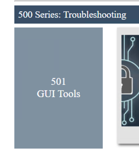
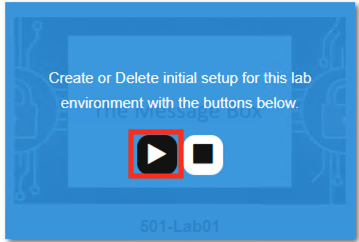
.. |image005| image:: ./media/lab01/005.png
.. |image006| image:: ./media/lab01/006.png
.. |image007| image:: ./media/lab01/007.png
.. |image008| image:: ./media/lab01/008.png
.. |image009| image:: ./media/lab01/009.png
.. |image010| image:: ./media/lab01/010.png
.. |image011| image:: ./media/lab01/011.png
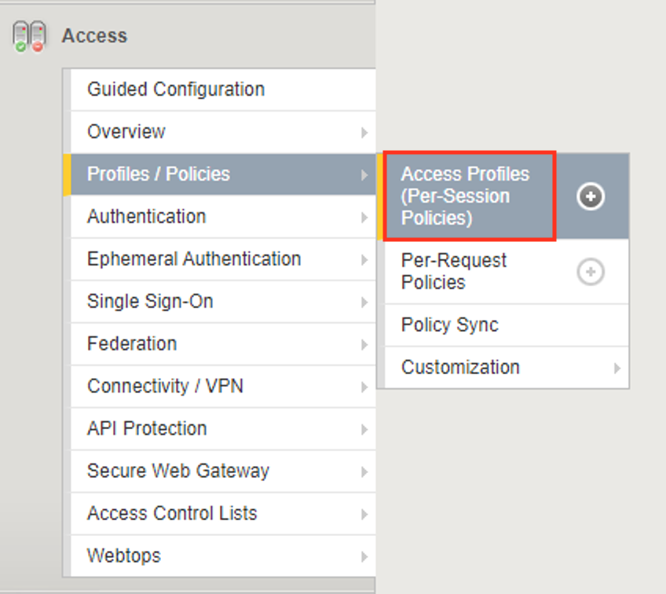
.. |image013| image:: ./media/lab01/013.png
.. |image014| image:: ./media/lab01/014.png
.. |image015| image:: ./media/lab01/015.png
.. |image016| image:: ./media/lab01/016.png
.. |image017| image:: ./media/lab01/017.png
.. |image018| image:: ./media/lab01/018.png
.. |image019| image:: ./media/lab01/019.png
.. |image020| image:: ./media/lab01/020.png
.. |image021| image:: ./media/lab01/021.png
.. |image022| image:: ./media/lab01/022.png
.. |image023| image:: ./media/lab01/023.png
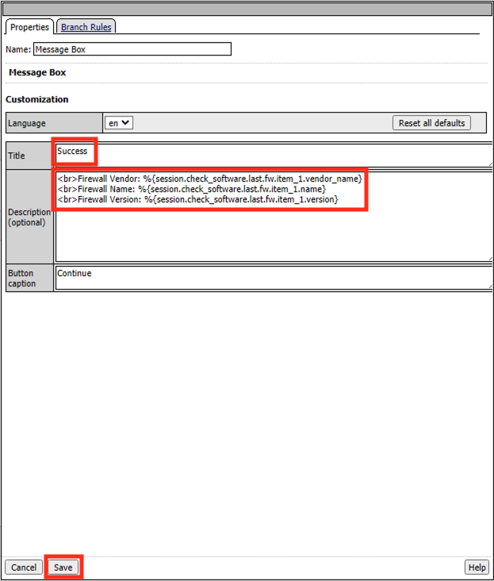
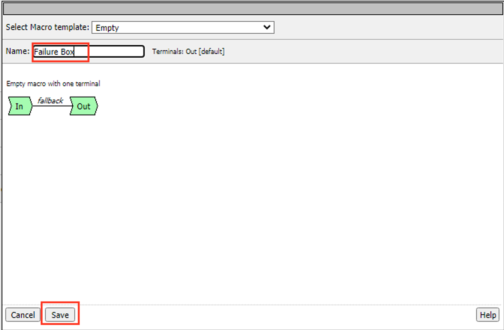
.. |image026| image:: ./media/lab01/026.png
.. |image027| image:: ./media/lab01/027.png
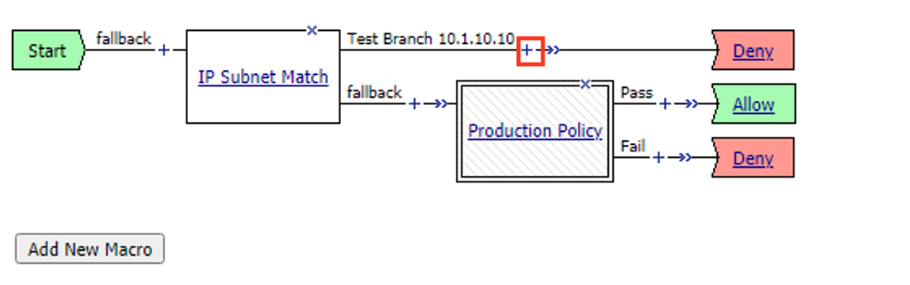
.. |image029| image:: ./media/lab01/029.png
.. |image030| image:: ./media/lab01/030.png
.. |image031| image:: ./media/lab01/031.png
.. |image032| image:: ./media/lab01/032.png
.. |image033| image:: ./media/lab01/033.png
.. |image034| image:: ./media/lab01/034.png
.. |image035| image:: ./media/lab01/035.png
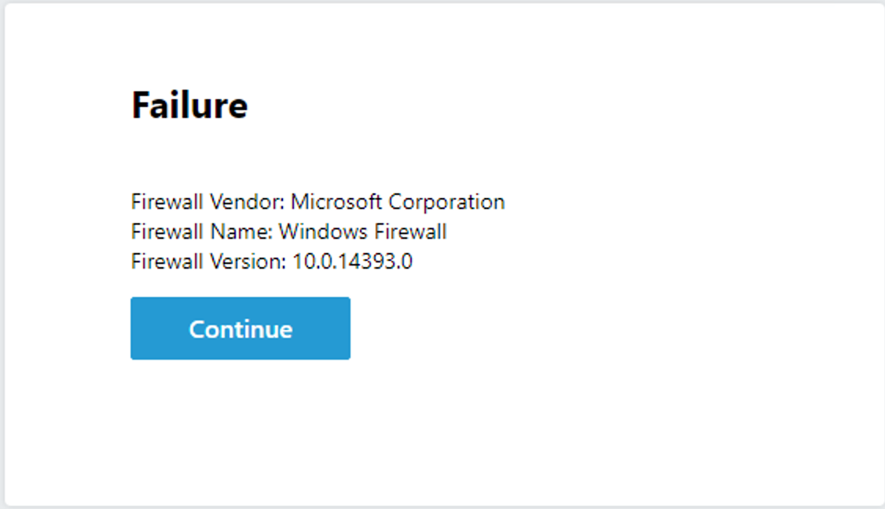
.. |image037| image:: ./media/lab01/037.png
.. |image038| image:: ./media/lab01/038.png
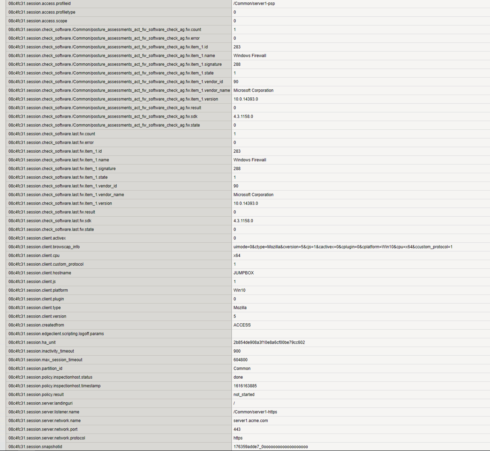
.. |image040| image:: ./media/lab01/040.png
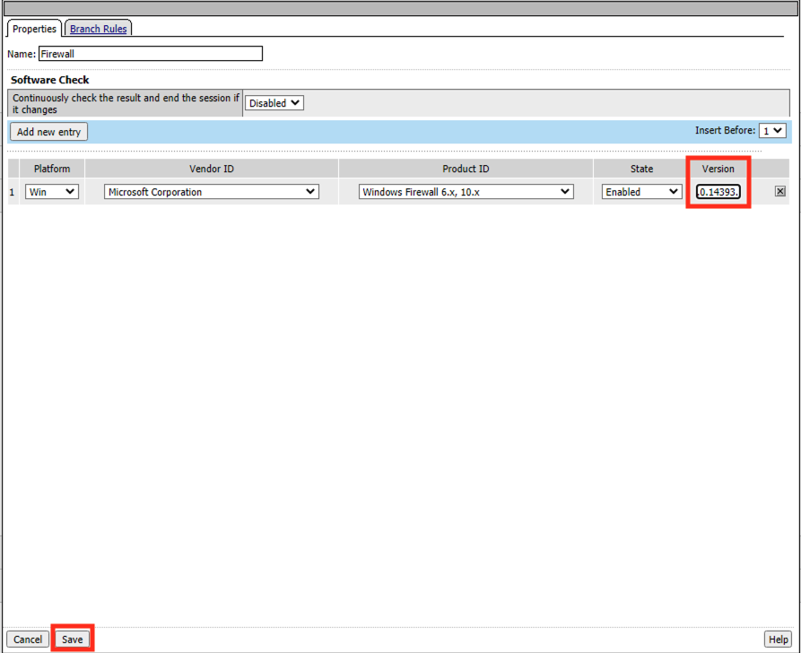
.. |image042| image:: ./media/lab01/042.png
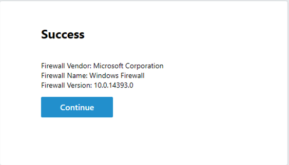
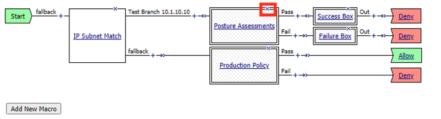
.. |image045| image:: ./media/lab01/045.png
.. |image046| image:: ./media/lab01/046.png
.. |image047| image:: ./media/lab01/047.png
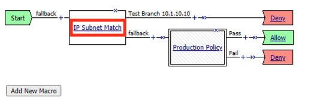
.. |image049| image:: ./media/lab01/049.png
.. |image050| image:: ./media/lab01/050.png
.. |image051| image:: ./media/lab01/051.png
.. |image052| image:: ./media/lab01/052.png
.. |image053| image:: ./media/lab01/053.png
.. |image054| image:: ./media/lab01/054.png
.. |image055| image:: ./media/lab01/055.png
.. |image998| image:: ./media/lab01/998.png
.. |image999| image:: ./media/lab01/999.png