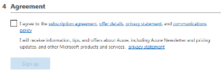

Conclusion
==========

Thank you for your participation in the 101 Access Policy Manager (APM)
Lab. This Lab Guide has highlighted several fundamental features of the Acccess 
Policy Manager Module. It provides a basic APM overview. It does not attempt to 
review all F5 APM capbilities but serves as an introduction to allow the
student to further explore the BIG-IP platform and Access Policy Manager
(APM), its functions & features.

Appendix
========

Links & Guides
--------------

The following are additional resources included for reference and assistance with
this lab guide and many other APM tasks.

-  **Access Policy Manager (APM) Operations Guide:**
   https://support.f5.com/content/kb/en-us/products/big-ip_apm/manuals/product/f5-apm-operations-guide/_jcr_content/pdfAttach/download/file.res/f5-apm-operations-guide.pdf

-  **Access Policy Manager (APM) Authentication and Single Sign on Concepts:**
   https://support.f5.com/kb/en-us/products/big-ip_apm/manuals/product/apm-authentication-sso-13-0-0.html
   
-  **SAML:**

   -  **Introduction:**
      https://support.f5.com/kb/en-us/products/big-ip_apm/manuals/product/apm-authentication-sso-13-0-0/28.html#guid-28f26377-6e10-42c9-883a-3ac65eab9092

   -  **F5 SAML IdP (Identity Provider with Portal):**
      https://support.f5.com/kb/en-us/products/big-ip_apm/manuals/product/apm-authentication-sso-13-0-0/29.html#guid-42e93e4b-e4fc-4c3d-ae53-910641d5755c

   -  **F5 SAML IdP (Identity Provider without Portal):**
      https://support.f5.com/kb/en-us/products/big-ip_apm/manuals/product/apm-authentication-sso-13-0-0/30.html#guid-39ffed07-65f2-40b8-85ae-c80073cc4e82

   -  **F5 SAML SP (Service Provider):**
      https://support.f5.com/kb/en-us/products/big-ip_apm/manuals/product/apm-authentication-sso-13-0-0/31.html#guid-be2cf224-727e-4a0f-aa68-676fdedba37b

   -  **F5 Federation iApp (Includes o365):**
      https://www.f5.com/pdf/deployment-guides/saml-idp-saas-dg.pdf

   -  **F5 o365 Deployment Guide:**
      https://www.f5.com/pdf/deployment-guides/microsoft-office-365-idp-dg.pdf

-  **OAuth**

   -  **OAuth Overview:**
      https://support.f5.com/kb/en-us/products/big-ip_apm/manuals/product/apm-authentication-sso-13-0-0/35.html#guid-c1b617a7-07b5-4ad6-9b84-29d6ecd789b4

   -  **OAuth Client & Resource Server:**
      https://support.f5.com/kb/en-us/products/big-ip_apm/manuals/product/apm-authentication-sso-13-0-0/36.html#guid-c6db081e-e8ac-454b-84c8-02a1a282a888

   -  **OAuth Authorization Server:**
      https://support.f5.com/kb/en-us/products/big-ip_apm/manuals/product/apm-authentication-sso-13-0-0/37.html#guid-be8761c9-5e2f-4ad8-b829-871c7feb2a20

   -  **Troubleshooting Tips**

      -  **OAuth Client & Resource Server:**
         https://support.f5.com/kb/en-us/products/big-ip_apm/manuals/product/apm-authentication-sso-13-0-0/36.html#guid-774384bc-cf63-469d-a589-1595d0ddfba2

      -  **OAuth Authorization Server:**
         https://support.f5.com/kb/en-us/products/big-ip_apm/manuals/product/apm-authentication-sso-13-0-0/37.html#guid-8b97b512-ec2b-4bfb-a6aa-1af24842ee7a

-  **Kerberos**

   -  **Kerberos AAA Object**: (*See Reference section below*)

   -  **Kerberos Constrained Delegation:**
      http://www.f5.com/pdf/deployment-guides/kerberos-constrained-delegation-dg.pdf

-  **Two-factor Integrations/Guides** (**Not a complete list**)

   -  **RSA Integration:**
      https://support.f5.com/kb/en-us/products/big-ip_apm/manuals/product/apm-authentication-single-sign-on-12-1-0/6.html#conceptid

   -  **DUO Security:**

      -  https://duo.com/docs/f5bigip

      -  https://duo.com/docs/f5bigip-alt

   -  **SafeNet MobilePass:**
      http://www.safenet-inc.com/resources/integration-guide/data-protection/SafeNet_Authentication_Service/SafeNet_Authentication_Service__RADIUS_Authentication_on_F5_BIG-IP_APM_Integration_Guide

   -  **Google Authenticator:**
      https://devcentral.f5.com/articles/two-factor-authentication-with-google-authenticator-and-apm

-  **Access Policy Manager (APM) Deployment Guides:**

   -  **F5 Deployment Guide for Microsoft Exchange 2010/2013:**
      https://f5.com/solutions/deployment-guides/microsoft-exchange-server-2010-and-2013-big-ip-v11

   -  **F5 Deployment Guide for Microsoft Exchange 2016:**
      https://f5.com/solutions/deployment-guides/microsoft-exchange-server-2016-big-ip-v11-v12-ltm-apm-afm

   -  **F5 Deployment Guide for Microsoft SharePoint 2010/2013:**
      https://f5.com/solutions/deployment-guides/microsoft-sharepoint-2010-and-2013-new-supported-iapp-big-ip-v114-ltm-apm-asm-aam

   -  **F5 Deployment Guide for Microsoft SharePoint 2016:**
      https://f5.com/solutions/deployment-guides/microsoft-sharepoint-2016-big-ip-v114-v12-ltm-apm-asm-afm-aam

   -  **F5 Deployment Guide for Citrix XenApp/XenDesktop:**
      https://f5.com/solutions/deployment-guides/citrix-xenapp-or-xendesktop-release-candidate-big

   -  **F5 Deployment Guide for VMWare Horizon View:**
      https://f5.com/solutions/deployment-guides/vmware-horizon-view-52-53-60-62-70-release-candidate-iapp-big-ip-v11-v12-ltm-apm-afm?tag=VMware

   -  **F5 Deployment Guide for Microsoft Remote Desktop Gateway Services:**
      https://f5.com/solutions/deployment-guides/microsoft-remote-desktop-gateway-services-big-ip-v114-ltm-afm-apm

   -  **F5 Deployment Guide for Active Directory Federated Services:**
      https://f5.com/solutions/deployment-guides/microsoft-active-directory-federation-services-big-ip-v11-ltm-apm

+----------------------------------------------------------------------------------------------+
| F5 Networks, Inc. \| f5.com                                                                  |
+----------------------------------------------------------------------------------------------+

+----------------------------------------------------------------------------------------------+
| US Headquarters: 401 Elliott Ave W, Seattle, WA 98119 \| 888-882-4447                        |
|                                                                                              |
| Americas: info@f5.com                                                                        |
|                                                                                              |
| Asia-Pacific: apacinfo@f5.com                                                                |
|                                                                                              |
| Europe/Middle East/Africa: emeainfo@f5.com                                                   |
|                                                                                              |
| Japan: f5j-info@f5.com                                                                       |
|                                                                                              |
| ©2020 F5 Networks, Inc. All rights reserved. F5, F5 Networks, and the F5 logo are trademarks |
|                                                                                              |
| of F5 Networks, Inc. in the U.S. and in certain other countries. Other F5 trademarks are     |
|                                                                                              |
| identified at f5.com. Any other products, services, or company names referenced herein may   |
|                                                                                              |
| be trademarks of their respective owners with no endorsement or affiliation, express or      |
|                                                                                              |
| implied, claimed by F5. These training materials and documentation are F5 Confidential       |
|                                                                                              |
| Information and are subject to the F5 Networks Reseller Agreement. You may not share these   |
|                                                                                              |
| training materials and documentation with any third party without the express written        |
|                                                                                              |
| permission of F5.                                                                            |
+----------------------------------------------------------------------------------------------+

.. |image143| image:: media/image139.png
   :width: 2.84352in
   :height: 1.33129in
.. |image144| image:: media/image140.png
   :width: 1.65644in
   :height: 1.35621in
.. |image145| image:: media/image141.png
   :width: 1.53374in
   :height: 1.34629in
.. |image146| image:: media/image142.png
   :width: 1.55828in
   :height: 1.56560in
.. |image147| image:: media/image143.png
   :width: 1.38650in
   :height: 1.55496in
.. |image148| image:: media/image144.png
   :width: 2.00614in
   :height: 2.21876in
.. |image149| image:: media/image145.png
   :width: 2.79693in
   :height: 1.78723in
.. |image150| image:: media/image146.png
   :width: 2.42294in
   :height: 2.73846in

