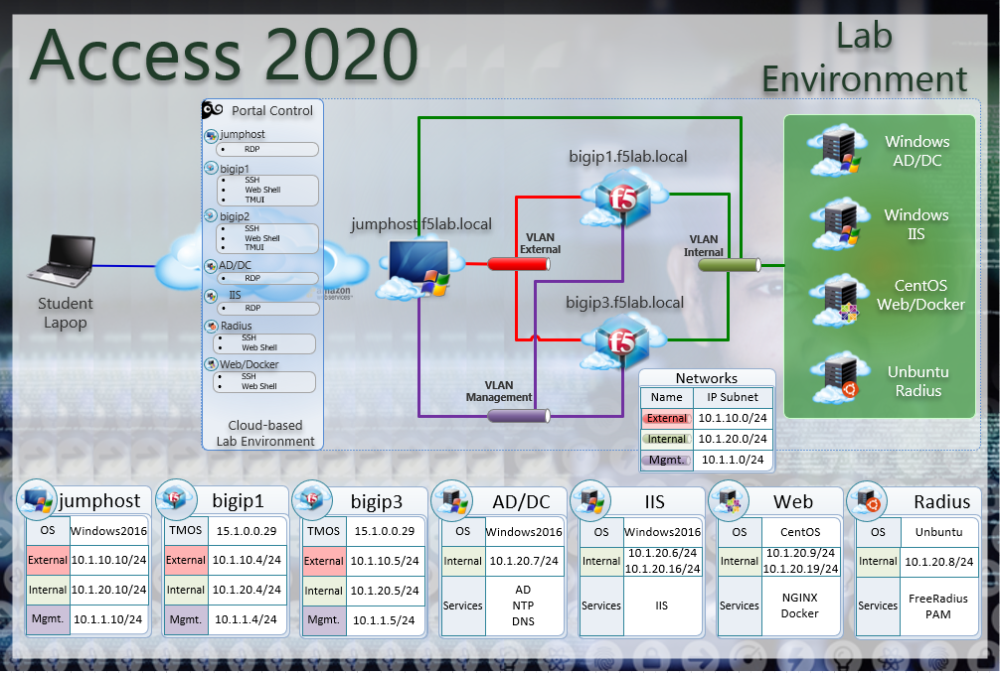

Getting Started
---------------

Please follow the instructions provided by the instructor to start your
lab and access your jump host.

To access your dedicated student lab environment, you will require a web browser
and Remote Desktop Protocol (RDP) client software. The web browser will be used to
access the Lab Training Portal. The RDP client will be used to connect to the Jump
Host, where you will be able to access the BIG-IP management interfaces (HTTPS, SSH).

+----------------------------------------------------------------------------------------------+
| 1. Establish a RDP connection to your provided lab Virtual Edition: **jumphost.f5lab.local** |
|                                                                                              |
|    with the following credentials:                                                           |
|                                                                                              |
|    * **UserID: f5lab\\user1** \| **Password: user1**                                         |
|                                                                                              |
| 2. Access the BIG-IP GUI via https://10.1.1.4  You can also double-click on the **bigip1**   |
|                                                                                              |
|    bookmark from within Chrome.                                                              |
|                                                                                              |
| 3. Login into the BIG-IP Configuration Utility with the following credentials:               |
|                                                                                              |
|    * **UserID: admin** \| **Password: admin**                                                |
|                                                                                              |
+----------------------------------------------------------------------------------------------+
| Note: All work for this lab will be performed exclusively from the provided lab environment. |
|                                                                                              |
|       No installation or interaction with your local system is required.                     |
+----------------------------------------------------------------------------------------------+

Lab Topology
~~~~~~~~~~~~

|image000|  

The following components have been included in your lab environment:

- 2 x F5 BIG-IP VE (v15.1)
- 1 x Windows Jumphost- Server 2016
- 1 x Windows 2016 Server hosting AD, CA, OCSP & DNS
- 1 x Windows 2016 Server hosting IIS
- 1 x Ubuntu 16.04 LTS 
- 1 x Centos 7

Lab Components
^^^^^^^^^^^^^^

The following table lists VLANS, IP Addresses and Credentials for all
components:

+------------------------+-------------------------+--------------------------+
| Component              | VLAN/IP Address(es)     | Credentials              |
+========================+=========================+==========================+
| jumpbox.f5lab.local    | - Management 10.1.1.10  | - user1/user1            |
|                        | - External   10.1.10.10 | - user2/user2            |
|                        | - Internal   10.1.20.10 |                          |
+------------------------+-------------------------+--------------------------+
| BIG-IP1.f5lab.local    | - Management 10.1.1.4   | - admin/admin            |
|                        | - External   10.1.10.4  |                          |
|                        | - Internal   10.1.20.4  |                          |
+------------------------+-------------------------+--------------------------+
| BIG-IP3.f5lab.local    | - Management 10.1.1.5   | - admin/admin            |
|                        | - External   10.1.10.5  |                          |
|                        | - Internal   10.1.20.5  |                          |
+------------------------+-------------------------+--------------------------+
| dc.f5lab.local         | - Management 10.1.1.7   | - administator/i3NqCqRQ  |
|                        | - Internal   10.1.20.7  |                          |
+------------------------+-------------------------+--------------------------+
| iis.f5lab.local        | - Management 10.1.1.6   | - administator/i3NqCqRQ  |
|                        | - Internal   10.1.20.6  |                          |
+------------------------+-------------------------+--------------------------+
| web.f5lab.local        | - Management 10.1.1.9   |                          |
|                        | - Internal   10.1.20.9  |                          |
|                        | - Internal   10.1.20.19 |                          |
+------------------------+-------------------------+--------------------------+
| radius.f5lab.local     | - Management 10.1.1.8   |                          |
|                        | - Internal   10.1.20.8  |                          |
+------------------------+-------------------------+--------------------------+

