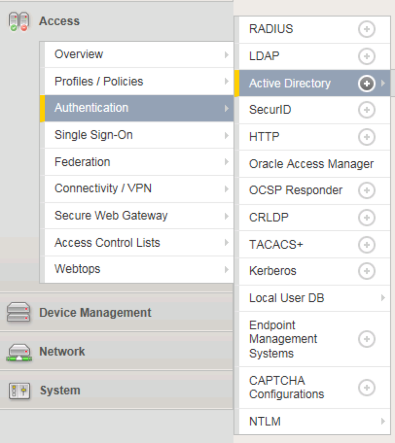
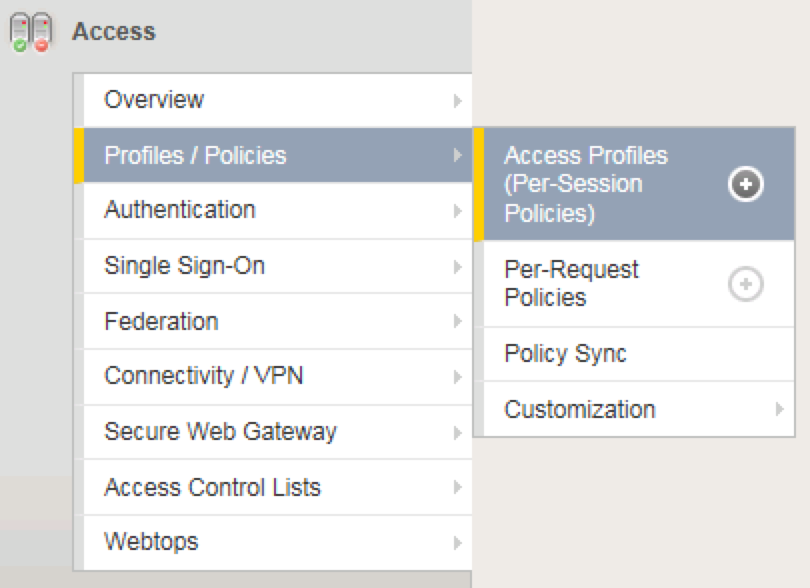
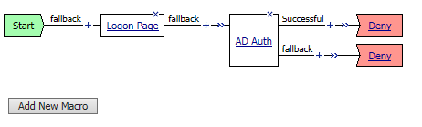
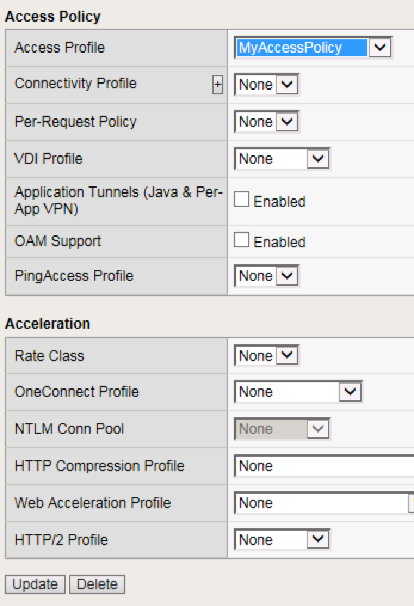

Lab 1: Building a Basic Access Policy
=====================================

Objectives
----------

The lab has a pre-configured test Virtual Server which will be used throughout the lab.  You will the Visual Policy Editor (VPE)
to create and attach a simple Access Profile which performs user authentication.

Lab Requirements
----------------

-  A pre existing virtual server at 10.1.10.101 or https://server1.acme.com

Task 1: Define an Authentication Server
---------------------------------------

Before we can create an access profile, we must create the necessary AAA
server profile for our Active Directory.

1. From the main screen, browse to **Access > Authentication > Active
   Directory**

2. Click **Create…** in the upper right-hand corner

3. Configure the new server profile as follows:

    Name: **Lab\_SSO\_AD\_Server**

    Domain Name: **f5lab.local**

    Server Connection: **Direct**

    Domain Controller: **10.1.20.7**

    User Name: **f5lab\\admin**

    Password: **admin**

4. Click **Finished**

Note: If you wish you can simply use the **pre-built-ad-servers**.

Task 2: Create a Simple Access Profile
--------------------------------------

1. Navigate to **Access > Profiles / Policies > Access Profiles
   (Per-Session Policies)**
   
   |image10|

2. From the Access Profiles screen, click **Create...** in the upper
   right-hand corner

3. In the Name field, enter **MyAccessPolicy** and for the **Profile Type**, 
   select the dropdown and choose **All**
	 
   |image11|

4. Under “Language Settings”, choose **English** and click the
   “\ **<<**\ “ button to slide over to the “Accepted Languages” column.
   
   |image12|

5. Click **Finished**, which will bring you back to the Access Profiles
   screen.

6. On the Access Profiles screen, click the **Edit** link under the
   Per-Session Policy column. 
   
   |image13|
   
   The Visual Policy Editor (VPE) will open in a new tab.

7. On the VPE page, click the ‘\ **+**\ ’ icon on the “fallback” path,
   to the right of the **Start** object.
   
   |image14|

8. On the popup menu, choose the **Logon Page** radio button under the
   Logon tab and click **Add Item**
   
   |image15|
   
   |image16|

9. Accept the defaults and click **Save**

Now let’s authenticate the client using the credentials to be provided
via the “Logon Page” object.

1. Between the “Logon Page” and “Deny” objects, click the ‘\ **+**\ ’
   icon, select **AD Auth** found under the **Authentication** tab,
   and click the **Add Item** button
   
   |image17|
   
   |image18|

2. Accept the default for the **Name** and in the **Server** drop-down
   menu select the AD server created above:
   **/Common/LAB\_SSO\_AD\_Server**, then click **Save**
   
   |image19|

3. On the “Successful” branch between the **AD Auth** and **Deny**
   objects, click on the word **Deny** to change the ending
   
   |image20|

4. Change the “Successful” branch ending to **Allow**, then click **Save**

   |image21|
   
   |image22|

5. In the upper left-hand corner of the screen, click on the **Apply
   Access Policy** link, then close the window using the **Close**
   button in the upper right-hand. Click **Yes** when asked “Do you
   want to close this tab?”
   
   |image23|
   
   |image24|

Task 3: Associate Access Policy to Virtual Servers
--------------------------------------------------

Now that we have created an access policy, we must apply it to the
appropriate virtual server to be able to use it.

1. From the **Local Traffic** menu, navigate to the **Virtual Servers
   List** and click the name of the virtual server created previously:
   **demo-vs-https**.

2. Scroll down to the “Access Policy” section, then for the “Access
   Profile” dropdown, select **MyAccessPolicy**
   
   |image25|

3. Click **Update** at the bottom of the screen

Task 4: Testing
---------------

Now you are ready to test.

1. Open a new browser window and open the URL for the virtual server
   that has the access policy applied:
   `**https://server1.acme.com** <https://server1.acme.com>`
   You will be presented with a login window
   
   |image26|

2. Enter the following credentials and click **Logon**:
   Username: **user1**
   Password: **user1**

   You will see a screen similar to the following:
   
   |image27|

Task 5: Troubleshooting tips
----------------------------

You can view active sessions by navigating Access/Overview/Active Sessions

You will see a screen similar to the following:

Click on the session id for the active session. If the session is active it will show up as a green in the status.

|image30|

Click on the "session ID" next to the active session. Note every session has a unique session id. Associated with it.
This can be used for troubleshooting specific authentication problem.

Once you click on the session id you wll be presented with a screen that is similar to the following.

|image31|

Note that the screen will show all of the log messages associated with the session. This becomes useful if there is a problem authenticating users.

The default log level shows limited "informational" messages but you can enable debug logging in the event that you need to increase the verbositiy of the logging 
on the APM policy. Note you should always turn off debug logging when you are finished with trouble shooting as debug level logging can
generate a lot of messages that will fill up log files and could lead to disk issues in the event that lgging is set to logto the
local Big-IP.

Please review the following support article that details how to enable debug logging.

https://support.f5.com/csp/article/K45423041

Lab 1 is now complete.

.. 

.. |image12| image:: media/image14.png
   :width: 5.30972in
   :height: 1.96914in
.. |image13| image:: media/image15.png
   :width: 5.30625in
   :height: 1.20139in
.. |image14| image:: media/image16.png
   :width: 3.67708in
   :height: 1.59375in
.. |image15| image:: media/image17.png
   :width: 5.30972in
   :height: 2.99543in
.. |image16| image:: media/image18.png
   :width: 4.09422in
   :height: 4.25486in

.. |image19| image:: media/image21.png
   :width: 5.05208in
   :height: 2.44710in

.. |image23| image:: media/image25.png
   :width: 2.14583in
   :height: 0.73958in
.. |image24| image:: media/image26.png
   :width: 2.00000in
   :height: 0.67921in

.. |image29| image:: media/image29.png
   :width: 18.33in
   :height: 3.17in
.. |image30| image:: media/image30.png
   :width: 14.44in
   :height: 3.0in
.. |image31| image:: media/image31.png
   :width: 19.641in
   :height: 4.65in
   
   
   
   
   
   
   
