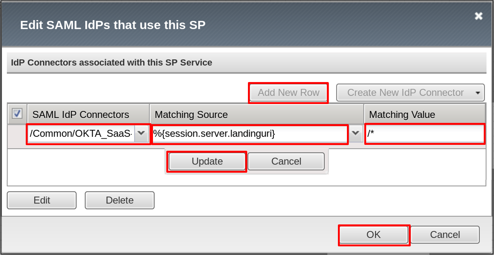

Lab 2: IDaaS SAML Identity Provider (iDP) Lab (OKTA)
====================================================

The purpose of this lab is to configure and test a IDaaS SAML Identity
Provider. Students will configure a IDaaS based SAML Identity Provider
(in this case OKTA) and import and bind to a SAML Service Provider and
test IdP-Initiated and SP-Initiated SAML Federation.

Objective:
----------

-  Gain an understanding of integrating a IDaaS SAML Identity
   Provider(IdP)

-  Gain an understanding of the access flow for IdP-Initiated SAML

Lab Requirements:
-----------------

-  All Lab requirements will be noted in the tasks that follow

-  Estimated completion time: 25 minutes

Lab 2 Tasks:
------------

TASK 1: Sign Up for OKTA Developer Account 
~~~~~~~~~~~~~~~~~~~~~~~~~~~~~~~~~~~~~~~~~~

Refer to the instructions and screen shots below:

+----------------------------------------------------------------------------------------------+
| *Note: The following steps provide instruction for setting up an OKTA developer account.*    |
|                                                                                              |
| *If you already have one, you may elect to use that account. Understand, however, that the*  |
|                                                                                              |
| *instructions below may need to be modified to match your environment.*                      |
+----------------------------------------------------------------------------------------------+

+----------------------------------------------------------------------------------------------+
| 1. Sign Up for an OKTA developer account by navigating to:                                   |
|                                                                                              |
|    **https://developer.okta.com/signup/** and using a VALID email and click **Get Started**  |
|                                                                                              |
| 2. Upon registration, you will be directed to a hyperlink (hostname) for your developer      |     
|                                                                                              |
|    account. This link should be saved for future use.                                        |     
|                                                                                              |
| 3. Additional instructions will be sent to the email address provided during account setup.  |     
+----------------------------------------------------------------------------------------------+
| |image022|                                                                                   |
|                                                                                              |
| |image023|                                                                                   |
+----------------------------------------------------------------------------------------------+

+----------------------------------------------------------------------------------------------+
| 4. Following the instructions received from the generated email, sign into the OKTA          |
|                                                                                              |
|    development environment with your provided, temporary password.                           |
+----------------------------------------------------------------------------------------------+
| |image024|                                                                                   |
+----------------------------------------------------------------------------------------------+

+----------------------------------------------------------------------------------------------+
| 5. Enter a **New Password** and the **Repeat New Password**                                  |
|                                                                                              |
| 6. Use the drop down to select a **Forgot Password Question** and provide the Answer         |
|                                                                                              |
| 7. Click a **Security Image**                                                                |
|                                                                                              |
| 8. Click **Create My Account**                                                               |
+----------------------------------------------------------------------------------------------+
| |image025|                                                                                   |
+----------------------------------------------------------------------------------------------+
 
TASK 2: OKTA Classic UI 
~~~~~~~~~~~~~~~~~~~~~~~

Refer to the instructions and screen shots below:

+----------------------------------------------------------------------------------------------+
| 1. For the purposes of the lab and SAML development, we will be using the OKTA Classic UI    |
|                                                                                              |
|    which provides access to SAML configurations. *(Note: At lab publication, the Developer*  |
|                                                                                              |
|    *Console did not have SAML resources.)*                                                   |
|                                                                                              |     
| 2. In the top, left hand corner click the **<>** & select **Classic UI** from the drop down. |
+----------------------------------------------------------------------------------------------+
| |image026|                                                                                   |
+----------------------------------------------------------------------------------------------+

TASK 3: Enable OKTA Multi-Factor Authentication [OPTIONAL]
~~~~~~~~~~~~~~~~~~~~~~~~~~~~~~~~~~~~~~~~~~~~~~~~~~~~~~~~~~

Refer to the instructions and screen shots below. This task will require a mobile app to enable a second factor.

+----------------------------------------------------------------------------------------------+
| **[OPTIONAL]**                                                                               |
|                                                                                              |
| *Note: Enabling MFA will require a Smart Device with the appropriate OKTA client for your OS*|
|                                                                                              |
| *The step can be skipped if you prefer to just use UserID/Password*                          |
|                                                                                              |
| 1. Click **Security** from the top navigation, then click **Multifactor**                    |
+----------------------------------------------------------------------------------------------+
| |image027|                                                                                   |
+----------------------------------------------------------------------------------------------+

+----------------------------------------------------------------------------------------------+
| **[OPTIONAL]**                                                                               |
|                                                                                              |
| 2. Under **OKTA Verify**, change the dropdown from **Inactive** to **Active**                |
|                                                                                              |
| 3. Click the **Edit** button next to ***OKTA Verify Settings**                               |
+----------------------------------------------------------------------------------------------+
| |image028|                                                                                   |
+----------------------------------------------------------------------------------------------+

+----------------------------------------------------------------------------------------------+
| **[OPTIONAL]**                                                                               |
|                                                                                              |
| 4. Check **Enable Push Verification**                                                        |
|                                                                                              |
| 5. Check **Require TouchID for OKTA Verify** (optional)                                      |
|                                                                                              |
| 6. Click **Save**                                                                            |
+----------------------------------------------------------------------------------------------+
| |image029|                                                                                   |
+----------------------------------------------------------------------------------------------+

TASK 4: Build SAML Application - OKTA 
~~~~~~~~~~~~~~~~~~~~~~~~~~~~~~~~~~~~~

Refer to the instructions and screen shots below:

+----------------------------------------------------------------------------------------------+
| 1. In the main menu, click **Applications**, and **Applications** from the dropdown in the   |
|                                                                                              |
|    top navigation.                                                                           |
+----------------------------------------------------------------------------------------------+
| |image030|                                                                                   |
+----------------------------------------------------------------------------------------------+

+----------------------------------------------------------------------------------------------+
| 2. Click **Add Application** in the **Applications** dialogue window.                        |
+----------------------------------------------------------------------------------------------+
| |image031|                                                                                   |
+----------------------------------------------------------------------------------------------+

+----------------------------------------------------------------------------------------------+
| 3. Click **Create New App** in the **Add Application Menu**                                  |
+----------------------------------------------------------------------------------------------+
| |image032|                                                                                   |
+----------------------------------------------------------------------------------------------+

+----------------------------------------------------------------------------------------------+
| 3. In the **Create a New Application Integration** dialogue box, select **Web** from the     |
|                                                                                              |
|    drop down for **Platform**.                                                               |
|                                                                                              |
| 4. Select the **SAML 2.0** radio button for **Sign on Method** and click **Create**.         |
+----------------------------------------------------------------------------------------------+
| |image033|                                                                                   |
+----------------------------------------------------------------------------------------------+

+----------------------------------------------------------------------------------------------+
| 5. In the **Create SAML Integration** screen, enter **app.f5demo.com** for the **App Name**. |
|                                                                                              |
| 6. Leave all other values as default and click **Next**.                                     |
+----------------------------------------------------------------------------------------------+
| |image034|                                                                                   |
+----------------------------------------------------------------------------------------------+

+----------------------------------------------------------------------------------------------+
| 7. In the **Create SAML Integration** screen, enter the following values                     |
|                                                                                              |
| 8. In the **SAML Setting** section                                                           |
|                                                                                              |
|    -  **Single Sign on URL:** **https://app.f5demo.com/saml/sp/profile/post/acs**            |
|                                                                                              |
|    -  **Audience URI (SP Entity ID):** **https://app.f5demo.com**                            |
|                                                                                              |
| 9. Leave all other values as default and click **Next**.                                     |
+----------------------------------------------------------------------------------------------+
| |image035|                                                                                   |
+----------------------------------------------------------------------------------------------+

+----------------------------------------------------------------------------------------------+
| 10. In the **Create SAML Integration** screen, select the:                                   |
|                                                                                              |
|     **“I’m an OKTA customer adding an internal app”** radio button for                       |
|                                                                                              |
|     **Are you a customer or partner?**                                                       |
|                                                                                              |
| 11. In the resulting expanded window, select:                                                |
|                                                                                              |
|     **“This is an internal app that we have created”** for **App Type**                      |
|                                                                                              |
|     and click **Finish**.                                                                    |
+----------------------------------------------------------------------------------------------+
| |image036|                                                                                   |
+----------------------------------------------------------------------------------------------+

+----------------------------------------------------------------------------------------------+
| 12. In the resulting application screen for **app.f5demo.com**, navigate to the              |
|                                                                                              |
|     **SAML 2.0 section**.                                                                    |
|                                                                                              |
| 13. Right Click the **Identity Provider Metadata** hyperlink and click **Save Link As …**    |
|                                                                                              |
| 14. Save the **metadata.xml** to your jumphost desktop. We will be using it in a later step  |
|                                                                                              |
|     in the Lab.                                                                              |
+----------------------------------------------------------------------------------------------+
| |image037|                                                                                   |
+----------------------------------------------------------------------------------------------+

TASK 5: Add User to SAML Application 
~~~~~~~~~~~~~~~~~~~~~~~~~~~~~~~~~~~~

Refer to the instructions and screen shots below:

+----------------------------------------------------------------------------------------------+
| 1. Within the **app.f5demo.com** application screen, Click **Assignments** then **Assign**   |
|                                                                                              |
|    and then **Assign to People** from the dropdown.                                          |
+----------------------------------------------------------------------------------------------+
| |image038|                                                                                   |
+----------------------------------------------------------------------------------------------+

+----------------------------------------------------------------------------------------------+
| 2. In the **Assign app.f5demo.com to People** dialogue box, select your **User ID**, click   |
|                                                                                              |
|    **Assign**, then **Done**.                                                                |
+----------------------------------------------------------------------------------------------+
| |image039|                                                                                   |
+----------------------------------------------------------------------------------------------+

+----------------------------------------------------------------------------------------------+
| 3. Click **Save and Go Back**.                                                               |
+----------------------------------------------------------------------------------------------+
| |image040|                                                                                   |
+----------------------------------------------------------------------------------------------+

+----------------------------------------------------------------------------------------------+
| 4. Click **Done**.                                                                           |
+----------------------------------------------------------------------------------------------+
| |image041|                                                                                   |
+----------------------------------------------------------------------------------------------+

TASK 6: Add Multi-Factor Authentication Sign-On Policy [OPTIONAL]
~~~~~~~~~~~~~~~~~~~~~~~~~~~~~~~~~~~~~~~~~~~~~~~~~~~~~~~~~~~~~~~~~

Refer to the instructions and screen shots below.  This section requires that **Task 3** be completed.

+----------------------------------------------------------------------------------------------+
| **[OPTIONAL]**                                                                               |
|                                                                                              |
| 1. Within the **app.f5demo.com** application screen, Click **Sign On**                       |
+----------------------------------------------------------------------------------------------+
| |image042|                                                                                   |
+----------------------------------------------------------------------------------------------+

+----------------------------------------------------------------------------------------------+
| **[OPTIONAL]**                                                                               |
|                                                                                              |
| 2. Scroll down to the **Sign On Policy** section and click **Add Rule**                      |
+----------------------------------------------------------------------------------------------+
| |image043|                                                                                   |
+----------------------------------------------------------------------------------------------+

+----------------------------------------------------------------------------------------------+
| **[OPTIONAL]**                                                                               |
|                                                                                              | 
| 3. In the **Add Sign On Rule** dialogue box, enter **MFA** for the **Rule Name**.            |
|                                                                                              |
| 4. Scroll down to the **Actions** section.                                                   |
|                                                                                              |
| 5. In the **Actions** section, under **Access**, check the box for **Prompt for factor**.    |
|                                                                                              |
| 6. Ensure **Every Sign On** radio button is selected.                                        |
|                                                                                              |
| 7. Click **Save**.                                                                           |
+----------------------------------------------------------------------------------------------+
| |image044|                                                                                   |
+----------------------------------------------------------------------------------------------+

TASK 7: Create the External IDP Connector
~~~~~~~~~~~~~~~~~~~~~~~~~~~~~~~~~~~~~~~~~

Refer to the instructions and screen shots below:

+----------------------------------------------------------------------------------------------+
| 1. Login to your lab provided **Virtual Edition BIG-IP**                                     |
|                                                                                              |
| 2. Begin by selecting: **Access** -> **Federation** -> **SAML Service Provider** ->          |
|                                                                                              |
|    **External IdP Connectors**.                                                              |
+----------------------------------------------------------------------------------------------+
| |image045|                                                                                   |
+----------------------------------------------------------------------------------------------+

+----------------------------------------------------------------------------------------------+
| 3. In the **External IdP Connectors** screen, click the **downward arrow** next to the word  |
|                                                                                              |
|    **Create** on the **Create** button (right side)                                          |
|                                                                                              |
| 4. Select **From Metadata** from the drop down menu                                          |
+----------------------------------------------------------------------------------------------+
| |image046|                                                                                   |
+----------------------------------------------------------------------------------------------+

+----------------------------------------------------------------------------------------------+
| 5. In the **Create New SAML IdP Connector** dialogue box, use the **Browse** button to       |
|                                                                                              |
|    select the **metadata.xml** from the desktop (created in Task 4).                         | 
|                                                                                              |
| 6. Name the **Identity Provider Name**: **OKTA\_SaaS-iDP**.                                  |
|                                                                                              |
| 7. Click **OK**.                                                                             |
+----------------------------------------------------------------------------------------------+
| |image047|                                                                                   |
+----------------------------------------------------------------------------------------------+

TASK 8: Change the SAML SP Binding
~~~~~~~~~~~~~~~~~~~~~~~~~~~~~~~~~~
Refer to the instructions and screen shots below:

+----------------------------------------------------------------------------------------------+
| 1. Begin by selecting: **Access** -> **Federation** -> **SAML Service Provider** ->          |
|                                                                                              |
|    **Local SP Services**                                                                     |
|                                                                                              |
| 2. Select the checkbox next to **app.f5demo.com** and click **Bind\\UnBind IdP Connectors**  |
+----------------------------------------------------------------------------------------------+
| |image048|                                                                                   |
+----------------------------------------------------------------------------------------------+

+----------------------------------------------------------------------------------------------+
| 3. Check the existing binding and click **Delete**.                                          |
+----------------------------------------------------------------------------------------------+
| |image049|                                                                                   |
+----------------------------------------------------------------------------------------------+

+----------------------------------------------------------------------------------------------+
| 4. Click **Add New Row** and use the following values                                        |
|                                                                                              |
|    -  **SAML IdP Connectors:** **/Common/OKTA\_SaaS-iDP**                                    |
|                                                                                              |
|    -  **Matching Source:** **%{session.server.landinguri}**                                  |
|                                                                                              |
|    -  **Matching Value:** /*                                                                 |
|                                                                                              |
| 5. Click **Update** then **OK**.                                                             |
+----------------------------------------------------------------------------------------------+
| |image050|                                                                                   |
+----------------------------------------------------------------------------------------------+

TASK 9: Apply Access Policy Changes
~~~~~~~~~~~~~~~~~~~~~~~~~~~~~~~~~~~
Refer to the instructions and screen shots below:

+----------------------------------------------------------------------------------------------+
| 1. Click the **Apply Access Policy** link in the top left corner of the Admin GUI            |
+----------------------------------------------------------------------------------------------+
| |image051|                                                                                   |
+----------------------------------------------------------------------------------------------+

+----------------------------------------------------------------------------------------------+
| 2. Ensure **app.f5demo.com-policy** is checked and click **Apply**                           |
+----------------------------------------------------------------------------------------------+
| |image052|                                                                                   |
+----------------------------------------------------------------------------------------------+

TASK 10 - Test Access to the app.f5demo.com application
~~~~~~~~~~~~~~~~~~~~~~~~~~~~~~~~~~~~~~~~~~~~~~~~~~~~~~~

Refer to the instructions and screen shots below:

+----------------------------------------------------------------------------------------------+
| 1. Using your browser from the Jump Host click on the provided bookmark or navigate to:      |
|                                                                                              |
|    https://app.f5demo.com                                                                    |
+----------------------------------------------------------------------------------------------+
| |image053|                                                                                   |
+----------------------------------------------------------------------------------------------+

+----------------------------------------------------------------------------------------------+
| 2. Follow the necessary prompts as directed.                                                 |
|                                                                                              |
|    *Note: Those who enabled MFA access will be required to activate their second factor for* |
|                                                                                              |
|    *application access. Requires Task 3 & Task be completed.*                                |
+----------------------------------------------------------------------------------------------+
| |image054|                                                                                   |
| |image055|                                                                                   |
| |image056|                                                                                   |
+----------------------------------------------------------------------------------------------+
+----------------------------------------------------------------------------------------------+
| 4. Did you successfully redirect to the OKTA SaaS IdP?                                       |
|                                                                                              |
| 5. Login to the iDP, were you successfully authenticated? Were you prompted for MFA          |
|                                                                                              |
|    if configured?                                                                            |
|                                                                                              |
| 6. After successful authentication, were you returned to the SAML SP?                        |
|                                                                                              |
| 7. Were you successfully authenticated (SAML)?                                               |
|                                                                                              |
| 8. Review your **Active Sessions** (**Access Overview** -> **Active Sessions**).             |
|                                                                                              |
| 9. Review your Access Report Logs (**Access Overview** -> **Access Reports**).               |
+----------------------------------------------------------------------------------------------+
| |image057|                                                                                   |
+----------------------------------------------------------------------------------------------+

+----------------------------------------------------------------------------------------------+
| 10. Destroy your Active Session by nagivating to **Access Overview** -> **Active Sessions**  |
|                                                                                              |
|     Select the checkbox next to your session and click the **Kill Selected Session** button. |
+----------------------------------------------------------------------------------------------+
| |image058|                                                                                   |
+----------------------------------------------------------------------------------------------+

+----------------------------------------------------------------------------------------------+
| 11. Close your browser and logon to your **https://dev-<Dev-ID>.oktapreview.com** account.   |
|                                                                                              |
|     Click on your **app.f5demo.com** application for IDP initiated Access.                   |
|                                                                                              |
| 12. After successful authentication, were you returned to the SAML SP?                       |
|                                                                                              |
| 13. Were you successfully authenticated (SAML)?                                              |
|                                                                                              |
| 14. Review your **Active Sessions** (**Access Overview** -> **Active Sessions**).            |
|                                                                                              |
| 15. Review your Access Report Logs (**Access Overview** -> **Access Reports**).              |
+----------------------------------------------------------------------------------------------+
| |image059|                                                                                   |
+----------------------------------------------------------------------------------------------+

.. |image022| image:: media/image022.png
   :width: 4.5in
   :height: 2.32in
.. |image023| image:: media/image023.png
   :width: 4.5in
   :height: 2.37in
.. |image024| image:: media/image024.png
   :width: 1.75in
   :height: 2.75in
.. |image025| image:: media/image025.png
   :width: 2.5in
   :height: 4.5in
.. |image026| image:: media/image026.png
   :width: 4.5in
   :height: 0.74in
.. |image027| image:: media/image027.png
   :width: 4.5in
   :height: 1.03in
.. |image028| image:: media/image028.png
   :width: 4.5in
   :height: 2.58in
.. |image029| image:: media/image029.png
   :width: 4.5in
   :height: 2.56in
.. |image030| image:: media/image030.png
   :width: 4.5in
   :height: 0.80in
.. |image031| image:: media/image031.png
   :width: 4.5in
   :height: 1.66in
.. |image032| image:: media/image032.png
   :width: 4.5in
   :height: 1.64in
.. |image033| image:: media/image033.png
   :width: 4.5in
   :height: 2.64in
.. |image034| image:: media/image034.png
   :width: 4.5in
   :height: 2.71in
.. |image035| image:: media/image035.png
   :width: 4.0in
   :height: 3.75in
.. |image036| image:: media/image036.png
   :width: 4.5in
   :height: 2.56in
.. |image037| image:: media/image037.png
   :width: 4.5in
   :height: 3.40in
.. |image038| image:: media/image038.png
   :width: 4.5in
   :height: 1.89in
.. |image039| image:: media/image039.png
   :width: 4.5in
   :height: 1.72in
.. |image040| image:: media/image040.png
   :width: 4.5in
   :height: 1.69in
.. |image041| image:: media/image041.png
   :width: 4.5in
   :height: 1.73in
.. |image042| image:: media/image042.png
   :width: 4.5in
   :height: 1.22in
.. |image043| image:: media/image043.png
   :width: 4.5in
   :height: 1.68in
.. |image044| image:: media/image044.png
   :width: 2.5in
   :height: 3.25in
.. |image045| image:: media/image045.png
   :width: 4.5in
   :height: 2.30in
.. |image046| image:: media/image046.png
   :width: 4.5in
   :height: 0.77in
.. |image047| image:: media/image047.png
   :width: 4.5in
   :height: 3.38in
.. |image048| image:: media/image048.png
   :width: 4.5in
   :height: 1.15in
.. |image049| image:: media/image049.png
   :width: 4.5in
   :height: 2.04in

.. |image051| image:: media/image051.png
   :width: 4.5in
   :height: 1.10in
.. |image052| image:: media/image052.png
   :width: 4.5in
   :height: 1.66in
.. |image053| image:: media/image053.png
   :width: 4.5in
   :height: 1.03in
.. |image054| image:: media/image054.png
   :width: 2.0in
   :height: 1.75in
.. |image055| image:: media/image055.png
   :width: 2.0in
   :height: 1.75in
.. |image056| image:: media/image056.png
   :width: 2.0in
   :height: 1.75in
.. |image057| image:: media/image057.png
   :width: 4.5in
   :height: 3.03in
.. |image058| image:: media/image058.png
   :width: 2.5in
   :height: 2.5in
.. |image059| image:: media/image059.png
   :width: 4.5in
   :height: 1.08in
