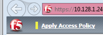
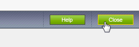
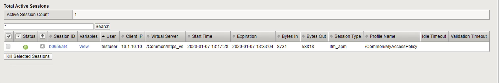
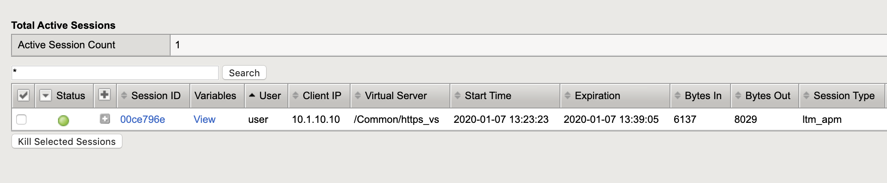
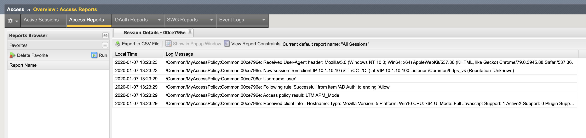
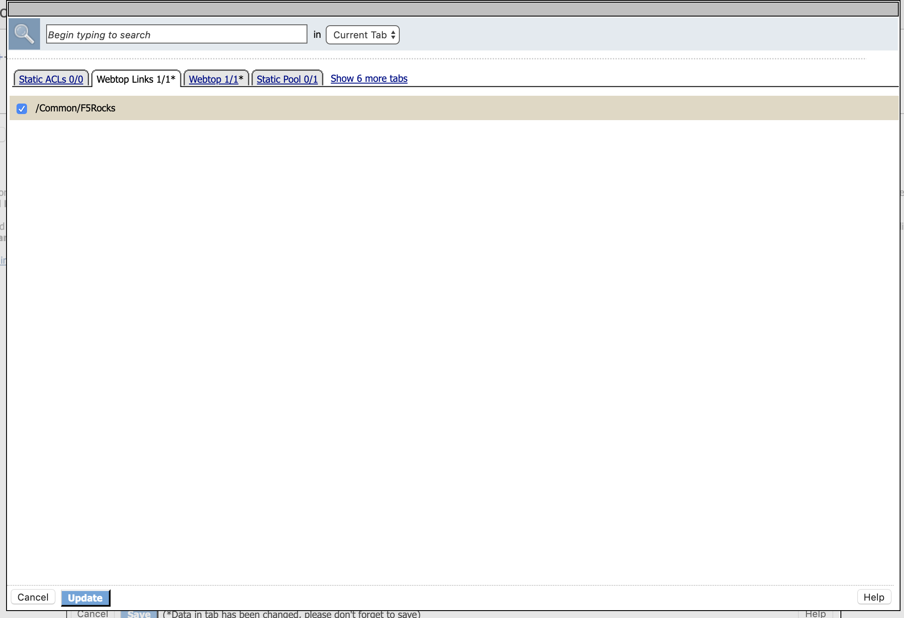

Lab 2: IDaaS SAML Identity Provider (iDP) Lab (OKTA)
====================================================

The purpose of this lab is to configure and test a IDaaS SAML Identity
Provider. Students will configure a IDaaS based SAML Identity Provider
(in this case OKTA) and import and bind to a SAML Service Provider and
test IdP-Initiated and SP-Initiated SAML Federation.

Objective:
----------

-  Gain an understanding of integrating a IDaaS SAML Identity
   Provider(IdP)

-  Gain an understanding of the access flow for IdP-Initiated SAML

Lab Requirements:
-----------------

-  All Lab requirements will be noted in the tasks that follow

-  Estimated completion time: 25 minutes

Lab 2 Tasks:
------------

TASK 1: Sign Up for OKTA Developer Account 
~~~~~~~~~~~~~~~~~~~~~~~~~~~~~~~~~~~~~~~~~~

Refer to the instructions and screen shots below:

+----------------------------------------------------------------------------------------------+
| *Note: The following steps provide instruction for setting up an OKTA developer account.*    |
|                                                                                              |
| *If you already have one, you may elect to use that account. Understand, however, that the*  |
|                                                                                              |
| *instructions below may need to be modified to match your environment.*                      |
+----------------------------------------------------------------------------------------------+

+----------------------------------------------------------------------------------------------+
| 1. Sign Up for an OKTA developer account by navigating to:                                   |
|                                                                                              |
|  **https://developer.okta.com/signup/** and using a VALID email and click **Get Started**    |
|                                                                                              |
| 2. Additional instructions will be sent to the email address provided.                       |     
+----------------------------------------------------------------------------------------------+
| |image26|                                                                                    |
+----------------------------------------------------------------------------------------------+

+----------------------------------------------------------------------------------------------+
| 3. Following the instructions received from the generated email, sign on to the OKTA         |
|                                                                                              |
|    development environment with your provided, temporary password.                           |
+----------------------------------------------------------------------------------------------+
| |image27|                                                                                    |
+----------------------------------------------------------------------------------------------+

+----------------------------------------------------------------------------------------------+
| 4. Enter a **New Password** and the **Repeat New Password**                                  |
|                                                                                              |
| 5. Use the drop down to select a **Forgot Password Question** and provide the Answer         |
|                                                                                              |
| 6. Click a **Security Image**                                                                |
|                                                                                              |
| 7. Click **Create My Account**                                                               |
+----------------------------------------------------------------------------------------------+
| |image28|                                                                                    |
+----------------------------------------------------------------------------------------------+
 
TASK 2: OKTA Classic UI 
~~~~~~~~~~~~~~~~~~~~~~~

Refer to the instructions and screen shots below:

+----------------------------------------------------------------------------------------------+
| 1. For the purposes of the lab and SAML development, we will be using the OKTA Classic UI    |
|                                                                                              |
|   which provides access to SAML configurations. *(Note: At lab publication, the Developer*   |
|                                                                                              |
|   *Console did not have SAML resources.)*                                                    |
|                                                                                              |     
| 2. In the top, left hand corner click the **<>** & select **Classic UI** from the drop down. |
+----------------------------------------------------------------------------------------------+
| |image29|                                                                                    |
+----------------------------------------------------------------------------------------------+

TASK 3: Enable OKTA Multi-Factor Authentication [OPTIONAL]
~~~~~~~~~~~~~~~~~~~~~~~~~~~~~~~~~~~~~~~~~~~~~~~~~~~~~~~~~~

Refer to the instructions and screen shots below:

+----------------------------------------------------------------------------------------------+
| *Note: Enabling MFA will require a Smart Device with the appropriate OKTA client for your OS*|
|                                                                                              |
| *The step can be skipped if you prefer to just use UserID/Password*                          |
|                                                                                              |
| 1. Click **Security** from the top navigation, then click **Multifactor**                    |
+----------------------------------------------------------------------------------------------+
| |image30|                                                                                    |
+----------------------------------------------------------------------------------------------+

+----------------------------------------------------------------------------------------------+
| 2. Check **OKTA Verify**                                                                     |
|                                                                                              |
| 3. Ensure that **Enable Push Verification** & (optionally) that                              |
|                                                                                              |
|    **Require TouchID for OKTA Verify** is checked.                                           |
|                                                                                              |
| 4. Click **Save**                                                                            |
+----------------------------------------------------------------------------------------------+
| |image31|                                                                                    |
+----------------------------------------------------------------------------------------------+

TASK 4: Build SAML Application - OKTA 
~~~~~~~~~~~~~~~~~~~~~~~~~~~~~~~~~~~~~

Refer to the instructions and screen shots below:

+----------------------------------------------------------------------------------------------+
| 1. In the main menu, click **Applications** in the top navigation.                           |
+----------------------------------------------------------------------------------------------+
| |image32|                                                                                    |
+----------------------------------------------------------------------------------------------+

+----------------------------------------------------------------------------------------------+
| 2. Click **Create New App** in the **Add Application Menu**                                  |
+----------------------------------------------------------------------------------------------+
| |image33|                                                                                    |
+----------------------------------------------------------------------------------------------+

+----------------------------------------------------------------------------------------------+
| 3. In the **Create a New Application Integration** dialogue box, select **Web** from the     |
|                                                                                              |
|    drop down for **Platform**.                                                               |
|                                                                                              |
| 4. Select the **SAML 2.0** radio button for **Sign on Method** and click **Create**.         |
+----------------------------------------------------------------------------------------------+
| |image34|                                                                                    |
+----------------------------------------------------------------------------------------------+

+----------------------------------------------------------------------------------------------+
| 5. In the **Create SAML Integration** screen, enter **app.f5demo.com** for the **App Name**. |
|                                                                                              |
| 6. Leave all other values as default and click **Next**.                                     |
+----------------------------------------------------------------------------------------------+
| |image35|                                                                                    |
+----------------------------------------------------------------------------------------------+

+----------------------------------------------------------------------------------------------+
| 7. In the **Edit SAML Integration** screen, enter the following values                       |
|                                                                                              |
| 8. In the **SAML Setting** section                                                           |
|                                                                                              |
|   -  **Single Sign on URL:** **https://app.f5demo.com/saml/sp/profile/post/acs**             |
|                                                                                              |
|   -  **Audience URI (SP Entity ID):** **https://app.f5demo.com**                             |
|                                                                                              |
| 9. Leave all other values as default and click **Next**.                                     |
+----------------------------------------------------------------------------------------------+
| |image36|                                                                                    |
+----------------------------------------------------------------------------------------------+

+----------------------------------------------------------------------------------------------+
| 10. In the **Create SAML Integration** screen, select the:                                   |
|                                                                                              |
|    **“I’m an OKTA customer adding an internal app”** radio button for                        |
|                                                                                              |
|    **Are you a customer or partner?**                                                        |
|                                                                                              |
| 11. In the resulting expanded window, select:                                                |
|                                                                                              |
|    **“This is an internal app that we have created”** for **App Type**                       |
|                                                                                              |
|    and click **Finish**.                                                                     |
+----------------------------------------------------------------------------------------------+
| |image37|                                                                                    |
+----------------------------------------------------------------------------------------------+

+----------------------------------------------------------------------------------------------+
| 12. In the resulting application screen for **app.f5demo.com**, navigate to the              |
|                                                                                              |
|    **SAML 2.0 section**.                                                                     |
|                                                                                              |
| 13. Right Click the **Identity Provider Metadata** hyperlink and click **Save Link As …**    |
|                                                                                              |
| 14. Save the **metadata.xml** to your jumphost desktop. We will be using it in a later step  |
|                                                                                              |
|     in the Lab.                                                                              |
+----------------------------------------------------------------------------------------------+
| |image38|                                                                                    |
+----------------------------------------------------------------------------------------------+

TASK 5: Add User to SAML Application 
~~~~~~~~~~~~~~~~~~~~~~~~~~~~~~~~~~~~

Refer to the instructions and screen shots below:

+----------------------------------------------------------------------------------------------+
| 1. Within the **app.f5demo.com** application screen, Click **Assignments** then **Assign**   |
+----------------------------------------------------------------------------------------------+
| |image39|                                                                                    |
+----------------------------------------------------------------------------------------------+

+----------------------------------------------------------------------------------------------+
| 2. In the **Assign app.f5demo.com to People** dialogue box, select your **User ID** and then |
|                                                                                              |
|    click **Done**.                                                                           |
+----------------------------------------------------------------------------------------------+
| |image40|                                                                                    |
+----------------------------------------------------------------------------------------------+

TASK 6: Add Multi-Factor Authentication Sign-On Policy [OPTIONAL]
~~~~~~~~~~~~~~~~~~~~~~~~~~~~~~~~~~~~~~~~~~~~~~~~~~~~~~~~~~~~~~~~~

Refer to the instructions and screen shots below:

+----------------------------------------------------------------------------------------------+
| **[OPTIONAL]**                                                                               |
|                                                                                              |
| 1. Within the **app.f5demo.com** application screen, Click **Sign On**                       |
+----------------------------------------------------------------------------------------------+
| |image41|                                                                                    |
+----------------------------------------------------------------------------------------------+

+----------------------------------------------------------------------------------------------+
| **[OPTIONAL]**                                                                               |
|                                                                                              |
| 2. Scroll down to the **Sign On Policy** section and click **Add Rule**                      |
+----------------------------------------------------------------------------------------------+
| |image42|                                                                                    |
+----------------------------------------------------------------------------------------------+

+----------------------------------------------------------------------------------------------+
| **[OPTIONAL]**                                                                               |
|                                                                                              | 
| 3. In the **Add Sign On Rule** dialogue box, enter **MFA** for the **Rule Name**.            |
|                                                                                              |
| 4. Scroll down to the **Actions** section.                                                   |
+----------------------------------------------------------------------------------------------+
| |image43|                                                                                    |
+----------------------------------------------------------------------------------------------+

+----------------------------------------------------------------------------------------------+
| **[OPTIONAL]**                                                                               |
|                                                                                              |
| 5. In the **Actions** section, under **Access**, check the box for **Prompt for factor**.    |
|                                                                                              |
| 6. Ensure **Every Sign On** radio button is selected.                                        |
|                                                                                              |
| 7. Click **Save**.                                                                           |
+----------------------------------------------------------------------------------------------+
| |image44|                                                                                    |
+----------------------------------------------------------------------------------------------+

+----------------------------------------------------------------------------------------------+
| **[OPTIONAL]**                                                                               |
|                                                                                              |
| 8. Review and verify the completed **Sign On Policy**.                                       |
+----------------------------------------------------------------------------------------------+
| |image45|                                                                                    |
+----------------------------------------------------------------------------------------------+

TASK 7: Create the External IDP Connector
~~~~~~~~~~~~~~~~~~~~~~~~~~~~~~~~~~~~~~~~~

Refer to the instructions and screen shots below:

+----------------------------------------------------------------------------------------------+
| 1. Login to your lab provided **Virtual Edition BIG-IP**                                     |
|                                                                                              |
| 2. Begin by selecting: **Access** -> **Federation** -> **SAML Service Provider** ->          |
|                                                                                              |
|    **External IdP Connectors**.                                                              |
+----------------------------------------------------------------------------------------------+
| |image46|                                                                                    |
+----------------------------------------------------------------------------------------------+

+----------------------------------------------------------------------------------------------+
| 3. In the **External IdP Connectors** screen, click the **downward arrow** next to the word  |
|                                                                                              |
|    **Create** on the **Create** button (right side)                                          |
|                                                                                              |
| 4. Select **From Metadata** from the drop down menu                                          |
+----------------------------------------------------------------------------------------------+
| |image47|                                                                                    |
+----------------------------------------------------------------------------------------------+

+----------------------------------------------------------------------------------------------+
| 5. In the **Create New SAML IdP Connector** dialogue box, use the **Browse** button to       |
|                                                                                              |
|    select the **metadata.xml** from the desktop (created in Task 4).                         | 
|                                                                                              |
| 6. Name the **Identity Provider Name**: **OKTA\_SaaS-iDP**.                                  |
|                                                                                              |
| 7. Click **OK**.                                                                             |
+----------------------------------------------------------------------------------------------+
| |image48|                                                                                    |
+----------------------------------------------------------------------------------------------+

TASK 8: Change the SAML SP Binding
~~~~~~~~~~~~~~~~~~~~~~~~~~~~~~~~~~
Refer to the instructions and screen shots below:

+----------------------------------------------------------------------------------------------+
| 1. Begin by selecting: **Access** -> **Federation** -> **SAML Service Provider** ->          |
|                                                                                              |
|    **Local SP Services**                                                                     |
|                                                                                              |
| 2. Select the checkbox next to **app.f5demo.com** and click **Bind\\UnBind IdP Connectors**  |
+----------------------------------------------------------------------------------------------+
| |image49|                                                                                    |
+----------------------------------------------------------------------------------------------+

+----------------------------------------------------------------------------------------------+
| 3. Delete/Remove the existing binding                                                        |
|                                                                                              |
| 4. Click **Add New Row** and use the following values                                        |
|                                                                                              |
|    -  **SAML IdP Connectors:** **/Common/OKTA\_SaaS-iDP**                                    |
|                                                                                              |
|    -  **Matching Source:** **%{session.server.landinguri}**                                  |
|                                                                                              |
|    -  **Matching Value:** /*                                                                 |
|                                                                                              |
| 5. Click **Update** then **OK**.                                                             |
+----------------------------------------------------------------------------------------------+
| |image50|                                                                                    |
+----------------------------------------------------------------------------------------------+

TASK 9: Apply Access Policy Changes
~~~~~~~~~~~~~~~~~~~~~~~~~~~~~~~~~~~
Refer to the instructions and screen shots below:

+----------------------------------------------------------------------------------------------+
| 1. Click the **Apply Access Policy** link in the top left corner of the Admin GUI            |
+----------------------------------------------------------------------------------------------+
| |image51|                                                                                    |
+----------------------------------------------------------------------------------------------+

+----------------------------------------------------------------------------------------------+
| 2. Ensure **app.f5demo.com-policy** is checked and click **Apply**                           |
+----------------------------------------------------------------------------------------------+
| |image52|                                                                                    |
+----------------------------------------------------------------------------------------------+

TASK 10 – Test Access to the app.f5demo.com application
~~~~~~~~~~~~~~~~~~~~~~~~~~~~~~~~~~~~~~~~~~~~~~~~~~~~~~~

Refer to the instructions and screen shots below:

+----------------------------------------------------------------------------------------------+
| *Note: Those who enabled MFA access will be required to activate their second factor for*    |
|                                                                                              |
| *application access.*                                                                        |
|                                                                                              |
| 1. Follow the necessary prompts as directed.                                                 |
+----------------------------------------------------------------------------------------------+
| |image53|                                                                                    |
| |image54|                                                                                    |
| |image55|                                                                                    |
+----------------------------------------------------------------------------------------------+

+----------------------------------------------------------------------------------------------+
| 2. Using your browser from the Jump Host click on the provided bookmark or navigate to:      |
|                                                                                              |
|    https://app.f5demo.com                                                                    |
+----------------------------------------------------------------------------------------------+
| |image56|                                                                                    |
+----------------------------------------------------------------------------------------------+

+----------------------------------------------------------------------------------------------+
| 3. Did you successfully redirect to the OKTA SaaS IdP?                                       |
|                                                                                              |
| 4. Login to the iDP, were you successfully authenticated? Were you prompted for MFA          |
|                                                                                              |
|    if configured?                                                                            |
|                                                                                              |
| 5. After successful authentication, were you returned to the SAML SP?                        |
|                                                                                              |
| 6. Were you successfully authenticated (SAML)?                                               |
|                                                                                              |
| 7. Review your **Active Sessions** (**Access Overview** -> **Active Sessions**).             |
|                                                                                              |
| 8. Review your Access Report Logs (**Access Overview** -> **Access Reports**).               |
+----------------------------------------------------------------------------------------------+
| |image57|                                                                                    |
+----------------------------------------------------------------------------------------------+

+----------------------------------------------------------------------------------------------+
| 9. Destroy your Active Session by nagivating to **Access Overview** -> **Active Sessions**   |
|                                                                                              |
|    Select the checkbox next to your session and click the **Kill Selected Session** button.  |
+----------------------------------------------------------------------------------------------+
| |image58|                                                                                    |
+----------------------------------------------------------------------------------------------+

+----------------------------------------------------------------------------------------------+
| 10. Close your browser and logon to your **https://dev-<Dev-ID>.oktapreview.com** account.   |
|                                                                                              |
|    Click on your **app.f5demo.com** application for IDP initiated Access.                    |
|                                                                                              |
| 11. After successful authentication, were you returned to the SAML SP?                       |
|                                                                                              |
| 12. Were you successfully authenticated (SAML)?                                              |
|                                                                                              |
| 13. Review your **Active Sessions** (**Access Overview** -> **Active Sessions**).            |
|                                                                                              |
| 14. Review your Access Report Logs (**Access Overview** -> **Access Reports**).              |
+----------------------------------------------------------------------------------------------+
| |image59|                                                                                    |
+----------------------------------------------------------------------------------------------+

.. |image22| image:: media/image24.png
   :width: 3.12075in
   :height: 1.43714in

.. |image25| image:: media/image27.png
   :width: 3.48173in
   :height: 2.62090in
.. |image26| image:: media/image28.png
   :width: 3.65172in
   :height: 1.65644in

.. |image30| image:: media/image32.png
   :width: 3.40491in
   :height: 1.18125in
.. |image31| image:: media/image33.png
   :width: 2.92025in
   :height: 3.13718in
.. |image32| image:: media/image34.png
   :width: 3.52521in
   :height: 1.67580in
.. |image33| image:: media/image35.png
   :width: 3.42355in
   :height: 1.57385in
.. |image34| image:: media/image36.png
   :width: 3.32812in
   :height: 1.90502in
.. |image35| image:: media/image37.png
   :width: 3.31187in
   :height: 2.30806in
.. |image36| image:: media/image38.png
   :width: 3.24757in
   :height: 2.40753in
.. |image37| image:: media/image39.png
   :width: 3.31528in
   :height: 1.80296in
.. |image38| image:: media/image40.png
   :width: 3.33472in
   :height: 3.67040in
.. |image39| image:: media/image41.png
   :width: 3.27878in
   :height: 0.92046in
.. |image40| image:: media/image42.png
   :width: 3.12813in
   :height: 1.69163in
.. |image41| image:: media/image43.png
   :width: 3.22523in
   :height: 0.52038in
.. |image42| image:: media/image44.png
   :width: 3.23750in
   :height: 1.20928in
.. |image43| image:: media/image45.png
   :width: 3.29965in
   :height: 2.28233in
.. |image44| image:: media/image46.png
   :width: 3.35967in
   :height: 2.30729in
.. |image45| image:: media/image47.png
   :width: 3.33229in
   :height: 1.96747in
.. |image46| image:: media/image48.png
   :width: 3.23750in
   :height: 2.11911in

.. |image48| image:: media/image50.png
   :width: 3.34429in
   :height: 2.45452in
.. |image49| image:: media/image51.png
   :width: 3.55668in
   :height: 0.58963in
.. |image50| image:: media/image52.png
   :width: 3.55455in
   :height: 1.80809in
.. |image51| image:: media/image53.png
   :width: 3.50192in
   :height: 0.74026in
.. |image52| image:: media/image54.png
   :width: 3.46558in
   :height: 1.04152in
.. |image53| image:: media/image55.png
   :width: 1.18229in
   :height: 1.49240in
.. |image54| image:: media/image56.png
   :width: 1.01568in
   :height: 1.50521in
.. |image55| image:: media/image57.png
   :width: 1.07076in
   :height: 1.47917in
.. |image56| image:: media/image58.png
   :width: 3.47185in
   :height: 0.49895in
.. |image57| image:: media/image59.png
   :width: 3.22424in
   :height: 2.40961in
