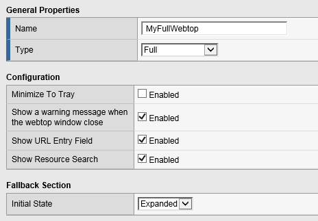

Lab 2: Webtop Access Policy Build
============================================

In this lab, we will add a Webtop resource to the Access Policy
created in the previous lab.

Lab Requirements
----------------

  - Working HTTPS Virtual Server with Access Policy Created in Lab 1 (Lab 1 successfully completed).

Task – Create a Webtop resource
~~~~~~~~~~~~~~~~~~~~~~~~~~~~~~~

#. Expand the **Access** tab from the main menu on the left and navigate
   to **Webtops** > **Webtop Lists**.

#. Click **Create** to create a new Webtop called **MyFullWebtop**,
   select Type “\ **Full**\ ”, uncheck “\ **Minmize To Tray**\ ” and
   click **Finished**.

   |image38|

Task – Create Webtop Item
~~~~~~~~~~~~~~~~~~~~~~~~~~~~~~~~~~~~~~~~~~~~~~~~~~~~~
#. Browse to **Access** > **Webtops >** **Webtop Link** and click create.

#. Complete the following entries.

      - Name: F5Rocks
      - Link Type Dropdown: Application URI
      - Applicatoin URI : https://www.f5.com
      - Application Caption : F5 Rocks.

   |image39|

   |image45|

Task – Add Webtop resource to existing Access Policy
~~~~~~~~~~~~~~~~~~~~~~~~~~~~~~~~~~~~~~~~~~~~~~~~~~~~

#. Browse to **Access** > **Profiles / Policies > Access Profiles
   (Per-Session Policies)**, click on **Edit** for **MyAccessPolicy**. A
   new tab should open to the Visual Policy Editor for **MyAccessPolicy**.

   |image40|

#. In between the AD Auth APM Item and the Allow APM item click the + option to add an item.
   
   |image46|

#. Select the **Advanced Resource Assign** object. Click on the "Assignment Tab" and select the "Advanced Resource Assign"
   radio button. Click **Add Item**.

   |image47|

#. Then Click the "Add New Entry" button. 

   |image48|

#. Then under the "Expression Section" click the "Add/Delete" button

#. | Click on the **Webtop** tab, select the radio button for
     **MyFullWebtop**. Click on the **Webop Links** tab, and select the radio button for **F5Rocks**
     then click the **Update** button at the bottom of
     the screen.

   |image49|

#. Click **Save**.

#. | At the top left of the browser window, click on “\ **Apply Access
     Policy**\ ”, then close the tab.

   |image42|

Task – Testing
~~~~~~~~~~~~~~

#. Open a web browser to the virtual server created in the previous lab
   by navigating to **https://server1.acme.com**. You will be presented
   with a Logon page similar to the one from the last lab.

#. Enter the following credentials:

   Username: **user1**

   Password: **user1**

#. Click **Logon**.

   This will open the APM Webtop landing page that shows the resources you
   are allowed to access. In this lab, we’ve only configured one resource: 
   **F5 Rocks**, but you can add as many as you want and they will
   appear on this Webtop page.

   |image43|

.. |image40| image:: media/image41.png
   :width: 7.18in
   :height: 3.21in
.. |image41| image:: media/image42.png
   :width: 3.89583in
   :height: 0.98194in
.. |image42| image:: media/image43.png
   :width: 1.90000in
   :height: 0.40000in
.. |image43| image:: media/image44.png
   :width: 7.31in
   :height: 6.32in
.. |image45| image:: media/image45.png
   :width: 9.39in
   :height: 6.17in
.. |image46| image:: media/image46.png
   :width: 6.71in
   :height: 2.54in
.. |image47| image:: media/image47.png
   :width: 11.4in
   :height: 3.82in
.. |image48| image:: media/image48.png
   :width: 11.4in
   :height: 3.82in
.. |image49| image:: media/image49.png
   :width: 14.42in
   :height: 9.86in
