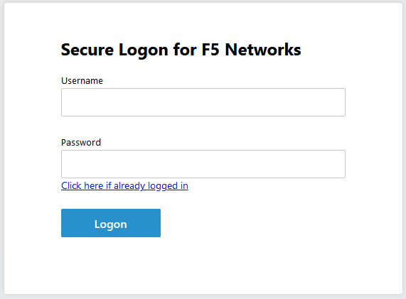
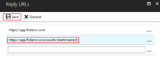
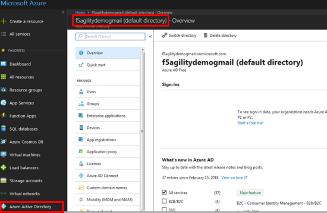
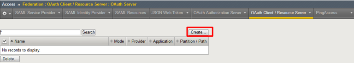
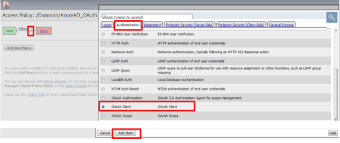
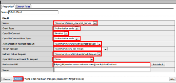
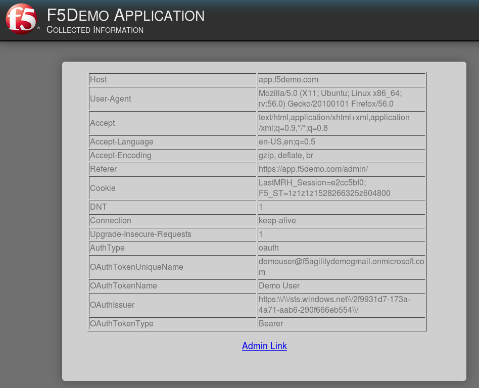
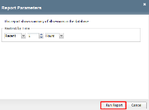

Lab 4: oAuth and AzureAD Lab
============================

The purpose of this lab is to familiarize the Student with the using APM
in conjunction with Microsoft Azure AD. Microsoft Active Directory
Domain Services is offered by Microsoft Azure as a cloud service. This
can be used together with OpenID to log in to APM.

Objective:
----------

-  Gain an understanding of additional F5 OAuth features

-  Deploy a working configuration using F5 APM and Microsoft Azure AD

Lab Requirements:
-----------------

-  All lab requirements will be noted in the tasks that follow

-  Estimated completion time: 25 minutes

Lab 4 Tasks:
------------

TASK 1: Create/Review New Application Registration
~~~~~~~~~~~~~~~~~~~~~~~~~~~~~~~~~~~~~~~~~~~~~~~~~~

Refer to the instructions and screen shots below:

+-----------------------------------------------------------------------------------------------+
| *Note: The following steps in this task can just be "REVIEWED". As setting up a free Azure*   |
|                                                                                               |
| *account requires the entry of billing information, setting up an account and performing the* |
|                                                                                               |
| *steps below is a [REVIEW] task. For those desiring to set up an account refer to the*        |
|                                                                                               |
| *"APPENDIX: Setting up an Azure Development Account". For those with existing accounts*       |
|                                                                                               |
| *these steps may be followed if desired. For all others, simply review the steps in*          |
|                                                                                               |
| *Task1 and proceed to Task 2.*                                                                |
+-----------------------------------------------------------------------------------------------+

+----------------------------------------------------------------------------------------------+
| **[REVIEW]**                                                                                 |
|                                                                                              |
| 1. Log into the Microsoft Azure Dashboard and click  **Azure Active Directory** in the left  |
|                                                                                              |
|    navigation menu.                                                                          |
+----------------------------------------------------------------------------------------------+
| |image99|                                                                                    |
+----------------------------------------------------------------------------------------------+

+----------------------------------------------------------------------------------------------+
| **[REVIEW]**                                                                                 |
|                                                                                              |
| 2. Click on **App Registration** on the resulting menu and then                              |
|                                                                                              |
|    **New Application Registration** on the flyout menu.                                      |
+----------------------------------------------------------------------------------------------+
| |image100|                                                                                   |
+----------------------------------------------------------------------------------------------+

+----------------------------------------------------------------------------------------------+
| **[REVIEW]**                                                                                 |
|                                                                                              |
| 3. In the pop menu for **Create App Registration**, enter the following values               | 
|                                                                                              |
| -  **Name:** **app.f5demo.com**                                                              |
|                                                                                              |
| -  **Application Type:** **Web App /API**                                                    |
|                                                                                              |
| -  **Sign On URL:** **https://app.f5demo.com**                                               |
|                                                                                              |
| 4. Click **Create**.                                                                         |
+----------------------------------------------------------------------------------------------+
| |image101|                                                                                   |
+----------------------------------------------------------------------------------------------+
 
+----------------------------------------------------------------------------------------------+
| **[REVIEW]**                                                                                 |
|                                                                                              |
| 5. In the resulting **app.f5demo.com Registered App** window, note & copy the                |
|                                                                                              |
|    **Application ID**. This will be used in a later setup step                               |
|                                                                                              |
| 6. Click **Settings**.                                                                       |
+----------------------------------------------------------------------------------------------+
| |image102|                                                                                   |
+----------------------------------------------------------------------------------------------+

+----------------------------------------------------------------------------------------------+
| **[REVIEW]**                                                                                 |
|                                                                                              |
| 7. In the **Settings** flyout panel, click **Keys**                                          |
+----------------------------------------------------------------------------------------------+
| |image103|                                                                                   |
+----------------------------------------------------------------------------------------------+

+----------------------------------------------------------------------------------------------+
| **[REVIEW]**                                                                                 |
|                                                                                              |
| 8. In the **Keys** flyout panel, enter the following values                                  |
|                                                                                              |
| -  **Description:** **app.f5demo.com**                                                       |
|                                                                                              |
| -  **Expires:** **In 2 Years**                                                               |
|                                                                                              |
| 9. Click **Save**.                                                                           |
+----------------------------------------------------------------------------------------------+
| |image104|                                                                                   |
+----------------------------------------------------------------------------------------------+

+----------------------------------------------------------------------------------------------+
| **[REVIEW]**                                                                                 |
|                                                                                              |
| 10. Note the message provided by Azure in the **Keys** panel.                                |
|                                                                                              |
| 11. Copy the ***Key Value*** for use in a later setup step.                                  |
+----------------------------------------------------------------------------------------------+
| |image105|                                                                                   |
+----------------------------------------------------------------------------------------------+
 
+----------------------------------------------------------------------------------------------+
| **[REVIEW]**                                                                                 |
|                                                                                              |
| 12. In the **Settings** flyout panel, click **Reply URL**.                                   |
+----------------------------------------------------------------------------------------------+
| |image106|                                                                                   |
+----------------------------------------------------------------------------------------------+

+----------------------------------------------------------------------------------------------+
| **[REVIEW]**                                                                                 |
|                                                                                              |
| 13. In the **Reply URL** flyout panel, enter                                                 |
|                                                                                              |
|     **https://app.f5demo.com/oauth/client/redirect**                                         |
|                                                                                              |
| 14. Click **Save**.                                                                          |
+----------------------------------------------------------------------------------------------+
| |image107|                                                                                   |
+----------------------------------------------------------------------------------------------+

+----------------------------------------------------------------------------------------------+
| **[REVIEW]**                                                                                 |
|                                                                                              |
| 15. In the **Settings** flyout panel, click **Required Permissions**                         |
|                                                                                              |
| 16. In the **Required Permissions** flyout panel, click **Grant Permissions**                |
+----------------------------------------------------------------------------------------------+
| |image108|                                                                                   |
+----------------------------------------------------------------------------------------------+

+----------------------------------------------------------------------------------------------+
| **[REVIEW]**                                                                                 |
|                                                                                              |
| 17. The following **Required Permissions** dialogue box may appear.                          |
|                                                                                              |
| 18. Click **Yes** to proceed.                                                                |
+----------------------------------------------------------------------------------------------+
| |image109|                                                                                   |
+----------------------------------------------------------------------------------------------+

+----------------------------------------------------------------------------------------------+
| **[REVIEW]**                                                                                 |
|                                                                                              |
| 19. In the **Required Permissions** flyout panel, click **Windows Azure Active Directory**.  |
|                                                                                              |
| 20. In the **Enable Access** flyout panel, ensure the **Sign In and Read User Profile**.     |
|                                                                                              |
|     permission is checked.                                                                   |
|                                                                                              |
| 21. Click **Save**.                                                                          |
+----------------------------------------------------------------------------------------------+
| |image110|                                                                                   |
+----------------------------------------------------------------------------------------------+

+----------------------------------------------------------------------------------------------+
| **[REVIEW]**                                                                                 |
|                                                                                              |
| 22. In the **Registered Application** panel, click **Manifest**.                             |
|                                                                                              |
| 23. In the **Edit Manifest** flyout panel, edit the **groupMembershipClaims** line (line 7)  |
|                                                                                              |
|     from **null** to **“All”** (note quotes are required).                                   |
|                                                                                              |
| 24. Click **Save**.                                                                          |
|                                                                                              |
| *Note: You can also update groupMembershipClaims to be "SecurityGroup".*                     |
+----------------------------------------------------------------------------------------------+
| |image111|                                                                                   |
+----------------------------------------------------------------------------------------------+

TASK 2: Create OAuth Request
~~~~~~~~~~~~~~~~~~~~~~~~~~~~

Refer to the instructions and screen shots below:

+----------------------------------------------------------------------------------------------+
| 1. Create the **OAuth Request** by navigating to **Access** -> **Federation** ->             |
|                                                                                              |
|    **OAuth Client/Resource Server** -> **Request** and clicking **Create**                   |
+----------------------------------------------------------------------------------------------+
| |image112|                                                                                   |
+----------------------------------------------------------------------------------------------+

+----------------------------------------------------------------------------------------------+
| 2. Use the following values to create the Request                                            |
|                                                                                              |
| -  **Name:** **Azure\_AD\_Token**                                                            |
|                                                                                              |
| -  **HTTP Method:** **POST**                                                                 |
|                                                                                              |
| -  **Type:** **token-request**                                                               |
|                                                                                              |
| 3. Create the following Request Parameters using the Parameter Type drop down:               |
|                                                                                              |
| -  **Parameter Type:** **client-id**                                                         |
|                                                                                              |
| -  **Parameter Name:** **client\_id** (notice \_ )                                           |
|                                                                                              |
| -  **Parameter Type:** **client-secret**                                                     |
|                                                                                              |
| -  **Parameter Name:** **client\_secret** (notice \_ )                                       |
|                                                                                              |
| -  **Parameter Type:** **grant-type**                                                        |
|                                                                                              |
| -  **Parameter Name:** **grant\_type** (notice \_ )                                          |
|                                                                                              |
| -  **Parameter Type:** **redirect-uri**                                                      |
|                                                                                              |
| -  **Parameter Name:** **redirect\_uri** (notice \_ )                                        |
|                                                                                              |
| -  **Parameter Type:** **custom**                                                            |
|                                                                                              |
| -  **Parameter Name:** **resource**                                                          |
|                                                                                              |
| -  **Parameter Value:** **dd4bc4c7-2e90-41c9-9c41-b7eab5ab68b7**                             |
|                                                                                              |
| 4. Click **Finished**.                                                                       |
+----------------------------------------------------------------------------------------------+
| |image113|                                                                                   |
+----------------------------------------------------------------------------------------------+

TASK 3: Create OAuth Provider
~~~~~~~~~~~~~~~~~~~~~~~~~~~~~

Refer to the instructions and screen shots below:

+----------------------------------------------------------------------------------------------+
| 1. Create the **OAuth Provider** by navigating to **Access** -> **Federation** ->            |
|                                                                                              |
|    **OAuth Client/Resource Server** -> **Provider** and clicking **Create**.                 |
+----------------------------------------------------------------------------------------------+
| |image114|                                                                                   |
+----------------------------------------------------------------------------------------------+

+----------------------------------------------------------------------------------------------+
| 2. Use the following values to create the Request                                            |
|                                                                                              |
| -  **Name**: **f5demo\_AzureAD\_Provider**                                                   |
|                                                                                              |
| -  **Type**: **AzureAD**                                                                     |
|                                                                                              |
| -  **OpenID URI:** (replace **\_tennantID\_** with the following tenantID                    |
|                                                                                              |
|    **f5agilitydemogmail.onmicrosoft.com** )                                                  |
|                                                                                              |
| Resulting URI should be as follows:                                                          |
|                                                                                              |
| https://login.windows.net/f5agilitydemogmail.onmicrosoft.com/.well-known/openid-configuration|
|                                                                                              |
| 3. Click **Discover**.                                                                       |
|                                                                                              |
| 4. Click **Save**.                                                                           |
|                                                                                              |
| *Note: if using another account you can find you TenantID by navigating to the*              |
|                                                                                              |
| *"Azure Portal" and clicking "Azure Active Directory". The tenant ID is the*                 |
|                                                                                              |
| *"default directory" as shown. The full name of the TenantID will be your*                   |
|                                                                                              |
| *"TenantID.onmicrosoft.com"*                                                                 |
+----------------------------------------------------------------------------------------------+
| |image115|                                                                                   |
|                                                                                              |
| |image116|                                                                                   |
+----------------------------------------------------------------------------------------------+

TASK 4: Create OAuth Server
~~~~~~~~~~~~~~~~~~~~~~~~~~~

Refer to the instructions and screen shots below:

+----------------------------------------------------------------------------------------------+
| 1. Create the **OAuth Server (Client)** by navigating to **Access** -> **Federation** ->     |
|                                                                                              |
|    **OAuth Client/Resource Server** -> **OAuth Server*** and clicking **Create**.            |
+----------------------------------------------------------------------------------------------+
| |image117|                                                                                   |
+----------------------------------------------------------------------------------------------+

+----------------------------------------------------------------------------------------------+
| 2. Using the following values to complete the OAuth Provider                                 |
|                                                                                              |
| -  **Name:** **f5demo\_AzureAD\_Server**                                                     |
|                                                                                              |
| -  **Mode:** **Client**                                                                      |  
|                                                                                              |
| -  **Type:** **AzureAD**                                                                     |
|                                                                                              |
| -  **OAuth Provider:** **f5demo\_AzureAD\_Provider**                                         |
|                                                                                              |
| -  **DNS Resolver:** **proxy\_dns\_resolver**                                                |
|                                                                                              |
| -  **Client ID:** **dd4bc4c7-2e90-41c9-9c41-b7eab5ab68b7**                                   |
|                                                                                              |
| -  **Client Secret:**  **YqHbzTosdBxdaGl9A/hXCs1ex1HWi+BTUSkgcfhbTwA=**                      |
|                                                                                              |
| -  **Client’s Server SSL Profile Name:** **serverssl-insecure-compatible**                   |
|                                                                                              |
| 3. Click **Finished**.                                                                       |
+----------------------------------------------------------------------------------------------+
| |image118|                                                                                   |
+----------------------------------------------------------------------------------------------+

TASK 5: Setup F5 Per Session Policy (Access Policy) 
~~~~~~~~~~~~~~~~~~~~~~~~~~~~~~~~~~~~~~~~~~~~~~~~~~~

Refer to the instructions and screen shots below:

+----------------------------------------------------------------------------------------------+
| 1. Create the **Per Session Policy** by navigating to **Access** -> **Profile/Policies** ->  |
|                                                                                              |
|    **Access Profiles (Per Session Policies)** and clicking **Create**.                       |
+----------------------------------------------------------------------------------------------+
| |image119|                                                                                   |
+----------------------------------------------------------------------------------------------+

+----------------------------------------------------------------------------------------------+
| 2. In the **New Profile** dialogue window enter the following values                         |
|                                                                                              |
| -  **Name:** **AzureAD\_OAuth**                                                              |
|                                                                                              |
| -  **Profile Type:** **All**                                                                 |
|                                                                                              |
| -  **Profile Scope:** **Profile**                                                            |
|                                                                                              |
| -  **Language:** **English**                                                                 |
|                                                                                              |
| 3. Click **Finished**.                                                                       |
+----------------------------------------------------------------------------------------------+
| |image120|                                                                                   |
+----------------------------------------------------------------------------------------------+

+----------------------------------------------------------------------------------------------+
| 4. Click **Edit** link on for the **AzureAD\_OAuth** Access Policy                           |
+----------------------------------------------------------------------------------------------+
| |image121|                                                                                   |
+----------------------------------------------------------------------------------------------+

+------------------------------------------------------------------------------------------------+
| 5. In the **AzureAD\_OAuth** Access Policy, click the “\ **+**\ ” between **Start** & **Deny** |
|                                                                                                |
| 6. Click the **Authentication** tab in the events window.                                      |
|                                                                                                |
| 7. Scroll down and click the radio button for **OAuth Client**.                                |
|                                                                                                |
| 8. Click **Add Item**.                                                                         |
+------------------------------------------------------------------------------------------------+
| |image122|                                                                                     |
+------------------------------------------------------------------------------------------------+

+----------------------------------------------------------------------------------------------+
| 9. In the ***OAuth\_Client*** window enter the following values as shown:                    |
|                                                                                              |
| -  **Server:** **/Common/f5demo\_AzureAD\_Server**                                           |
|                                                                                              |
| -  **Grant Type:** **Authorization code**                                                    |
|                                                                                              |
| -  **OpenID Connect:** **Enabled**                                                           |
|                                                                                              |
| -  **OpenID Connect Flow Type:** **Authorization code**                                      |
|                                                                                              |
| -  **Authentication Redirect Request:** **/Common/AzureADAuthRedirectRequest**               |
|                                                                                              |
| -  **Token Request:** **/Common/Azure\_AD\_Token**                                           |
|                                                                                              |
| -  **Refresh Token Request:** **/Common/AzureADTokenRefreshRequest**                         |
|                                                                                              |
| -  **OpenID Connect UserInfo Request:** **None**                                             |
|                                                                                              |
| -  **Redirection URI:** **https://%{session.server.network.name}/oauth/client/redirect**     |
|                                                                                              |
| 10. Click **Save**.                                                                          |
+----------------------------------------------------------------------------------------------+
| |image123|                                                                                   |
+----------------------------------------------------------------------------------------------+

+----------------------------------------------------------------------------------------------+
| 11. Click on the **Deny** link, in the **Select Binding**, select the **Allow** radio button |
|                                                                                              |
|    and click **Save**.                                                                       |
+----------------------------------------------------------------------------------------------+
| |image124|                                                                                   |
+----------------------------------------------------------------------------------------------+

+----------------------------------------------------------------------------------------------+
| 12. Click on the **Apply Access Policy** link in the top left-hand corner.                   |
|                                                                                              |
| *Note: Additional actions can be taken in the Per Session policy (Access Policy). The lab*   |
|                                                                                              |
| *is simply completing authorization. Other access controls can be implemented based*         |
|                                                                                              |
| *on the use case.*                                                                           |
+----------------------------------------------------------------------------------------------+
| |image125|                                                                                   |
+----------------------------------------------------------------------------------------------+

TASK 6: Associate Access Policy to Virtual Server 
~~~~~~~~~~~~~~~~~~~~~~~~~~~~~~~~~~~~~~~~~~~~~~~~~

Refer to the instructions and screen shots below:

+----------------------------------------------------------------------------------------------+
| 1. Navigate to **Local Traffic** -> **Virtual Servers** -> **Virtual Server List** and       |
|                                                                                              |
|    click on the **app.f5demo.com** Virtual Server link                                       |
|                                                                                              |
| 2. Scroll to the **Access Policy** section.                                                  |
+----------------------------------------------------------------------------------------------+
| |image126|                                                                                   |
+----------------------------------------------------------------------------------------------+

+----------------------------------------------------------------------------------------------+
| 3. Use the **Access Profile** drop down to change the **Access Profile** to                  |
|                                                                                              |
|    **AzureAD\_OAuth**.                                                                       |
|                                                                                              |
| 4. Use the **Per-Request Policy** drop down to change the **Per-Request Policy** to          |
|                                                                                              |
|    **AzureAD\_oauth\_policy**.                                                               |
|                                                                                              |
| 5. Scroll to the bottom of the **Virtual Server** configuration and click **Update**.        |
+----------------------------------------------------------------------------------------------+
| |image127|                                                                                   |
+----------------------------------------------------------------------------------------------+

TASK 7: Test app.f5demo.com
~~~~~~~~~~~~~~~~~~~~~~~~~~~

Refer to the instructions and screen shots below:

+----------------------------------------------------------------------------------------------+
| 1. Navigate in your provided browser to **https://app.f5demo.com**                           |
+----------------------------------------------------------------------------------------------+
| |image128|                                                                                   |
+----------------------------------------------------------------------------------------------+

+----------------------------------------------------------------------------------------------+
| 2. Authenticate with the following AzureAD account:                                          |
|                                                                                              |
| -  **Username:** **demouser@f5agilitydemogmail.onmicrosoft.com**                             |
|                                                                                              |
| -  **Password:** **f5d3m0u$3r**                                                              |
+----------------------------------------------------------------------------------------------+
| |image129|                                                                                   |
+----------------------------------------------------------------------------------------------+

+----------------------------------------------------------------------------------------------+
| 3. Did you successfully redirect to the AzureAD?                                             |
|                                                                                              |
| 4. After successful authentication, were you returned to the app.f5demo.com?                 |
|                                                                                              |
| 5. Did you successfully pass your OAuth Token?                                               |
+----------------------------------------------------------------------------------------------+
| |image130|                                                                                   |
+----------------------------------------------------------------------------------------------+

TASK 8: Per Request Policy Controls
~~~~~~~~~~~~~~~~~~~~~~~~~~~~~~~~~~~

Refer to the instructions and screen shots below:

+----------------------------------------------------------------------------------------------+
| 1. As in the prior lab, you can experiment with Per Request Policy controls. In the          |
|                                                                                              |
| application page for **https://app.f5demo.com** click the **Admin Link** shown.              |
+----------------------------------------------------------------------------------------------+
| |image131|                                                                                   |
+----------------------------------------------------------------------------------------------+

+----------------------------------------------------------------------------------------------+
| 2. You will receive an **Access to this page is blocked** (customizable) message with a      |
|                                                                                              |
|    reference. You have been blocked because you do not have access on a per request basis.   |
|                                                                                              |
| 3. Press the **Back** button in your browser to return to **https://app.f5demo.com**.        |
+----------------------------------------------------------------------------------------------+
| |image132|                                                                                   |
+----------------------------------------------------------------------------------------------+

+----------------------------------------------------------------------------------------------+
| 4. Navigate to **Local Traffic** -> **iRules** -> **Datagroup List** and click on the        |
|                                                                                              |
|    **Allowed\_Users** datagroup.                                                             |
|                                                                                              |
| 5. Enter your **demouser@f5agilitydemogmail.onmicrosoft.com** used for this lab as the       |
|                                                                                              |
|    **String** value.                                                                         |
|                                                                                              |
| 6. Click **Add** then Click **Update**.                                                      |
|                                                                                              |
| *Note: We are using a DataGroup control to minimize lab resources and steps. AD or LDAP*     |
|                                                                                              |
| *Group memberships, Session variables, other user attributes and various other access*       |
|                                                                                              |
| *control mechanisms can be used to achieve similar results.*                                 |
+----------------------------------------------------------------------------------------------+
| |image133|                                                                                   |
+----------------------------------------------------------------------------------------------+

+----------------------------------------------------------------------------------------------+
| 7. You should now be able to successfully to access the Admin Functions by clicking on the   |
|                                                                                              |
|    Admin Link.                                                                               |
|                                                                                              |
| *Note: Per Request Policies are dynamic and do not require the same “Apply Policy” action*   |
|                                                                                              |
| *as Per Session Policies*.                                                                   |
+----------------------------------------------------------------------------------------------+
| |image134|                                                                                   |
+----------------------------------------------------------------------------------------------+

+----------------------------------------------------------------------------------------------+
| 8. To review the Per Request Policy, navigate to ***Access** -> **Profiles/Policies** ->     |
|                                                                                              |
|    **Per Request Policies** and click on the Edit link for the **AzureAD\_oauth\_policy**.   |
+----------------------------------------------------------------------------------------------+
| |image135|                                                                                   |
+----------------------------------------------------------------------------------------------+
 
+----------------------------------------------------------------------------------------------+
| 9. The various Per-Request-Policy actions can be reviewed.                                   |
|                                                                                              |
| *Note: Other actions like Step-Up Auth controls can be performed in a Per-Request Policy*    |
+----------------------------------------------------------------------------------------------+
| |image136|                                                                                   |
+----------------------------------------------------------------------------------------------+

TASK 9: Review OAuth Results 
~~~~~~~~~~~~~~~~~~~~~~~~~~~~

Refer to the instructions and screen shots below:

+----------------------------------------------------------------------------------------------+
| 1. Review your Active Sessions (**Access** -> **Overview** -> **Active Sessions**).          |
|                                                                                              |
| 2. You can review Session activity or session variable from this window or kill the          |
|                                                                                              |
|    selected Session.                                                                         |
+----------------------------------------------------------------------------------------------+
| |image137|                                                                                   |
+----------------------------------------------------------------------------------------------+

+----------------------------------------------------------------------------------------------+
| 3. Review your Access Report Logs (**Access** -> **Overview** -> **Access Reports**).        | 
+----------------------------------------------------------------------------------------------+
| |image138|                                                                                   |
+----------------------------------------------------------------------------------------------+

+----------------------------------------------------------------------------------------------+
| 4. In the **Report Parameters window** click **Run Report**.                                 |
+----------------------------------------------------------------------------------------------+
| |image139|                                                                                   |
+----------------------------------------------------------------------------------------------+

+----------------------------------------------------------------------------------------------+
| 5. Look at the **SessionID** report by clicking the **Session ID** Link.                     |
+----------------------------------------------------------------------------------------------+
| |image140|                                                                                   |
+----------------------------------------------------------------------------------------------+

+----------------------------------------------------------------------------------------------+
| 6. Look at the **Session Variables** report by clicking the **View Session Variables** link. |
|                                                                                              |
|    Pay attention to the OAuth Variables.                                                     |
|                                                                                              |
| *Note: Any of these session variables can be used to perform further actions to improve*     |
|                                                                                              |
| *security or constrain access with logic in the Per-Session or Per Request VPE policies*     |
|                                                                                              |
| *or iRules/iRulesLX.*                                                                        |
+----------------------------------------------------------------------------------------------+
| |image141|                                                                                   |
+----------------------------------------------------------------------------------------------+

+----------------------------------------------------------------------------------------------+
| 7. Review your Access Report Logs (**Access** -> **Overview** -> **OAuth Reports** ->        |  
|                                                                                              |
|    **Client/Resource Server**).                                                              |
+----------------------------------------------------------------------------------------------+
| |image142|                                                                                   |
+----------------------------------------------------------------------------------------------+

.. |image97| image:: media/image99.png
   :width: 3.62160in
   :height: 1.84971in

.. |image99| image:: media/image101.png
   :width: 3.53540in
   :height: 2.21472in
.. |image100| image:: media/image102.png
   :width: 3.57743in
   :height: 1.86503in
.. |image101| image:: media/image103.png
   :width: 3.51729in
   :height: 1.82209in
.. |image102| image:: media/image104.png
   :width: 3.50084in
   :height: 1.84049in
.. |image103| image:: media/image105.png
   :width: 3.46012in
   :height: 2.15172in
.. |image104| image:: media/image106.png
   :width: 3.44880in
   :height: 1.32496in
.. |image105| image:: media/image107.png
   :width: 3.48404in
   :height: 1.95989in
.. |image106| image:: media/image108.png
   :width: 3.42975in
   :height: 1.95950in

.. |image108| image:: media/image110.png
   :width: 3.34969in
   :height: 1.17463in
.. |image109| image:: media/image111.png
   :width: 3.10354in
   :height: 1.37929in
.. |image110| image:: media/image112.png
   :width: 3.21285in
   :height: 2.38037in
.. |image111| image:: media/image113.png
   :width: 3.49868in
   :height: 1.73941in
.. |image112| image:: media/image114.png
   :width: 3.57223in
   :height: 0.49387in
.. |image113| image:: media/image115.png
   :width: 3.51822in
   :height: 4.58896in
.. |image114| image:: media/image116.png
   :width: 3.50920in
   :height: 1.09553in
.. |image115| image:: media/image117.png
   :width: 3.48005in
   :height: 4.92024in

.. |image118| image:: media/image120.png
   :width: 3.52761in
   :height: 3.06445in
.. |image119| image:: media/image77.png
   :width: 3.74792in
   :height: 0.49354in
.. |image120| image:: media/image121.png
   :width: 3.52888in
   :height: 2.83435in
.. |image121| image:: media/image122.png
   :width: 3.52578in
   :height: 0.74560in

.. |image124| image:: media/image125.png
   :width: 3.46736in
   :height: 1.11639in
.. |image125| image:: media/image126.png
   :width: 3.55208in
   :height: 1.27646in
.. |image126| image:: media/image84.png
   :width: 3.50234in
   :height: 2.68712in
.. |image127| image:: media/image127.png
   :width: 3.54283in
   :height: 0.94203in
.. |image128| image:: media/image86.png
   :width: 3.57570in
   :height: 0.25694in
.. |image129| image:: media/image128.jpeg
   :width: 3.53525in
   :height: 1.87225in

.. |image131| image:: media/image130.png
   :width: 2.82477in
   :height: 2.26623in
.. |image132| image:: media/image90.png
   :width: 2.80941in
   :height: 1.35399in
.. |image133| image:: media/image91.png
   :width: 3.15971in
   :height: 2.33461in
.. |image134| image:: media/image92.png
   :width: 3.40586in
   :height: 1.10658in
.. |image135| image:: media/image131.png
   :width: 3.47790in
   :height: 1.47860in
.. |image136| image:: media/image132.png
   :width: 3.44664in
   :height: 0.99351in
.. |image137| image:: media/image133.png
   :width: 3.08095in
   :height: 1.31035in

.. |image139| image:: media/image135.png
   :width: 1.99074in
   :height: 0.45516in
.. |image140| image:: media/image136.png
   :width: 1.98052in
   :height: 0.89862in
.. |image141| image:: media/image137.png
   :width: 2.64361in
   :height: 2.43384in
.. |image142| image:: media/image138.png
   :width: 3.56993in
   :height: 1.64660in
.. |image143| image:: media/image139.png
   :width: 2.84352in
   :height: 1.33129in
.. |image144| image:: media/image140.png
   :width: 1.65644in
   :height: 1.35621in
.. |image145| image:: media/image141.png
   :width: 1.53374in
   :height: 1.34629in
.. |image146| image:: media/image142.png
   :width: 1.55828in
   :height: 1.56560in
