Lab 1: SAML Service Provider (SP) Lab
==========================================

.. toctree::
   :maxdepth: 1
   :glob:

The purpose of this lab is to configure and test a SAML Service
Provider (SP). Students will configure the various aspects of a SAML Service
Provider, import and bind to a SAML Identity Provider (IdP) and test
SP-Initiated SAML Federation.

Objective:
----------

-  Gain an understanding of SAML Service Provider(SP) configurations and
   its component parts

-  Gain an understanding of the access flow for SP-Initiated SAML

Lab Requirements:
-----------------

-  All Lab requirements will be noted in the tasks that follow

-  Estimated completion time: 25 minutes

Lab 1 Tasks:
-----------------

TASK 1: Configure the SAML Service Provider (SP)
~~~~~~~~~~~~~~~~~~~~~~~~~~~~~~~~~~~~~~~~~~~~~~~~

Refer to the instructions and screen shots below:

+----------------------------------------------------------------------------------------------+
| 1. Login to your lab provided **Virtual Edition BIG-IP**                                     |
|     - On your jumphost launch Chrome and click the bigip1 link from the app shortcut menu    |
|     - Login with credentials admin/admin                                                     |
|                                                                                              |
| 2. Begin by selecting: **Access -> Federation -> SAML Service Provider** ->                  |
|                                                                                              |
|    **Local SP Services**                                                                     |
|                                                                                              |
| 3. Click the **Create** button (far right)                                                   |
+----------------------------------------------------------------------------------------------+
| |image001|                                                                                   |
+----------------------------------------------------------------------------------------------+

+----------------------------------------------------------------------------------------------+
| 4. In the **Create New SAML SP Service**  dialogue box click **General Settings** in         |
|                                                                                              |
|    the left navigation pane and key in the following as shown:                               |
|                                                                                              |
|    -  **Name**: **app.acme.com**                                                             |
|                                                                                              |
|    -  **Entity ID**: **https://app.acme.com**                                                |
|                                                                                              |
|    *Note: The yellow box on Host will disappear when the Entity ID is entered.*              |
+----------------------------------------------------------------------------------------------+
| |image002|                                                                                   |
+----------------------------------------------------------------------------------------------+

+----------------------------------------------------------------------------------------------+
| 5. Click on the **Security Settings** in the left navigation menu.                           |
|                                                                                              |
| 6. Check the **Sign Authentication Request** checkbox                                        |
|                                                                                              |
| 7. Select **/Common/acme.com-wildcard** from drop down menu for the                          |
|    **Message Signing Private Key**                                                           |
|                                                                                              |
| 8. Select **/Common/acme.com-wildcard** from drop down menu for the                          |
|    **Message Signing Certificate**                                                           |
|                                                                                              |
| 9. Click **OK** on the dialogue box                                                          |
+----------------------------------------------------------------------------------------------+
| |image003|                                                                                   |
+----------------------------------------------------------------------------------------------+

TASK 2: Configure the External SAML IdP Connector
~~~~~~~~~~~~~~~~~~~~~~~~~~~~~~~~~~~~~~~~~~~~~~~~~

Refer to the instructions and screen shots below:

+----------------------------------------------------------------------------------------------+
| 1. Click on the **Access** -> **Federation** -> **SAML Service Provider** ->                 |
|                                                                                              |
|    **External IdP Connectors** or click on the **SAML Service Provider** tab in the          |
|                                                                                              |
|    horizontal navigation menu and select **External IdP Connectors**.                        |
|                                                                                              |
| 2. Click specifically on the **Down Arrow** next to the **Create** button (far right)        |
|                                                                                              |
| 3. Select **From Metadata** from the drop down menu                                          |
+----------------------------------------------------------------------------------------------+
| |image004|                                                                                   |
+----------------------------------------------------------------------------------------------+

+----------------------------------------------------------------------------------------------+
| 4. In the **Create New SAML IdP Connector** dialogue box, click **Browse** and select        |
|                                                                                              |
|    the **idp.acme.com_metadata.xml** file from the C:\Labfiles\SAML Metadata jump host.      |
|                                                                                              |
| 5. In the **Identity Provider Name** field enter the following: **idp.acme.com**             |
|                                                                                              |
| 6. Click **OK** on the dialogue box.                                                         |
|                                                                                              |
| *Note: The idp.acme.com_metadata.xml was created previously. Oftentimes, iDP*                |
|                                                                                              |
| *providers will have a metadata file representing their IdP service. This can be*            |
|                                                                                              |
| *imported to save object creation time as it has been done in this lab*                      |
+----------------------------------------------------------------------------------------------+
| |image005|                                                                                   |
+----------------------------------------------------------------------------------------------+

TASK: 3: Bind the External SAML IdP Connector to the SAML SP
~~~~~~~~~~~~~~~~~~~~~~~~~~~~~~~~~~~~~~~~~~~~~~~~~~~~~~~~~~~~

Refer to the instructions and screen shots below:

+----------------------------------------------------------------------------------------------+
| 1. Click on the **Local SP Services** from the **SAML Service Provider** tab in the          |
|                                                                                              |
|    horizontal navigation menu.                                                               |
|                                                                                              |
| 2. Click the **Checkbox** next to the previously created **app.acme.com** and select         |
|                                                                                              |
|    **Bind/Unbind IdP Connectors** button at the bottom of the GUI.                           |
+----------------------------------------------------------------------------------------------+
| |image006|                                                                                   |
+----------------------------------------------------------------------------------------------+

+----------------------------------------------------------------------------------------------+
| 3. In the **Edit SAML IdP’s that use this SP** dialogue box click the **Add New Row** button |
|                                                                                              |
| 4. In the added row click the **Down Arrow** under **SAML IdP Connectors** and select the    |
|                                                                                              |
|    **/Common/idp.acme.com** SAML IdP Connector previously created.                           |
|                                                                                              |
| 5. Click the **Update** button and the **OK** button at the bottom of the dialogue box.      |
+----------------------------------------------------------------------------------------------+
| |image007|                                                                                   |
+----------------------------------------------------------------------------------------------+

+----------------------------------------------------------------------------------------------+
| 6. Under the **Access** -> **Federation** -> **SAML Service Provider** ->                    |
|                                                                                              |
|    **Local SP Services** menu you should now see the following (as shown):                   |
|                                                                                              |
|    -  **Name**: **app.acme.com**                                                             |
|                                                                                              |
|    -  **SAML IdP Connectors**: **idp.acme.com**                                              |
+----------------------------------------------------------------------------------------------+
| |image008|                                                                                   |
+----------------------------------------------------------------------------------------------+

TASK 4: Configure the SAML SP Access Policy
~~~~~~~~~~~~~~~~~~~~~~~~~~~~~~~~~~~~~~~~~~~

Refer to the instructions and screen shots below:

+----------------------------------------------------------------------------------------------+
| 1. Begin by selecting: **Access** -> **Profiles/Policies** -> **Access Profiles**            |
|    **(Per-Session Policies)**                                                                |
|                                                                                              |
| 2. Click the **Create** button (far right)                                                   |
+----------------------------------------------------------------------------------------------+
| |image009|                                                                                   |
+----------------------------------------------------------------------------------------------+

+----------------------------------------------------------------------------------------------+
| 3. In the **New Profile** window, key in the following as shown:                             |
|                                                                                              |
|    -  **Name**: **app.acme.com-policy**                                                      |
|                                                                                              |
|    -  **Profile Type**: **All** (from drop down)                                             |
|                                                                                              |
|    -  **Profile Scope**: **Profile** (default)                                               |
|                                                                                              |
| 4. Scroll to the bottom of the **New Profile** window to the **Language Settings**           |
|                                                                                              |
| 5. Select **English** from the **Factory Built-in Languages** menu on the right and click    |
|                                                                                              |
|    the **Double Arrow (<<)**, then click the **Finished** button.                            |
+----------------------------------------------------------------------------------------------+
| |image010|                                                                                   |
+----------------------------------------------------------------------------------------------+

+----------------------------------------------------------------------------------------------+
| 6. From the **Access** -> **Profiles/Policies** -> **Access Profiles**                       |
|    **(Per-Session Policies)**,                                                               |
|                                                                                              |
|    click the **Edit** link on the previously created **app.acme.com-policy** line.           |
+----------------------------------------------------------------------------------------------+
| |image011|                                                                                   |
+----------------------------------------------------------------------------------------------+

+----------------------------------------------------------------------------------------------+
| 7. In the **Visual Policy Editor** window for the **/Common/app.acme.com-policy**, click     |
|    the **Plus (+) Sign** between **Start** and **Deny**.                                     |
|                                                                                              |
| 8. In the pop-up dialogue box select the **Authentication** tab and then click the **Radio** |
|                                                                                              |
|    **Button** next to **SAML Auth**. Once selected click the **Add Item** button.            |
+----------------------------------------------------------------------------------------------+
| |image012|                                                                                   |
|                                                                                              |
| |image013|                                                                                   |
+----------------------------------------------------------------------------------------------+

+----------------------------------------------------------------------------------------------+
| 9. In the **SAML Auth** configuration window, select **/Common/app.acme.com** from the       |
|                                                                                              |
|    **SAML Authentication**, **AAA Server** drop down menu.                                   |
|                                                                                              |
| 10. Click the **Save** button at the bottom of the configuration window.                     |
+----------------------------------------------------------------------------------------------+
| |image014|                                                                                   |
+----------------------------------------------------------------------------------------------+

+----------------------------------------------------------------------------------------------+
| 11. In the **Visual Policy Editor** select the **Deny** along the **Successful** branch      |
|     following the **SAML Auth**                                                              |
|                                                                                              |
| 12. From the **Select Ending** dialogue box select the **Allow Radio Button** and then       |
|     click **Save**.                                                                          |
+----------------------------------------------------------------------------------------------+
| |image015|                                                                                   |
+----------------------------------------------------------------------------------------------+

+----------------------------------------------------------------------------------------------+
| 13. In the **Visual Policy Editor** click the **Apply Access Policy** (top left) and close   |
|     the **Visual Policy Editor**.                                                            |
|                                                                                              |
| *Note: Additional actions can be taken in the Per Session policy (Access Policy). The lab*   |
|                                                                                              |
| *is simply completing authentication. Other access controls can be implemented based on the* |
|                                                                                              |
| *use case*                                                                                   |
+----------------------------------------------------------------------------------------------+
| |image016|                                                                                   |
+----------------------------------------------------------------------------------------------+

TASK 5: Create the SP Virtual Server & Apply the SP Access Policy
~~~~~~~~~~~~~~~~~~~~~~~~~~~~~~~~~~~~~~~~~~~~~~~~~~~~~~~~~~~~~~~~~

Refer to the instructions and screen shots below:

+----------------------------------------------------------------------------------------------+
| 1. Begin by selecting: **Local Traffic** -> **Virtual Servers**                              |
|                                                                                              |
| 2. Click the **Create** button (far right)                                                   |
+----------------------------------------------------------------------------------------------+
| |image017|                                                                                   |
+----------------------------------------------------------------------------------------------+

+----------------------------------------------------------------------------------------------+
| 3. In the **New Virtual Server** window, key in the following as shown:                      |
|                                                                                              |
|    -  **Name**: **app.acme.com**                                                             |
|                                                                                              |
|    -  **Destination Address/Mask**: **10.1.10.100**                                          |
|                                                                                              |
|    -  **Service Port**: **443**                                                              |
|                                                                                              |
|    -  **HTTP Profile:** **http** (drop down)                                                 |
|                                                                                              |
|    -  **SSL Profile (client):** **acme_wildcard**                                            |
|                                                                                              |
|    -  **Source Address Translation:**  **Auto Map**                                          |
|                                                                                              |
| 4. Scroll to the **Access Policy** section                                                   |
|                                                                                              |
|    -  **Access Profile**: **app.acme.com-policy**                                            |
|                                                                                              |
|                                                                                              |
|                                                                                              |
| 5. Scroll to the Resource section                                                            |
|                                                                                              |
|    -  **Default Pool**: **iis_pool**                                                         |
|                                                                                              |
| 6. Scroll to the bottom of the configuration window and click **Finished**                   |
|                                                                                              |
+----------------------------------------------------------------------------------------------+
| |image018|                                                                                   |
|                                                                                              |
+----------------------------------------------------------------------------------------------+

TASK 6: Test the SAML SP
~~~~~~~~~~~~~~~~~~~~~~~~

Refer to the instructions and screen shots below:

+----------------------------------------------------------------------------------------------+
| 1. Using your browser from the Jump Host click on the provided bookmark or navigate to       |
|                                                                                              |
|    https://app.acme.com . The SAML SP that you have just configured.                         |
+----------------------------------------------------------------------------------------------+
| |image020|                                                                                   |
+----------------------------------------------------------------------------------------------+

+----------------------------------------------------------------------------------------------+
| 2. Did you successfully redirect to the IdP?                                                 |
|                                                                                              |
| 3. Login to the iDP, were you successfully authenticated? (use credentials provided in the   |
|                                                                                              |
|    Authentication Information section at the beginning of this guide)                        |
|                                                                                              |
|    -  **Username**: **user1**                                                                |
|                                                                                              |
|    -  **Password**: **user1**                                                                |
|                                                                                              |
| 4. After successful authentication, were you returned to the SAML SP?                        |
|                                                                                              |
| 5. Were you successfully authenticated (SAML)?                                               |
|                                                                                              |
| 6. Review your **Active Sessions** (**Access -> Overview -> Active Sessions**)               |
|                                                                                              |
| 7. Review your Access Report Logs (**Access -> Overview -> Access Reports**)                 |
|                                                                                              |
| *Note: For further information on Active Sessions and Access Reports see Lab4*               |
+----------------------------------------------------------------------------------------------+
| |image021|                                                                                   |
+----------------------------------------------------------------------------------------------+

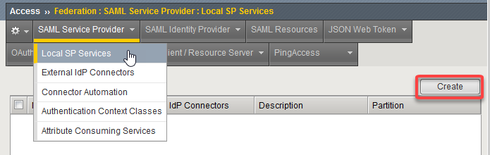
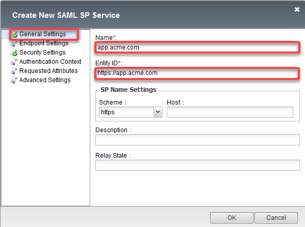
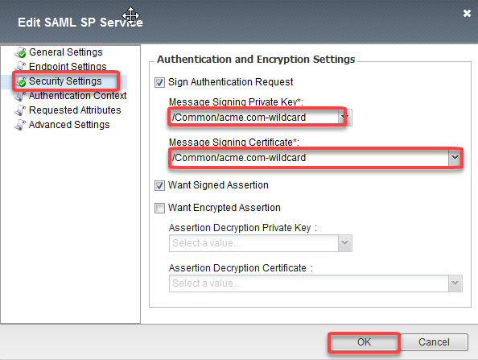
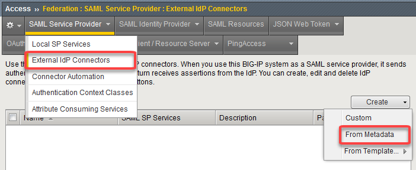
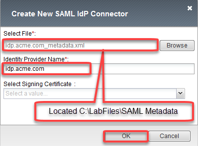
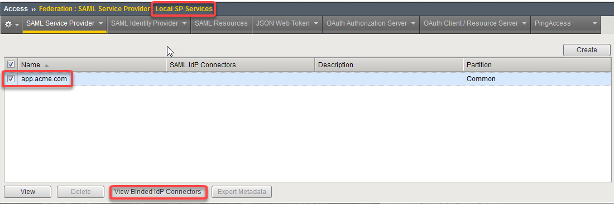
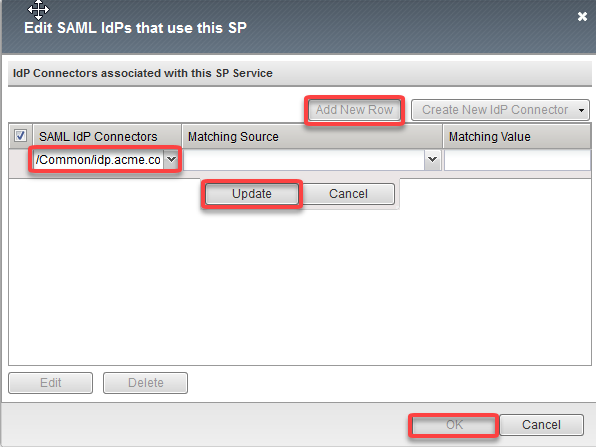
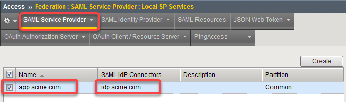
.. |image009| image:: media/Lab1/image009.png
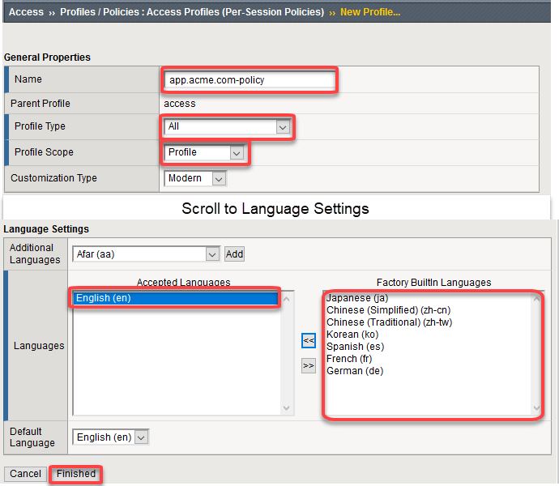
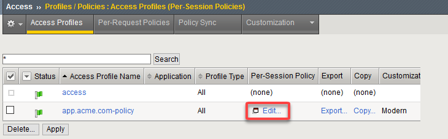
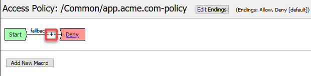
.. |image013| image:: media/Lab1/image013.png
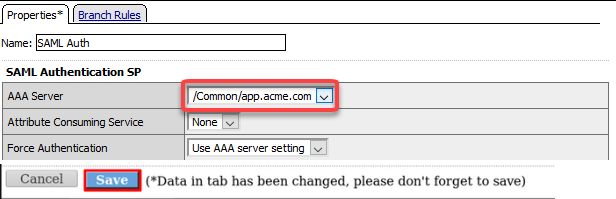
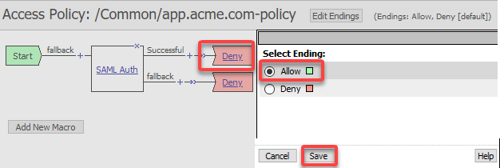
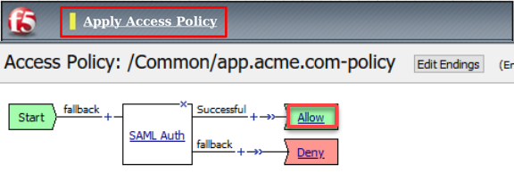
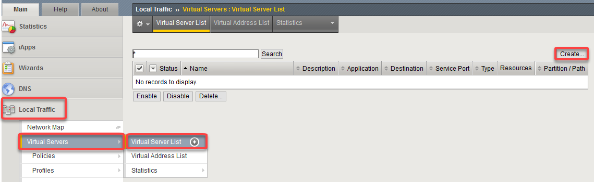
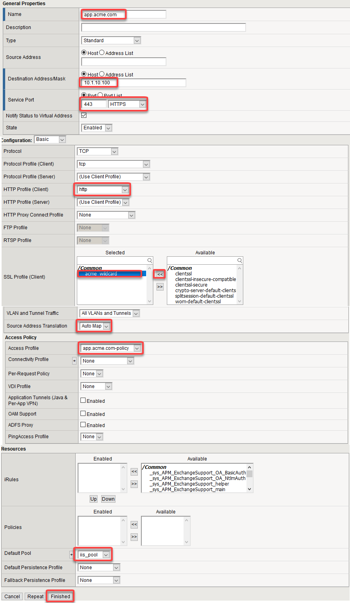
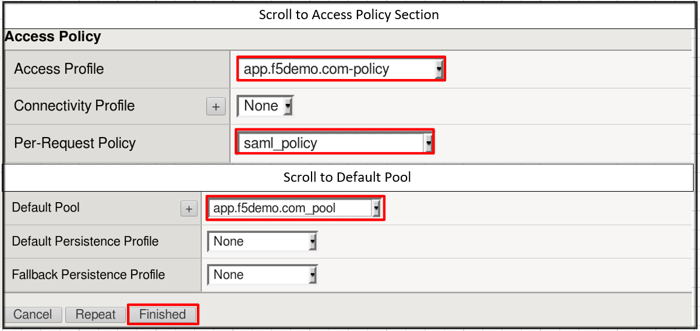
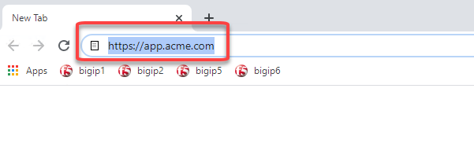
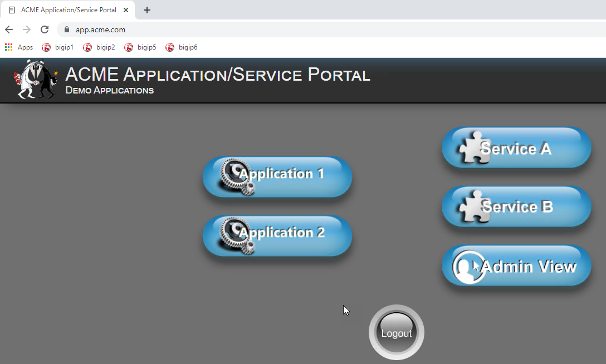
