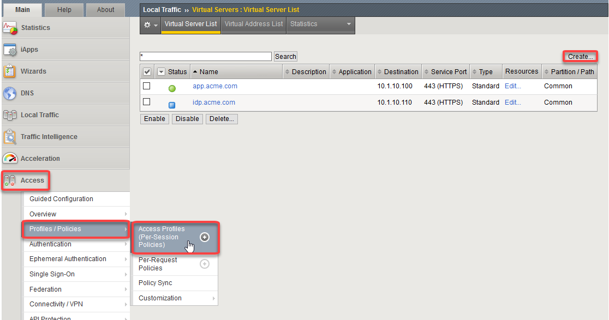
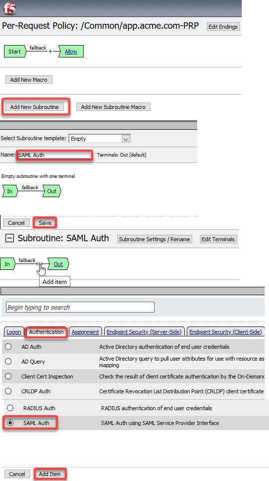
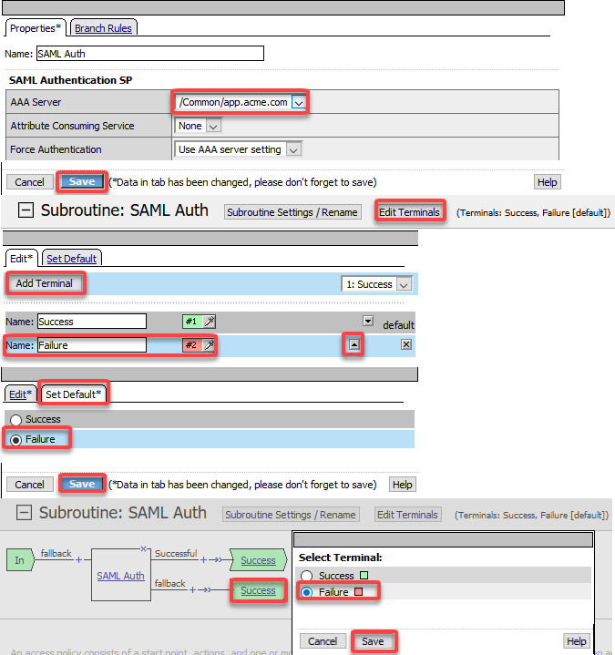
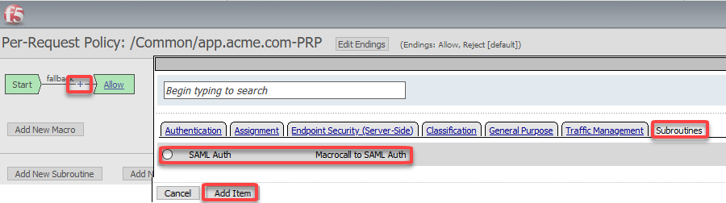
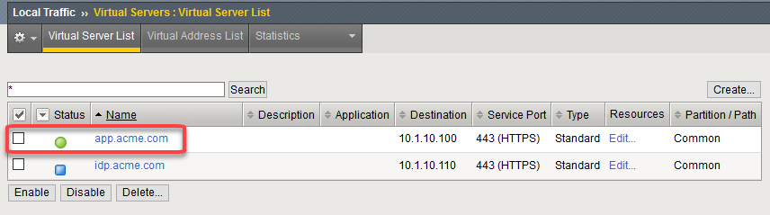
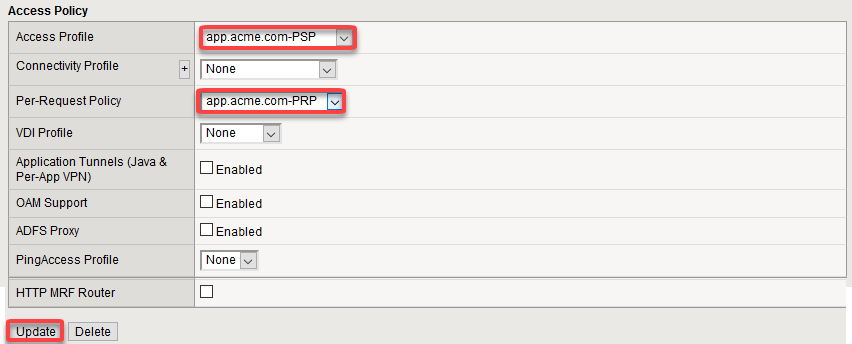

Lab 2: APM Per Request Policies
==========================================

.. toctree::
   :maxdepth: 1
   :glob:

The purpose of this lab is to familiarize the Student with Per Request Policies.
The F5 Access Policy Manager (APM) provides two types of policies.

Access Policy - The access policy runs when a client initiates a session.   Depending
on the actions you include in the access policy, it can authenticate the user
and perform group or class queries to populate session variables with data for
use throughout the session.

Per-Request Policy - After a session starts, a per-request policy runs each time
the client makes an HTTP or HTTPS request.  A per-request policy can include a
subroutine, which starts a subsession.  Multiple subsessions can exist at one
time. One access policy and one per-request are specified within a virtual server.

**It's important to note that APM first executes a per-session policy when a client
attempts to connect to a resource.   After the session starts then a per-request
policy runs on each HTTP/HTTPS request.  Per-Request policies can be utilized in a
number of different scenarios; however, in the interest of time this lab will only
demonstrate one method of leveraging Per-Request policies**

This lab will only focus on configuring Per-Request policies for controlling access
to external URL categories.

Objective:
----------

-  Gain an understanding of Per Request policies

-  Gain an understanding of use for Per Request Policy

Lab Requirements:
-----------------

-  All lab requirements will be noted in the tasks that follow

Estimated completion time: 15 minutes

Lab 3 Tasks:
-----------------

TASK 1: Create Per Session Policy
~~~~~~~~~~~~~~~~~~~~~~~~~~~~~~~~~~~~~~~~~~~~~~~~

Refer to the instructions and screen shots below:

+----------------------------------------------------------------------------------------------+
| 1. Login to your lab provided **Virtual Edition BIG-IP**                                     |
|     - On your jumphost launch Chrome and click the bigip1 link from the app shortcut menu    |
|     - Login with credentials admin/admin                                                     |
|                                                                                              |
| 2. Begin by selecting: **Access -> Profiles/Policies -> Per Session Policies** ->            |
|                                                                                              |
| 3. Click the **Create** button (far right)                                                   |
+----------------------------------------------------------------------------------------------+
| |image001|                                                                                   |
+----------------------------------------------------------------------------------------------+

+----------------------------------------------------------------------------------------------+
| 4. Enter the name of the policy, profile type, and profile scope                             |
|                                                                                              |
|    -  **Name**: **app.acme.com-PSP**                                                         |
|                                                                                              |
|    -  **Profile Type**: **All**                                                              |
|                                                                                              |
|    -  **Profile Scope**: **Profile**                                                         |
|                                                                                              |
|    -  **Accept Languages**: **English (en)**                                                 |
|                                                                                              |
| *Note: You will need a per session policy and a per request policy but we will be*           |
|        *leaving the per session policy blank and performing our auth in per Request*         |
+----------------------------------------------------------------------------------------------+
| |image002|                                                                                   |
+----------------------------------------------------------------------------------------------+

+----------------------------------------------------------------------------------------------+
| 5. On the app.acme.com-PSP policy click **Edit**                                             |
|                                                                                              |
| 6. Click on the **Deny** and change the Select Ending to **Allow**                           |
|                                                                                              |
| 7. Click **Save**                                                                            |
|                                                                                              |
| 8. Click Apply policy                                                                        |
|                                                                                              |
|   *Note:  Nothing will be set in this policy we will simply establish a session and manage*  |
|           *all the authentication in the Per-Request Policy*                                 |
+----------------------------------------------------------------------------------------------+
| |image003|                                                                                   |
|                                                                                              |
| |image004|                                                                                   |
+----------------------------------------------------------------------------------------------+

TASK 2: Configure SAML Per Request Policy
~~~~~~~~~~~~~~~~~~~~~~~~~~~~~~~~~~~~~~~~~~~~~~~~~

Refer to the instructions and screen shots below:

+----------------------------------------------------------------------------------------------+
| In Lab 1 we created all the SAML SP objects and bound them to an IdP.  Now we will           |
| leverage those objects to create our SAML Per-Request Policy                                 |
|                                                                                              |
| 1. Begin by selecting: **Access -> Profiles/Policies -> Per Request Policies** ->            |
|                                                                                              |
| 2. Click the **Create** button (far right)                                                   |
+----------------------------------------------------------------------------------------------+
| |image005|                                                                                   |
+----------------------------------------------------------------------------------------------+

+----------------------------------------------------------------------------------------------+
| 3. Give the policy a name and select the Language Settings                                   |
|                                                                                              |
|    -  **Name**: **app.acme.com-PRP**                                                         |
|                                                                                              |
|    -  **Accept Languages**: **English (en)**                                                 |
+----------------------------------------------------------------------------------------------+
| |image006|                                                                                   |
+----------------------------------------------------------------------------------------------+

+----------------------------------------------------------------------------------------------+
| 4. On the app.acme.com-PRP policy click **Edit**                                             |
|                                                                                              |
| 5. Click on **Add New Subroutine**                                                           |
|                                                                                              |
| 6. Give it a name and Click Save                                                             |
|                                                                                              |
|    -  **Name**: **SAML Auth**                                                                |
|                                                                                              |
| 7. Click the + between In and Out                                                            |
|                                                                                              |
| 8. Click the **Authentication** Tab                                                          |
|                                                                                              |
| 9. At the bottom of the list choose **SAML Auth** and click **Add Item**                     |
|                                                                                              |
+----------------------------------------------------------------------------------------------+
| |image007|                                                                                   |
|                                                                                              |
| |image008|                                                                                   |
+----------------------------------------------------------------------------------------------+

+----------------------------------------------------------------------------------------------+
| 10. Click on the **SAML Auth** box in the new Subroutine and select the AAA Server and Save  |
|                                                                                              |
|     -  **Name**: **/Common/app.acme.com**                                                    |
|                                                                                              |
|    *Note:  This object was created in Lab 1*                                                 |
|                                                                                              |
| 11. Click the **Edit Terminals** Button                                                      |
|                                                                                              |
| 12. Click *Add Terminal* in the new window                                                   |
|                                                                                              |
| 13. Name one terminal **Success** and the other **Failure**                                  |
|                                                                                              |
| 14. Change the order so that **Success** is on top and **Failure** is on the bottom          |
|                                                                                              |
| 15. Click on **Set Default** table and set **Failure** as the default, click Save            |
|                                                                                              |
| 16. Click the fallback box and change the terminal to **Failure**, click Save                |
|                                                                                              |
+----------------------------------------------------------------------------------------------+
| |image009|                                                                                   |
+----------------------------------------------------------------------------------------------+

+----------------------------------------------------------------------------------------------+
| 17. Click on the + between Start and Allow in the main policy                                |
|                                                                                              |
| 18. Click the Subroutine table                                                               |
|                                                                                              |
| 19. Choose SAML Auth                                                                         |
|                                                                                              |
| 20. Click **Add Item**                                                                       |
|                                                                                              |
+----------------------------------------------------------------------------------------------+
| |image010|                                                                                   |
+----------------------------------------------------------------------------------------------+

+----------------------------------------------------------------------------------------------+
| 21. Click on **Local Traffic -> Virtual Servers** and choose the **app.acme.com**            |
|                                                                                              |
| 22. Scroll to the **Access Policy** section                                                  |
|                                                                                              |
| 23. From the drop down for **Access Profile** choose **app.acme.com-PSP**                    |
|                                                                                              |
| 24. For the drop down on **Per-Request Policy** choose **app.acme.com-PRP**                  |
|                                                                                              |
+----------------------------------------------------------------------------------------------+
| |image011|                                                                                   |
|                                                                                              |
| |image012|                                                                                   |
+----------------------------------------------------------------------------------------------+

+----------------------------------------------------------------------------------------------+
| 25. Open Chrome and go to **https://app.acme.com**                                           |
|                                                                                              |
| 26. Enter your credentials **User1/User1**                                                   |
|                                                                                              |
+----------------------------------------------------------------------------------------------+
| |image021|                                                                                   |
+----------------------------------------------------------------------------------------------+

.. |image002| image:: media/Lab2/image002.png
.. |image003| image:: media/Lab2/image003.png
.. |image004| image:: media/Lab2/image004.png
.. |image005| image:: media/Lab2/image005.png
.. |image006| image:: media/Lab2/image006.png
.. |image007| image:: media/Lab2/image007.png

.. |image021| image:: media/Lab2/image021.png
