Lab 3: SSO Lab
===========================

The purpose of this lab is to demonstrate Single Sign-On capabilities
of APM.    The SSO Credential Mapping action enables users to forward
stored user names and passwords to applications and servers automatically,
without having to input credentials repeatedly.   This allows single
sign-on (SSO) functionality for secure user access.  As different applications
and resources support different authentication mechanisms, the SSO system
may be required to store and transform credentials to meet these requirements.
For example, username and password may be transformed into forms-based 
authentication, a SAML assertion into Kerberos or Kerberos authentication into
SAML. 

Although a number of different SSO methods exist, this lab will demonstrate access
single SSO method, the Kerberos to SAML method.

Objective:

-  Gain an understanding of SSO Token User Name Caching and SSO Token Password
   Caching.

-  Gain an understanding of the Kerberos to SAML relationship and its
   component parts.

-  Develop an awareness of the different deployment models that Kerberos
   to SAML authentication opens up

Lab Requirements:

-  All Lab requirements will be noted in the tasks that follow

Estimated completion time: 15 minutes

Task 1: Kerberos AAA Object
~~~~~~~~~~~~~~~~~~~~~~~~~~~

AD User and Keytab
^^^^^^^^^^^^^^^^^^

#. Create a new user in Active Directory

#. From the Jumphost click **Windows Menu -> Administrative Tools -> Active Directory Users and Computers**

   |image105|

#. Create the User Logon Name *kerberos*, click **Next** uncheck box for user to change password check box for never expires and set password to password

   |image100|

#. Open a command prompt on the jumphost.  Change directory to C:\\Users\\User1  **cd c:\\users\\user1**

#. From the Windows command line, run the KTPASS command to generate a keytab
   file for the previously created user object

   ``ktpass -princ HTTP/idp.acme.com@F5LAB.LOCAL -mapuser f5lab\kerberos crypto AES256-SHA1 -ptype KRB5_NT_PRINCIPAL -pass password -out file2.keytab``

   +-------------------------+-----------------------+
   | FQDN of virtual server: | ``idp.acme.com``      |
   +-------------------------+-----------------------+
   | AD Domain (UPN format): | ``@F5LAB.LOCAL``      |
   +-------------------------+-----------------------+
   | Username:               | ``f5lab\kerberos``    |
   +-------------------------+-----------------------+
   | Password:               | ``password``          |
   +-------------------------+-----------------------+

#. Review the changes to the AD User object

   |image101|

#. Under **Account options** scroll until you find **This account supports Kerberos AES 256 bit encryption** check the box, click OK

   |image111|

#. Click on the delegation tab of the new Active Directory User Account and ensure the **Trust this user for delegation to any service** Selected

   |image112|

Kerberos AAA Object
^^^^^^^^^^^^^^^^^^^

#. Return to your BIG-IP1

#. Create the AAA object by navigating to **Access ‑> Authentication -> Kerberos**

    |image106|

    +--------------------+---------------------------------+
    | Name:              | ``Kerbos_SSL``                  |
    +--------------------+---------------------------------+
    | Auth Realm:        | ``F5LAB.LOCAL``                 |
    +--------------------+---------------------------------+
    | Service Name:      | ``HTTP``                        |
    +--------------------+---------------------------------+

#. Specify a **Name**

#. Specify the **Auth Realm** (Ad Domain)

#. Specify a **Service Name** (This should be *HTTP* for http/https services)

#. Browse to locate the **Keytab File** **c:\\user\\user1\\file2.keytab**

#. Click **Finished** to complete creation of the AAA object

   |image113|

#. Review the AAA server configuration at **Access ‑> Authentication**

Task 2 – Modify the SAML Identity Provider (IdP) Access Policy
~~~~~~~~~~~~~~~~~~~~~~~~~~~~~~~~~~~~~~~~~~~~~~~~~~~~~~~~~~~~~~~

#. Navigate to **Access ‑> Profiles/Policies ‑> Access Profiles (Per-Session Policies)**, and click
   the **Copy** link next to the existing *idp.acme.com-policy*

   |image114|

#. Give it a name **idp.acme.com-kerberos** and click **Copy**

#. Click on **Edit** for this new policy

#. Click the + between Start and Logon page

#. Choose **HTTP 401 Response** radio button and click **Add item**

   |image107|

#. In the **HTTP 401 Response** dialog box, enter the following information and click Save:

   +-------------------+---------------------------------+
   | Basic Auth Realm: | ``F5LAB.LOCAL``                 |
   +-------------------+---------------------------------+
   | HTTP Auth Level:  | ``basic+negotiate`` (drop down) |
   +-------------------+---------------------------------+

   |image116|

#. Delete the **Logon Page** object by clicking on the **X**

#. In the resulting **Item Deletion Confirmation** dialog, ensure that the
   previous node is connect to the **acme.com** branch, and click the
   **Delete** button

#. In the **Visual Policy Editor** window for ``/Common/idp.acme.com‑kerberos``,
   click the **Plus (+) Sign** on the **Negotiate** branch between
   **HTTP 401 Response** and **Deny**

#. In the pop-up dialog box, select the **Authentication** tab and then
   select the **Radio** next to **Kerberos Auth**, and click the
   **Add Item** button

   |image075|

#. In the **Kerberos Auth** dialog box, enter the following information:

   +----------------------+-------------------------------------+
   | AAA Server:          | ``/Common/Kerberos_SSL`` (drop down)|
   +----------------------+-------------------------------------+
   | Request Based Auth:  | ``Disabled`` (drop down)            |
   +----------------------+-------------------------------------+

#. Click the **Save** button at the bottom of the dialog box

   |image076|

#. In the **Visual Policy Editor** window for
   ``/Common/idp.acme.com‑policy``, click the **Plus (+) Sign** on the
   **Successful** branch between **Kerberos Auth** and **Deny**

   |image077|

#. In the pop-up dialog box, select the **Authentication** tab and then
   select the **Radio** next to **AD Query**, and click the **Add Item** button

   |image078|

#. In the resulting **AD Query(1)** pop-up window, select
   ``/Commmon/AD_Server`` from the **Server** drop down menu

#. In the **SearchFilter** field, enter the following value:
   ``userPrincipalName=%{session.logon.last.username}``

   |image079|

#. In the **AD Query(1)** window, click the **Branch Rules** tab

#. Change the **Name** of the branch to *Successful*.

#. Click the **Change** link next to the **Expression**

   |image080|

#. In the resulting pop-up window, delete the existing expression by clicking
   the **X** as shown

   |image082|

#. Create a new **Simple** expression by clicking the **Add Expression** button

   |image080|

#. In the resulting menu, select the following from the drop down menus:

   +------------+---------------------+
   | Agent Sel: | ``AD Query``        |
   +------------+---------------------+
   | Condition: | ``AD Query Passed`` |
   +------------+---------------------+

#. Click the **Add Expression** Button

   |image084|

#. Click the **Finished** button to complete the expression

   |image081|

#. Click the **Save** button to complete the **AD Query**

#. In the **Visual Policy Editor** window for ``/Common/idp.acme.com‑policy``,
   click the **Plus (+) Sign** on the **Successful** branch between
   **AD Query(1)** and **Deny**

#. In the pop-up dialog box, select the **Assignment** tab and then select
   the **Radio** next to **Advanced Resource Assign**, and click the
   **Add Item** button

   |image087|

#. In the resulting **Advanced Resource Assign(1)** pop-up window, click
   the **Add New Entry** button

#. In the new Resource Assignment entry, click the **Add/Delete** link

   |image088|

#. In the resulting pop-up window, click the **SAML** tab, and select the
   **Checkbox** next to */Common/app.acme.com*

   |image089|

#. Click the **Webtop** tab, and select the **Checkbox** next to
   ``/Common/full_webtop``

   |image090|

#. Click the **Update** button at the bottom of the window to complete
   the Resource Assignment entry

#. Click the **Save** button at the bottom of the
   **Advanced Resource Assign** window

#. In the **Visual Policy Editor**, select the **Deny** ending on the
   fallback branch following **Advanced Resource Assign**

#. In the **Select Ending** dialog box, selet the **Allow** radio button
   and then click **Save**

   |image091|

#. In the **Visual Policy Editor**, click **Apply Access Policy**
   (top left), and close the **Visual Policy Editor**

   |image092|

#. Click **Local Traffic -> Virtual Servers -> Virtual Servers List** select
   the ''idp.acme.com'' Virtual Server

   |image093|

#. Scroll down to **Access Policy** and select the ''idp.acme.com-kerberos''
   policy from the drop down. Scroll to the down and click Update

   |image094|

Task 3 - Test the Kerberos to SAML Configuration
~~~~~~~~~~~~~~~~~~~~~~~~~~~~~~~~~~~~~~~~~~~~~~~~

.. NOTE:: In the following Lab Task it is recommended that you use Microsoft
   Internet Explorer.  While other browsers also support Kerberos
   (if configured), for the purposes of this Lab Microsoft Internet
   Explorer has been configured and will be used.

#. Using Internet Explorer from the jump host, navigate to the SAML IdP you
   previously configured at *https://idp.acme.com*

   |image095|

#. Were you prompted for credentials? Were you successfully authenticated?
   Did you see the webtop with the SP application?

#. Click on the app.acme.com icon. Were you successfully authenticated
   (via SAML) to the SP?

#. Review your Active Sessions **(Access ‑> Overview ‑> Active Sessions­­­)**

#. Review your Access Report Logs **(Access ‑> Overview ‑> Access Reports)**

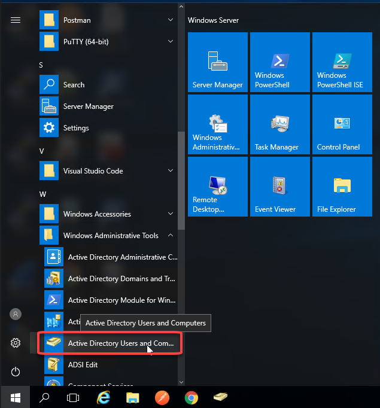
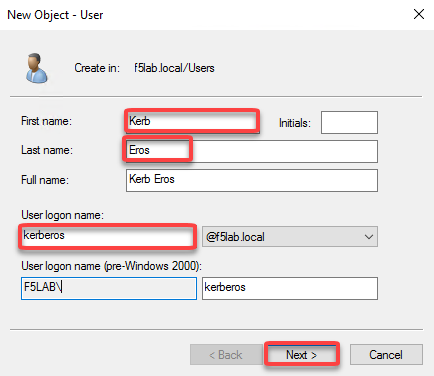
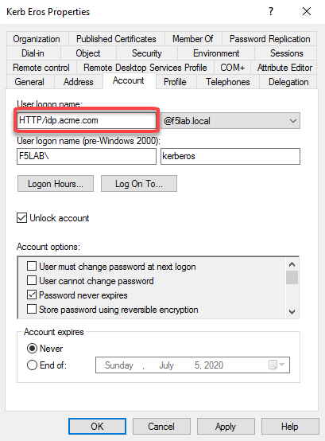
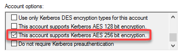
.. |image112| image:: media/Lab3/image112.png
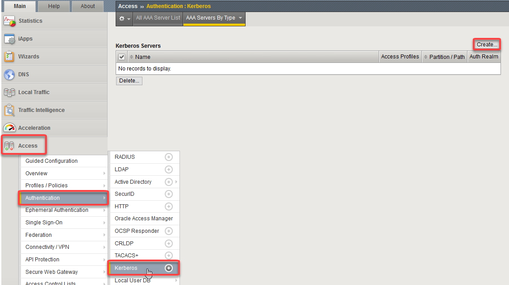
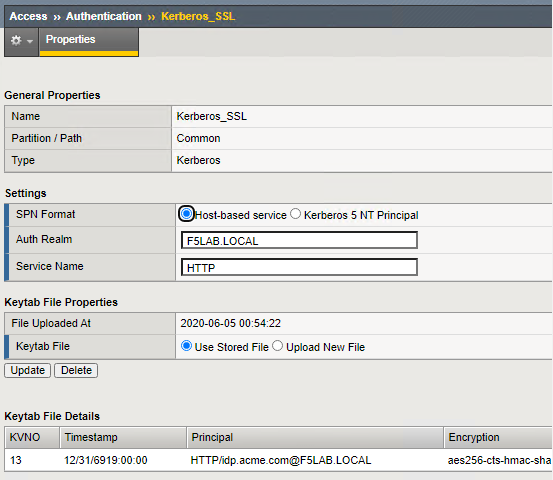
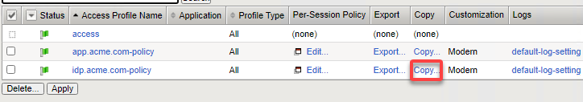
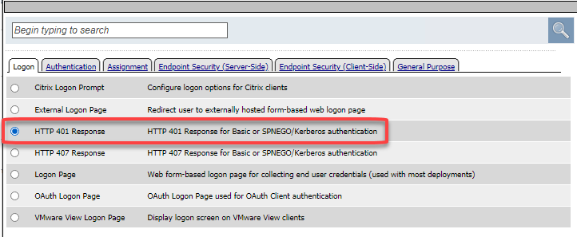
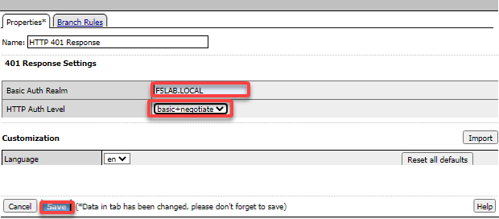
.. |image075| image:: media/Lab3/image075.png
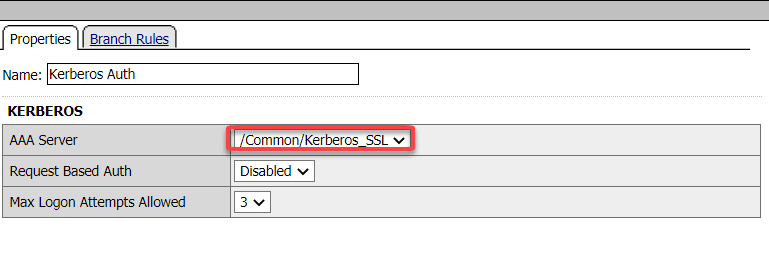
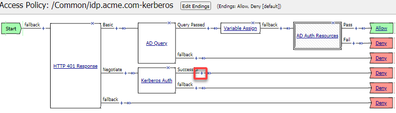
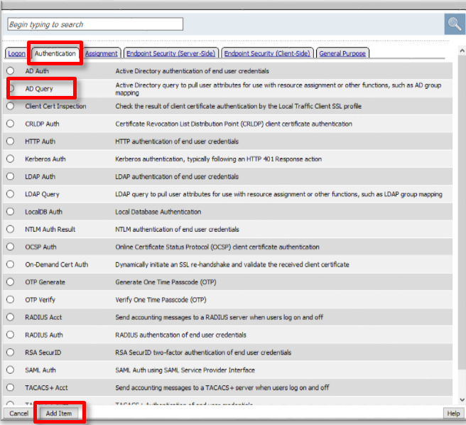
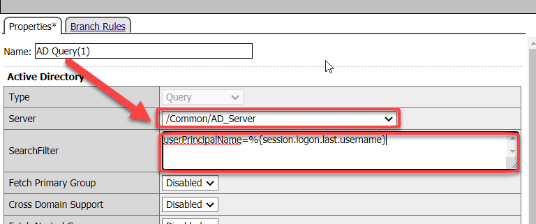
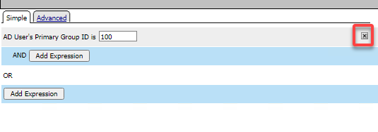
.. |image080| image:: media/Lab3/image080.png
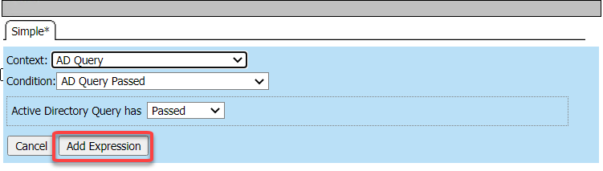
.. |image081| image:: media/Lab3/image081.png
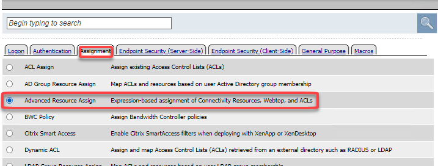
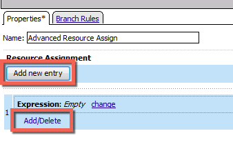
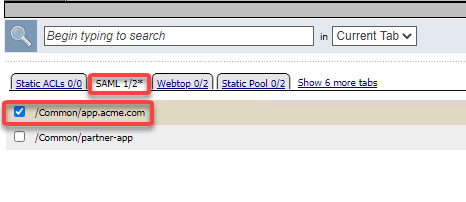
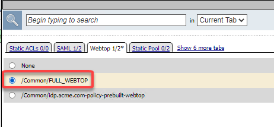
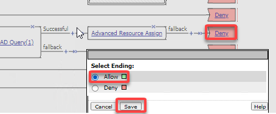
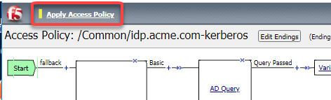
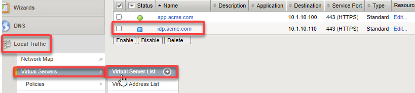
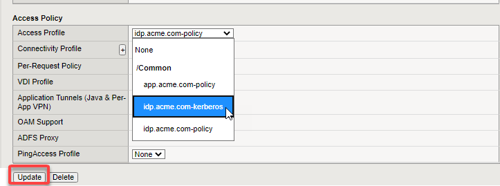
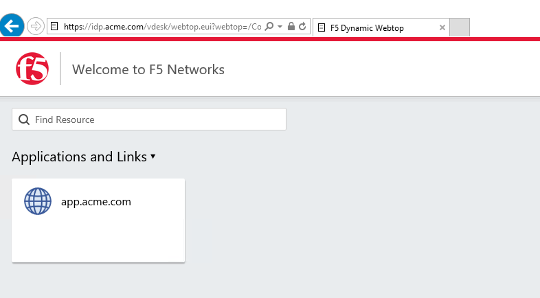
