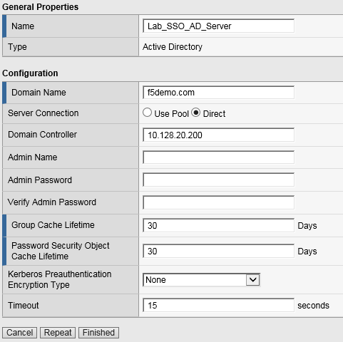
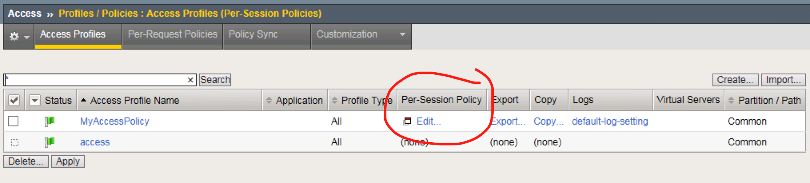
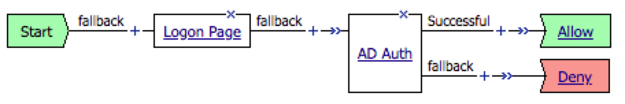

Lab 2 – Create My First Policy
------------------------------

In this lab, we will use the resources configured in the previous lab
and configure a simple Access Profile using the Visual Policy Editor
(VPE) to perform user authentication.

.. NOTE::
  Lab Requirements:

  - Working HTTP and HTTPS Virtual Servers (from previous lab)

Task – Define an Authentication Server
~~~~~~~~~~~~~~~~~~~~~~~~~~~~~~~~~~~~~~

Before we can create an access profile, we must create the necessary AAA
server profile for our Active Directory.

Follow these steps to complete this task:

#. From the main screen, browse to **Access > Authentication > Active
   Directory**

#. Click **Create…** in the upper right-hand corner

#. Configure the new server profile as follows, then click **Finished**:

   - Name: **Lab\_SSO\_AD\_Server**

   - Domain Name: **f5demo.com**

   - Server Connection: **Direct**

   - Domain Controller: **10.128.20.200**

   |image8|   |image9|

Task – Create a Simple Access Profile
~~~~~~~~~~~~~~~~~~~~~~~~~~~~~~~~~~~~~

#. Navigate to **Access > Profiles / Policies > Access Profiles (Per-Session Policies)**

   |image10|

#. From the Access Profiles screen, click **Create...** in the upper right-hand corner

#. In the Name field, enter “\ **MyAccessPolicy**\ ”, and for “Profile Type”, select the dropdown and choose **All**

   |image11|

#. Under “Language Settings”, choose **English** and click the “\ **<<**\ “ button to slide over to the “Accepted Languages” column.

   |image12|

#. Click **Finished**, which will bring you back to the Access Profiles screen.

#. On the Access Profiles screen, click the **Edit** link under the Per-Session Policy column. The Visual Policy Editor (VPE) will open in a new tab.

   |image13|

#. On the VPE page, click the ‘\ **+**\ ’ icon on the “fallback” path, to the right of the **Start** object.

   |image14|

#. On the popup menu, choose the **Logon Page** radio button under the Logon tab.

   |image15|

#. Click **Add Item**.

   |image16|

#. Accept the defaults and click **Save**.

   Now let’s authenticate the client using the credentials to be provided via the “Logon Page” object.

#. Between the “Logon Page” and “Deny” objects, click the ‘\ **+**\ ’ icon.

   |image17|

#. Select **AD Auth** found under the **Authentication** tab, and click the **Add Item** button.

   |image18|

#. Accept the default for the **Name** and in the **Server** drop-down menu select the AD server created above: **/Common/LAB\_SSO\_AD\_Server**, then click **Save**.

   |image19|

#. On the “Successful” branch between the **AD Auth** and **Deny** objects, click on the word **Deny** to change the ending.

   |image20|

#. Change the “Successful” branch ending to **Allow**, then click **Save**.

   |image21|

   |image22|

#. In the upper left-hand corner of the screen, click on the **Apply Access Policy** link, then close the window using the **Close** button in the upper right-hand. Click **Yes** when asked “Do you want to close this tab?”.

   |image23|

   |image24|

Task – Associate Access Policy to Virtual Servers
~~~~~~~~~~~~~~~~~~~~~~~~~~~~~~~~~~~~~~~~~~~~~~~~~
Now that we have created an access policy, we must apply it to the appropriate virtual server to be able to use it.

#. From the **Local Traffic** menu, navigate to the **Virtual Servers List** and click the name of the virtual server created previously: **https\_vs**.

#. Scroll down to the “Access Policy” section, then for the “Access Profile” dropdown, select **MyAccessPolicy**.

   |image25|

#. Click **Update** at the bottom of the screen.

Task – Testing
~~~~~~~~~~~~~~

Now you are ready to test.

#. Open a new browser window and open the URL for the virtual server that has the access policy applied: **https://www.f5demo.com**. You will be presented with a login window.

   |image26|

#. Enter the following credentials and click **Logon**:

   - Username: **user**

   - Password: **Agility1**

   You will see a screen similar to the following:

   |image27|

.. |image8| image:: media/image10.png
   :width: 2.59124in
   :height: 2.90971in

.. |image10| image:: media/image12.png
   :width: 2.81496in
   :height: 2.04331in
.. |image11| image:: media/image13.png
   :width: 3.35694in
   :height: 1.17083in
.. |image12| image:: media/image14.png
   :width: 5.30972in
   :height: 1.96914in

.. |image14| image:: media/image16.png
   :width: 3.67708in
   :height: 1.59375in
.. |image15| image:: media/image17.png
   :width: 5.30972in
   :height: 2.99543in
.. |image16| image:: media/image18.png
   :width: 4.09422in
   :height: 4.25486in
.. |image17| image:: media/image19.png
   :width: 2.75000in
   :height: 1.32500in
.. |image18| image:: media/image20.png
   :width: 2.83858in
   :height: 4.42520in
.. |image19| image:: media/image21.png
   :width: 5.05208in
   :height: 2.44710in
.. |image20| image:: media/image22.png
   :width: 4.80000in
   :height: 1.40000in
.. |image21| image:: media/image23.png
   :width: 2.17708in
   :height: 2.73681in

.. |image23| image:: media/image25.png
   :width: 2.14583in
   :height: 0.73958in
.. |image24| image:: media/image26.png
   :width: 2.00000in
   :height: 0.67921in
.. |image25| image:: media/image27.png
   :width: 2.40945in
   :height: 3.52362in
.. |image26| image:: media/image28.png
   :width: 2.13489in
   :height: 1.96875in
.. |image27| image:: media/image9.png
   :width: 5.07751in
   :height: 2.84357in
